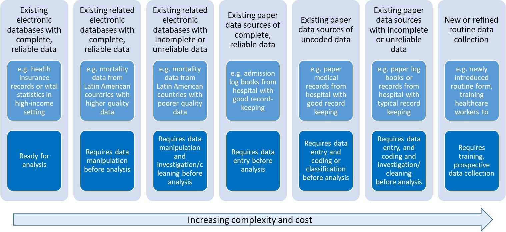
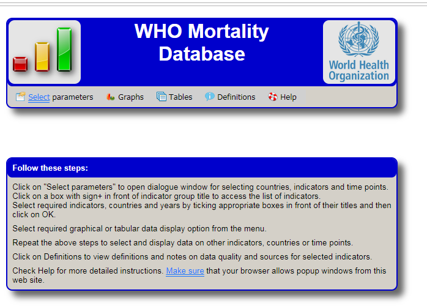

---
title: DRAFT:Measuring the impact of new vaccines using mortality and administrative
  hospitalization data
subtitle: Pneumococcal conjugate vaccine as a case study
output:
  rmdformats::readthedown:
    code_folding: hide
    css: ../stylesreadthedown.css
    lightbox: no
    self_contained: yes
    thumbnails: no
    toc_depth: '3'
  word_document:
    toc: yes
    toc_depth: '2'
--- 

```{r setup, include=FALSE}
#library(RCurl)
library(InterventionEvaluatR)
library(lubridate)
library(rmdformats)
library(htmlTable)
knitr::opts_chunk$set(echo = FALSE)

data(pnas_brazil, package = "InterventionEvaluatR") #load the data
br1<-pnas_brazil
br1$date<-as.Date(br1$date)

 data(ecuador_mortality, package = "InterventionEvaluatR") #load the data
ecuador_mortality$monthdate<-as.Date(ecuador_mortality$monthdate)
ecuador_mortality$date<-ecuador_mortality$monthdate


#
#https://medium.com/@arinbasu/a-tutorial-on-how-to-interface-an-r-notebook-with-overleaf-11f23c306cfd
```

```{r knitr-logo, out.width='50%', fig.show='hold',fig.align="center"}

```
<br>

WHO working group on the use of administrative data to evaluate the impact of pneumococcal conjugate vaccines:
 
* Adam Cohen (World Health Organization)
* Lucia Helena De Oliveira (Pan American Health Organization)
* Fernanda Lessa (Centers for Disease Control and Prevention)
* Jennifer Loo Farrar (Centers for Disease Control and Prevention)
* Tomoka Nakamura (World Health Organization)
* Cristiana Toscano (Universidade Federal de Goiás)
* Daniel Weinberger (Yale School of Public Health)

## Introduction 
Pneumococcal infections cause significant morbidity and mortality in children under 5 years of age in countries throughout the world, being the leading cause of vaccine-preventable deaths worldwide [Liu L, Lancet 2016].  Streptococcus pneumoniae (S. pneumoniae or pneumococcus) causes a variety of clinical syndromes, including pneumonia, meningitis, and bacteremia, as well as milder but more common illnesses such as otitis media and sinusitis [O’Brien KL, Lancet 2009]. All age groups are affected but most of the burden affects infants, young children and the elderly.

The World Health Organization (WHO) estimated, in 2005, that pneumococcal disease was the leading cause of vaccine-preventable deaths worldwide. A more recent disease burden study estimated that 14.5 million cases of serious pneumococcal disease occur each year worldwide, resulting in approximately 826,000 deaths [O’Brien KL, Lancet 2009]. Bacteremia is the most common invasive clinical presentation of pneumococcal infection in children aged 2 years or less, whereas pneumonia is the most common clinical presentation in adults. Invasive pneumococcal disease (IPD) implies the morbidity associated with isolation of pneumococci from normally sterile body sites, such as the blood stream, or those secondary to bloodstream spread, e.g. meningitis or septic arthritis.

Pneumococcal conjugate vaccines (PCVs) were first licensed in 2000. There are currently two commercially available vaccines, Synflorix (10-valent, PCV10) and Prevnar (13-valent, PCV13), both of which were introduced in the market in 2010. All available vaccines have demonstrated excellent safety and efficacy profiles in clinical trials [WER, 2019].
The World Health Organization (WHO) in 2012 recommended the introduction of pneumococcal conjugate vaccines (PCVs) in childhood immunization programs with high priority to countries with mortality rate >50 deaths/1000 births in children under 5 years of age [WER, 2012]. In, SAGE updated its recommendation, urging all countries in the world to introduce PCVs, in either 3+0 or 2+1 schedules, regardless of disease burden and mortality rates [WER, 2019].

To date, more than 140 countries in the world have introduced PCV into its national immunization programs, including many low- and middle-income countries [IVAC - View-hub report, 2019].Impact assessment studies are crucial after the introduction of new technologies. This is particularly true for new vaccines which have been made available in the past decade and are associated with higher costs when compared to traditional vaccines [Penfold RB, Acad Pediatr 2013; Bruhn CA, Epidemiology 2017]. 

Demonstrating vaccine impact on disease occurrence is crucial to inform decision making and allow the sustainability of immunization programs. In addition to providing evidence for decision makers, vaccine impact studies are crucial to allow all stakeholders to appreciate the benefits of vaccination; to assess the programmatic use of vaccine; and monitor progress towards national and international child health goals. 

After PCV introduction in several countries, many studies to assess their effectiveness and impact on the various relevant clinical outcomes have been conducted. To this end, many studies benefited from guidance provided by the WHO manual “Measuring impact of Streptococcus pneumoniae and Haemophilus influenzae type b conjugate vaccination”, published in 2012 [WHO, 2012]. In this manual, selected approaches to measuring PCV and Hib impact on disease occurrence and a framework for determining the best methodology for measuring that impact for different country or epidemiologic settings are presented, including using secondary data sources such as vital statistics and administrative records of hospitalizations. However, ecologic study designs are not explored and may be a useful method for measuring vaccine impact, as recently demonstrated by several studies, particularly assessing available secondary data such as mortality registries and administrative hospitalization databases.

A significant body of evidence is currently available demonstrating PCV effectiveness and impact on acute otitis media, pneumonia, invasive bacterial diseases, including both cases managed in the outpatient setting and more severe disease requiring hospitalization [de Oliveira, 2016; Loo, JD, 2014 ]. However, to date, there is scarce evidence on the impact of PCVs on mortality and morbidity in children under 5 years of age, using available secondary mortality and hospitalization data-sources, particularly in middle and low income countries. This is mainly due to challenges in availability, access to, and analysis of secondary sources of morbidity and mortality data. 

A recent multi-national study led by PAHO conducted in 10 low and middle income countries in the Latin American Region was recently completed, with the aim of determining the impact of PCVs on pneumonia mortality in children under 5 years of age, following their introduction into the national routine immunization program targeting infants. This study has been able to demonstrate, as a proof of concept, that it is possible to use available mortality data to evaluate the impact of PCVs on all-cause pneumonia mortality in children under the age of 5 years in selected countries, by means of time series analysis methodology [de Oliveira, Lancet Global Health, 2020]. In addition, similar studies are being undertaken by AFRO, EURO, and SEARO with countries in their regions [REFS CDC - CID, 2019].

The use of nationwide data from secondary sources, including the National Mortality Information Systems and Hospitalization Information systems, from pre- and post-vaccine introduction periods is possible, granted various aspects of data availability, extraction, quality, and other methodological challenges are adequately addressed and overcome.  

As such, this document provides guidance on approaches to measuring PCV impact using mortality and hospitalization, including minimum data requirements, and a framework for ensuring adequate application of relevant methodological aspects required for the use of time series methodology. This may serve to policy makers who will use results of impact assessment studies to make decisions regarding vaccine introduction and sustainability; Ministry of Health technical officers directly involved with requesting and/or conducting data management, epidemiologic studies and data analysis; as well as professionals working in academic institutions supporting the Ministry of Health in conducting research impact assessment evaluation. 


## What is vaccine 'impact'?
Efficacy studies are needed for licensure of new health technologies, including vaccines. Such studies, conducted as clinical trials, provide a measure of proportional reduction of disease in a vaccinated group compared to an unvaccinated group. However, in addition to being conducted in a scenario of “ideal conditions”, efficacy studies are limited to etiologically confirmed disease, and focuses on individual level effects only.  Once a vaccine is licensed and introduced in the population, post-licensure studies are required to measure vaccine effectiveness and impact of vaccination programs on the population [Hanquet G, 2013]. 

Given some confusion in the literature regarding definitions and terminology, and considering the active discussion in the public health community on how to assess and incorporate, in addition to safety and measures of protective efficacy, the full public health value of a vaccination program, the conference “Beyond efficacy: the full public health impact of vaccines in addition to efficacy measures in trials” was held in France in 2015 to addressed this issue and provided recommendations [Saadatian-Elahi M, 2016]. 

Vaccine effectiveness are post-licensure studies in which the actual performance of a vaccine at population level is measured. Both vaccine efficacy and effectiveness can be based on individual or cluster randomized designs and can report direct and indirect effects of vaccines. Direct effect is the direct protective effect in a vaccinated subject. Indirect effects correspond to the reduction of infection or disease transmission in unimmunized subjects due to the presence of immune individuals. Total vaccine effectiveness is the combined effects of the chosen vaccination strategy and direct protective effect in vaccinated subjects while overall vaccine effectiveness (i.e. herd effect) is the effect of vaccine in the population with immunized and unimmunized subjects as compared to if the population had not had the vaccination strategy [Saadatian-Elahi M, 2016]. 

Distinction should also be made between effects due to exposure to individual vaccination from that of exposure to a vaccination program, as the latter depends on vaccine coverage, other population factors and includes indirect effects as well. Vaccine (direct) effectiveness is estimated by comparing vaccinated and unvaccinated individuals exposed to the same vaccination program.

Once vaccines or other public health interventions are deployed, it is often desirable to measure their impact on health. This information is often critical for policy-makers who prioritize funding and implementation of different programs. 

The impact of a vaccination program, defined here as the population prevented fraction when exposure is the program, is measured by comparing populations with and without a vaccination program, most commonly the same population before and after vaccination. [Hanquet, 2013]

However, conducting robust and credible evaluations of the public health impact of interventions is challenging. Real-world data are complex, and decisions about how to clean, format, analyze, and interpret the data can influence the conclusions about the impact of the intervention.

The assessment of vaccination through ecologic study design using aggregate data, such as interrupted time series and before-after studies, provide measures of impact that combine direct effects, related to individual protection from immune response, and indirect effects including non-vaccinated subjects who benefitted from reduced circulation of S. pneumoniae achieved with high vaccine coverage. On the other hand, effectiveness measurements based on observational study designs, such as cohort and case-control studies, estimates the proportion of cases prevented in vaccinated subjects that were attributable to vaccination excluding indirect effects [Hanquet, Vaccine 2013] 

Different types of data can be used for health impact assessment purposes. Primary data involve prospectively-gathered data from a variety of sources, including population-based surveillance, sentinel site surveillance, periodic surveys, or nationally notifiable disease surveillance. 

Secondary data sources are existing data collected for another purpose, such as routine hospital clinical and administrative data, hospitalization data from a network of hospitals of a given healthcare system, and national mortality data. Such secondary data sources are a potential source of information which have been successfully used to assess the impact of various vaccines, including rotavirus vaccines on diarrheal disease, Hib vaccines on invasive bacterial disease, and PCV on pneumonia hospitalization and mortality. One type of secondary data is administrative data, which are data routinely collected for administrative purposes (including claims, billing, and  health records), which may or may not be electronic. 

Considering available electronic administrative data in health care, Figure 1 below depicts the spectrum of data considering availability, type of data, data processing and cleaning requirements prior to analysis, complexity, and costs.

```{r, out.width='100%', fig.align="center"}

```

*Source: from Jennifer Verani, Centers for Disease Control and Prevention – Kenya, slideset on “Using administrative data to measure PCV impact in Africa”*


A significant increase in the number of studies on vaccine impact has been observed in recent years. Most published studies on vaccine impact assessment used secondary data from health information systems, surveillance systems, and others sources, while few studies used primary data. 

Several are the outcomes that can be considered when assessing vaccine impact. For PCV impact, as pneumococcal is related to a variety of syndromes, these can include acute otitis media events, invasive bacterial disease (suspected, probable or confirmed), pneumonia (clinical or X-ray confirmed), severe pneumonia (usually measured as hospitalized pneumonia), and mortality (due to invasive bacterial disease, pneumonia, or all-cause mortality). 

One must consider the estimated effect of the vaccine in the various outcomes of interest in the pre-licensure clinical trials, in order to plan the outcome of interest to be considered in impact assessment studies. 

<<TODO insert table comparing efficacy in trials>>
```{r}
ds<- cbind.data.frame(
  c("California-PCV7","Gambia-PCV9 (PCV7+1,5)", "South Africa-PCV9", "Philippines-PCV11 (never licensed)", "Latin America- PCV10"),
  c('21%', '35%*', '21%', '23%','23%'),
  c(NA, '18%',NA , NA, NA),
  c(NA, "13%", NA, NA, NA)
)
rownames(ds)<-NULL
names(ds)<-c('Trial', 'Effect on radiological pneumonia', 'Effect on severe/hospitalized pneumonia', 'Effect on mortality' )
htmlTable(ds, align=c('l','c','c','c'),
          tfoot="*Mackenzie GA, Vaccine 2014"
)

```

As severe disease (hospitalization) and mortality outcomes are the most relevant outcomes of interest from a public health perspective, it is expected that secondary data will be the most used data sources for the purpose of PCV impact assessment. 

In most countries in world where routinely collected secondary data on hospitalization and mortality is available, it is possible to evaluate vaccine impact after its introduction into the program. We thus focus this guidance document in these two data types and its potential  sources.


##	Defining the study question and objectives 
In order to assess the impact of an intervention in a given population, the investigator should structure the study question considering the PICO strategy. As such, the following should be identified:

*	the target population in which the impact of the intervention is to be measured
*	the intervention and date of intervention
*	the outcome of interest, i.e., what is the condition being evaluated which is expected to be impacted by the intervention

The comparator considered will depend on the methodology of the study and will be discusses in further detail in the methods section of this document.

For pneumonia in children as the case study for the assessment of PCV, the study question would be what is the impact of PCV in pneumonia hospitalizations or deaths in children of a given age group of interest, in country X, in a given time period (consider the time being assessed after PCV introduction).

Study objectives will be structured considering the research question above, and include:

**Main objective**: Evalute the impact of PCV vaccination (INTERVENTION) in pneumonia mortality (OUTCOME) in children younger tan 5 years of age (POPULATION) in CONTRY X through the assessment of available secondary mortality data.
Secondary objectives:

1.	Describe the pneumonia mortality disease burden in Country X in children <5 years of age and by sub-groups of age
2.	Describe the pneumonia mortality burden in Country X considering any cause of death reported and considering only the main cause of death reported.  
3.	Characterize the temporal trends of PCV vaccine coverage (3rd dose) in children aged 1 year of age over time in Country X.
4.	Others 


## Mortality data from Vital Statistics 

Many decision-makers are very interested in the ability of PCVs to prevent deaths. However, mortality is a less frequent and very non-specific outcome, as many diseases and conditions are causes of deaths, varying mostly by age group but also by income and development level of countries. One alternative is to evaluate the impact of PCVs on mortality due to pneumonia, which is also challenging as pneumococcus is just one of many pathogens that can cause pneumonia. Therefore the relative decline in disease rates due to the vaccine might be modest.

Information on mortality, natality, and migration is fundamental to the study of a population’s demographic dynamic. Together with information from population censuses, it also provides the basic data for estimating life expectancy and constructing other important sociodemographic and health indicators. Mortality statistics are widely used in health situation analysis, whether for different populations at a single point in time or for a single population at different times. This analysis is usually accompanied by specific information disaggregated by age, sex, causes of death. (PAHO, 2018) 

The availability of nationally representative mortality data from mortality registries render mortality as an important outcome measure to evaluate health programs and interventions.

Vital statistics systems based on civil registration are the basic source of information for mortality analysis. The majority of countries in the world have vital statistics systems based on civil registration, an act whose legal purpose is the official registration of vital events (births, deaths, marriages, divorces, adoptions, etc.). (PAHO, 2018) 
In the mid-20th century, in order to provide countries with uniform statistical standards, concepts, and definitions to improve international comparability, the United Nations published a Handbook of Vital Statistics Methods. This was followed by the Principles and Recommendations for a Vital Statistics System, approved in 1970 and published by the UN in 1973. (PAHO, 2018)

According to the United Nations definition, “Civil registration is defined as the continuous, permanent, compulsory and universal recording of the occurrence and characteristics of vital events, in particular, events concerning the marital status of persons, as provided by decree or regulation, in accordance with the legal requirements in each country.” (United Nations, 2003:7).

A vital statistic system in defined as “the total process consisting of a) collecting information by civil registration or enumeration on the frequency of occurrence of specified and defined vital events, as well as relevant characteristics of the events themselves and of the person or persons concerned, and b) compiling, processing, to analyzing, evaluating, presenting and disseminating these data in statistical form.” (United Nations, 2003:5)
This process is mandated by law, and is standardized across countries, requiring deaths to be registered through a medical death certificate that must be completed by a physician or legally authorized individual. The death certificate must contain information on characteristics of the deceased, the circumstances of the death, and, primarily, the cause or causes of death. The death certificate is and the reporting of deaths are standardized, with most countries in the world following the United Nations’ Principles and Recommendations for a Vital Statistics System (United Nations, 2003).  
The international medical certificate of death is internationally used and recognized, consisting of 2 parts. Part I, devoted to the causes intervening in the causal chain, and Part II, devoted to the causes that, outside the chain, contributed to the fatal outcome. 

The figure below shows an example of a completed form of Medical Certificate of cause of death.

<<TODO INSERT FIGURE--screen shot>>

```{r}

```
 
From the first to last line, Part I indicates the following causes of deaths: a) direct cause of death: the one that finalizes the process and, without leading to another cause, directly ends the person’s life. b) Intermediate or intervening cause(s): as the name indicates, the cause or causes in the middle of the process. c) Originating antecedent cause (OAC): this is what is entered on the last line, because it engendered all the causes entered on the lines above it.

Part II of the certificate will record other pathological states or diseases that, not having been part of the causal chain, contributed to the death simply because they were present. These states are known as contributing causes.
The underlying cause of death (UDC) is defined as: “(a) The disease or injury which initiated the train of morbid events leading directly to death, or (b) the circumstances of the accident or violence which produced the fatal injury.” If the causes were entered correctly into the cause of death form/death certificate, the cause on the last line (OAC) will be the one selected as the UCD.

Most countries use the International Statistical Classification of Diseases (ICD), a nomenclature system for diseases standardized by World Health Organization (WHO) for reporting diseases and health conditions. Different diseases, injuries, disorders and other medical conditions are classified under ICD. There ICD has approximately 15,000 unique codes. The ICD has different revisions, the one currently in used by most countries being the 10th edition (ICD-10). 
A specific ICD-10 code will be assigned for each cause entered on the death certificate, considering the diverse ways in which the different causes can be stated by the physician. The cause of death for primary tabulation by a single cause will be the underlying cause of death (UCD). (WHO, 2004)

The 11th edition of the ICD (ICD-11) has been launched recently, but very few countries in the world are using the updated edition (WHO, 2018). ICD is the foundation for the identification of health trends and statistics globally, and the international standard for reporting diseases and health conditions. It is the diagnostic classification standard for all clinical and research purposes. ICD defines the universe of diseases, disorders, injuries and other related health conditions, listed in a comprehensive, hierarchical fashion that allows for easy storage, retrieval and analysis of health information for evidenced-based decision-making; sharing and comparing health information between hospitals, regions, settings and countries; and data comparisons in the same location across different time periods. (WHO, 2018)

The countries’ death information is usually compiled in electronic files containing all registered deaths. Mortality data repositories are available at National and International level, as all countries report and share their mortality data with WHO Regional offices. The WHO provides raw data files on its website. These files contain a regional mortality database. The data are presented in a standard format that can be processed with most of the available computer software. The data contain annual information on deaths for each country in the Region, disaggregated by country of origin, sex, age of the deceased, cause of death (through various groupings), and details about the information sources and their availability (some countries submit information from estimates and others, from permanent universal registries) (WHO, 2015).

## Hospitalization data from administrative sources 
Pneumonia hospitalizations are proxies to severe pneumonia. In most settings, administrative data from hospitalizations are recorded, and can contain individual level basic information of each patient, including age, date of hospitalization and discharge and admission/discharge diagnosis, coded by ICD codes. Thus, data from single hospitals, from a network of hospitals from a healthcare provider, and from national public healthcare systems, are useful sources of information to evaluate trends of hospitalizations and assess impact of vaccines in severe disease over time. 

Hospitals are reimbursed for healthcare services provided, and thus detailed administrative data on every hospitalization is collected, for medical claims. This is different and in addition to surveillance of selected syndromes and health conditions that may be in place in a given hospital or network of healthcare service providers. The hospital reimbursement process is complex and various approaches exist, varying by country and even within countries by healthcare structure and type. Furthermore, coverage, access, quality of healthcare service are variables that may change over time influencing significantly hospitalization rates. 

As such, in addition to the challenges of obtaining good quality hospitalization data, estimates of vaccine impact based on hospitalization data may be particularly prone to confounding, as hospitalization rates are tightly linked to changes in the quality, access and use of the healthcare system, which often occur simultaneously with the introduction of new vaccines [Schuck-Paim, Vaccine 2017].

Different than mortality data from vital statistics, hospitalization data is usually not standardized and very rarely shared with international organizations or other institutions outside of the country. Although the type and quality of the data collected varies, most hospitals collect information on the age, date of admission and discharge, outcome (discharged, transferred, died), and admission and discharge diagnosis for each individual hospitalization claim. Newly admitted patients are assigned with an admission diagnosis code upon hospitalization. Usually, diagnosis are recorded using standardized ICD codes. This code on the institutional claim indicates the beneficiary’s initial diagnosis at the time of admission. The principal discharge diagnosis is the condition that occasioned the need for hospitalization and is determined after the patient has been thoroughly examined and completed the diagnostic examinations. The admission and discharge diagnosis may differ – and evidence support that in fact they are often in discord. This is particularly true for hospitalizations due to respiratory conditions, among which pneumonias [Zikos 2019].

## Study design (DAN) 

### Overview
Observational studies present a number of analytical challenges. The introduction of vaccines is often occurring concurrently with other oublic health and social interventions that can influence disease rates. Other relevant changes include changes in social welfare systems, changes in the capacity of the healthcare system, changes in the efficincy of registering hospitalizations and deaths, and other pharmacological interventions that could influence susceptibility (e.g., increasing use of anti-retroviral therapy in sub-Saharan Africa). Because vaccines are introduced at the same time as these other changes, it can be challenging to attribute specific changes to the introduction of a vaccine. The methods that we will discuss here attempt to address this issue using different approaches and different assumptions. It is important to be aware of the assumptions and limitations of the different approaches. 

###	Possible study designs for impact assessment

The analysis goal is to disentangle changes in disease rates that are caused by the introduction of a vaccine program with changes that are due to these other factors. There are several approaches that could be taken. First, in a *pre-licensure* study, vaccine impact could be evaluated using a cluster-randomized study design, where disease rates are compared between spatial clusters that have been randomized to receive that vaccine or not. Assuming that there is not transmission between clusters, that the assignment of clusters was random and succesful (i.e., that the vaccinated and unvaccinated clusters are comparable), this provides an unbiased estimate of the total effect of the vaccine. 

In a *post-licensure setting*, the cluster-randomized design can be approximated by using a 'step-wedge' study design. This design can be implemented in settings where the vaccine has not yet be introduced and where it might not be feasible to introduce to the entire population at the same time. With this design, geographic areas are randomized to receive the vaccine earlier or later. All geographic units eventually receive the vaccine. With this phased rollout, the geographic units that introduce the vaccine later serve as controls for the geographics units that introduce the vaccine earlier. Because the control group is changing over time and the comparisons between the vaccinated and unvaccinated groups is taking place over some time period, estimates of vaccine impact could be cofounded by underlying temporal trends. Therefore, it is important to appropriately adjust for time-varying rates of disease when analyzing these studies. 

In most settings, such controlled roll-outs of vaccine are not possible. Therefore, the most common study designs are purely observational, in which changes in disease rates are evaluated over time or between regions. Extreme caution needs to be used when performing and interpreting these studies to ensure that factors unrelated to vaccination are appropriately adjusted in the analysis. This guide will focus on the analysis situation where there is a single time series of interest from a country or region and the goal is to detect changes in incidence following vaccine introduction from this time series. When time series from multiple subnational regions are available, additional types of analyses are possible, including performing spatiotemporal analyses in which the declines in regions with higher or lower coverage are compared.  

Interrupted time series analysis is among the most common and strongest approach to assess population-level impact of new vaccines [Bruhn, PNAS 2017; Penfold, Acad Pediatr 2013]. Among other potential methods for such purpose, interrupted time series analysis allow for adjustments in annual variations, secular disease trends and changes in health care use, among others [Hanquet, Vaccine 2013]. Nonetheless, as other authors have reported in developed countries, methodological challenges exist when assessing vaccination impact, particularly considering PCVs [Hanquet, Vaccine 2013].

Recently, with the aims of mitigating the effect of confounding factors in time series analyses, a new methodological strategy denominated 'synthetic controls' has been proposed [Bruhn, PNAS 2017]. In this strategy, multiple comparator groups are integrated into a single constructed control variable through the weighted sum of each result. The weighting is done according to the individual capacity of each comparator group to predict the outcome of interest (eg pneumonia) in the pre-vaccination period identified through regression analysis.

Further, additional methodological recommendations have been proposed for improving the assessment of population level vaccine impact analyses, which could increase the accuracy, reproducibility, and comparability of such studies [Bruhn, Epidemiology 2017]. 


### Counterfactuals: What would have happened without a vaccine?
With any analysis of vaccine impact, the goal is to compare the observed disease rates in the post-vaccine period with an estimate of what would have happened if the vaccine had not been introduced. This value is called the **counterfactual**. There are many ways to estimate counterfactuals from very simple approaches (as is done in pre/post comparison of incidence) to more complex approaches that adjust for trends and dynamics of the disease. In each of the followinng sections, we will discuss different methods to obtain this quantity.


### Choosing control variables 
As discussed in the following sections, control variables can be used to strengthen analyses of vaccine impact in several ways. They can help identify data quality issues and also to adjust for time-varying factors that could lead to misleading conclusions. For instance, social welfare programs might influence the general health of the population and drive down rates of pneumonia, independent of a vaccine. Ignoring the effects of this social welfare program would lead one to incorrectly attribute declines in disease rates to the vaccine. A control disease that is also influenced by the general health improvements could allow an analyst to detect and adjust for these improvements when calculating vaccine impact   

The key challenge comes in deciding which control diseases would be appropriate controls for the disease of interest. As a general principle, the control disease and the disease of interest should share relevant risk factors and etiologies. For instance, if the goal is to adjust for the effect of the social welfare program on the risk of infectious diseases, using fractures as a control when estimating the effect of a vaccine against pneumonia might be a poor choice. This is because trends in fractures have a completely different set of causes than trends in acute respiratory infections. Perhaps a different acute infectious event would be more appropriate. Conversely, if the goal is to adjust for changes in healthcare capacity,  trends in fractures could capture important trends. Pathogen-specific time series, such as for influenza or RSV activity, could also be used to adjust pneumonia rates for short-term epidemics and tease out the long term trends. It can sometimes be difficult to determine *a priori* which controls would be appropriate. For instance, in mortality databases, some deaths are attributed to unspecified causes.

A key assumption when selecting control diseases is that the relationship between the outcome of interest (e.g., pneumonia hospitalizations) and the control time series is stable over time, and that the only thing that causes a change between them is the intervention of interest. Therefore, diarrhea might be a poor control variable for pneumonia when evaluating pneumococcal conjugate vaccines if rotavirus vaccine has been introduced recently as well. This is because the rotavirus vaccine changes the relationship between diarrhea and pneumonia. In this example, using diarrhea as a control would lead to a bias towards detecting no effect because diarrhea and pneumonia will both be going down due to their respective vaccines. 

Another key assumption is that the control variables are themselves not influenced by the intervention of interest. Therefore, invasive pneumococcal disease (IPD) would be a poor control for evaluating the impact of pneumococcal conjugate vaccines on pneumonia, because IPD is itself influenced by the same vaccine. The inclusion of a control that is influenced by the same intervention will bias the estimates towards  no effect because both will be going down in parallel due to the same cause.

Low-quality databases often have a large proportion of deaths coded using these junk codes, but in many settings, the quality of coding has changed over time. A decrease in junk codes over time would be expected to be associated with an increase in cause-specific codes. Therefore, the time series of junk codes itself could be useful for adjusting the reported rates of pneumonia deaths for changes in coding practices. Conversely, if actual pneumonia cases are incorrectly coded with a junk code, then the vaccine will cause a decline in the junk codes, and including these junk codes as control variables

**In summary**
Control diseases should share some relevant etiological drivers with the disease of interest and should themselves not be influenced by the intervention or by other interventions that would change the relationship between the control and the outcome of interest. The sections that follow discuss some specific uses of control diseases in analyses. 

### Key considerations for analyses 

####Denominators
It is common when analyzing trend data to analyze changes in incidence (i.e., cases/population size) rather than the raw number of cases. The assumption here is that the number of cases should scale with population size. However, when using administrative data, using a population denominator might not effectively adjust for underlying change. Often, the administrative database does not cover the entire population, or other factors (e.g., access to healthcare) are larger drivers of trends than population size. Using alternative denominators, such as total number of hospitalizations in the system, can sometimes be a more effective approach (see Schuck-Paim et al., *Vaccine* 2017). Whatever the chosen denominator, it can either be included as an offset term (regression coefficient is held to 1), or as a covariate in a regression model. 

#### Transition period 
After a vaccine is formally introduced into a national immunization program, it typically takes some amount of time to implement the vaccine and vaccinate a large proportion of eligible infants. Additionally, it takes time for children who are vaccinated as infants to age and become toddlers (an age group that might be more important for transmitting pneumococcus). Due to these considerations, a transition period is typically defined to allow the program to reach maturity before trying to estimate changes in disease rates. The data are therefore subset into a pre-vaccine period, a transition period, and a post-vaccine period, and vaccine impact is defined by comparing the post-vaccine period and the pre-vaccine period, while ignoring the transition period. The length of transition period depends on how quickly the vaccine program is implemented. In most settings, 1-2 years are defined as the transition period. In many of the Latin American countries, 3-dose coverage rapidly reached a plateau within a year, so a 12 month transition period was used. 

#### How many years of data required?
In many instances, vaccines are introduced in the context of unrleated changes that influence disease rates. Changes in the underlying health of the population (e.g., due to changes in social welfare programs, declines in indoor air pollution), changes in healthcare utilization, and changes in coding can all affect the reported rates of disease. Therefore, it is important to have sufficient data from the pre-vaccine period to detect and adjust for such trends. *At least 4-5 years* of pre-vaccine data are typically needed to adequately adjust for existing trends in the data. This is often context specific and depends on the particular factors driving underlying trends. Analyses using fewer years of pre-vaccine data should be interpreted with *extreme caution*. 

Likewise, it is ideal to accumulate several years of post-vaccine data prior to evaluating vaccine uptake. This allows the vaccine program to mature. Additionally, pneumonia rates during short periods of observation can be strongly influenced by short epidemics such as those cuased by influenza or RSV. This can potentially obscure or exagerate the true vaccine effects.

#### What to do if you have an epidemic disease
All of these methods assume that the disease patterns follow a preditable pattern and can be captured either using a straight line relationship (ITS), or that the relationship with control variables is stable. Therefore, these methods are generally only appropriate for **endemic** diseases. For diseases that are epidemic (e.g., meningococcal meningitis), other approaches might be required that account for the dynamics of the pathogen and the build-up of immunity in the population. If the epidemic is widespread but the intervention is limited to a smaller region, it  might be possible to use the time series from an unvaccinated control population (e.g., another region within the country) as the control variable to generate a counterfactual in a synthetic control-type analysis. Or it might be necessary to use a dynamic transmission model that can capture non-linear dynamics (e.g., a compartmental model with Susceptiple, Infected, and Resistant classes). 

##	Types of analyses
In this context, a 'time series' is defined as a variable in which the number of cases is tallied in each unit of time (week/month/quarter/year). The goal for the analysis is to detect changes in the average number of cases or incidence.

In the following sections, we will look at 2 examples: Hospitalization due to pneumonia among children 3-11 months of age in Brazil, and deaths due to pneumonia among children age 2-59 months of age. These provide a useful contrast. The dataset from Brazil is more stable during the pre-vaccine period (i.e., not strong trends), and there is less unexplained noise. In contrast, in Ecuador, there is a strong downward trend in deaths prior to vaccine introduction. In Brazil, the results are less sensitive to the model choice, while in Ecuador, it varies notably. In both datasets, pneumonia is defined based on ICD10 codes (J12-J18).

```{r}
#Setup the data

intro.date<-as.Date('2010-03-01')
intro.date.minus.one<-intro.date %m-% months(1)
eval.date<-as.Date('2011-03-01')
outcome.name<-'J12_18'
offset.name<- "ach_noj"
first.date<-as.Date("2004-01-01")
last.date<-as.Date("2013-12-01")
kids<-br1[br1$age_group==1,]
kids<-kids[kids$date<=last.date & kids$date>=first.date,]
kids$month<-as.factor(month(kids$date))

intro.date2<-as.Date('2010-08-01')
intro.date.minus.one2<-intro.date2 %m-% months(1)
eval.date2<-as.Date('2011-08-01')
outcome.name2<-'J12_J18_prim'
offset.name2<-'acm_noj_prim'
first.date2<-as.Date("2005-01-01")
last.date2<-as.Date("2015-12-01")
kids2<-ecuador_mortality[ecuador_mortality$age_group=='ec 2-59m A',]
kids2<-kids2[kids2$monthdate<=last.date2,]
kids2$month<-as.factor(month(kids2$monthdate))


```

```{r, fig.width=10, fig.height=3}
par(mfrow=c(1,2))
plot(kids$date, kids[,outcome.name], type='l', bty='l', ylab="N Hosp.", xlab='date', ylim=c(0, max(kids[,outcome.name])), main='Time series of pneumonia hosp (Brazil)')
abline(v=intro.date, lty=2, col='gray')

plot(kids2$date, kids2[,outcome.name2], type='l', bty='l', ylab="N Deaths", xlab='date', ylim=c(0, max(kids2[,outcome.name2])), main='Time series of pneumonia deaths (Ecuador)')
abline(v=intro.date2, lty=2, col='gray')
```

### Pre-Post comparison
The simplest possible analysis approach is to compare the average number of cases or incidence in the post-vaccine period with that in the pre-vaccine period (a 'pre-post comparison' study). This method is easy to implement and easy to understand. The analyst needs to define the pre-vaccine period and the post-vaccine period. Typically, the first year or two after vaccine introducion are excluded from the analysis because vaccine coverage has not yet reached full coverage levels. The decision about where to set the pre- and post-vaccine periods should be made *a priori* and should not be influenced by observed aberrations in the data (unless these are due to a known data quality issue); otherwise the estimation of the variability in disease rates will not be accurate. 

```{r, fig.width=10, fig.height=3}
mean.pre<-mean(kids[,outcome.name][kids$date< intro.date])
mean.post<-mean(kids[,outcome.name][kids$date>=eval.date])

par(mfrow=c(1,2))
plot(kids$date, kids[,outcome.name], type='l', bty='l', ylab="N Hosp.", xlab='date', ylim=c(0, max(kids[,outcome.name])), main='Pre-post comparison (Brazil)')
abline(v=intro.date, lty=2, col='gray')
arrows(x0=first.date, x1=intro.date.minus.one , y0=mean.pre, length=0, col='#1b9e77')
arrows(x0=eval.date, x1=last.date , y0=mean.post, length=0, col='#7570b3')

mean.pre<-mean(kids2[,outcome.name2][kids2$date< intro.date2])
mean.post<-mean(kids2[,outcome.name2][kids$date>=eval.date2])
plot(kids2$date, kids2[,outcome.name2], type='l', bty='l', ylab="N Deaths", xlab='date', ylim=c(0, max(kids2[,outcome.name2])), main='Pre-post comparison (Ecuador)')
abline(v=intro.date2, lty=2, col='gray')
arrows(x0=first.date2, x1=intro.date.minus.one2 , y0=mean.pre, length=0, col='#1b9e77')
arrows(x0=eval.date2, x1=last.date2 , y0=mean.post, length=0, col='#7570b3')

```

**Counterfactual** In this study design, it is assumed that if the vaccine had not been introduced, the incidence rate after vaccine introduction would be the same as the incidence of disease before vaccine introduction. Therefore the counterfactual is simply the average incidence in the pre-vaccine period, and the comparison is with incidence in the post vaccine period. In the plot below, the counterfactual is shown with a dotted line. Comparing the counterfactual with the observed mean for the post-period gives an estimate of the vaccine effect.

**Simple pre-post comparison**

```{r, fig.width=10, fig.height=3}
mean.pre<-mean(kids[,outcome.name][kids$date<intro.date])
mean.post<-mean(kids[,outcome.name][kids$date>=eval.date])

par(mfrow=c(1,2))
plot(kids$date, kids[,outcome.name], type='p',pch=16,cex=0.75, bty='l',col='lightgray', ylab="N hosp.", xlab='date', ylim=c(0, max(kids[,outcome.name])), main='Counterfactual (Brazil)')
arrows(x0=first.date, x1=intro.date.minus.one , y0=mean.pre, length=0, col='#1b9e77')
arrows(x0=eval.date, x1=last.date , y0=mean.post, length=0, col='#7570b3')
arrows(x0=eval.date, x1=last.date , y0=mean.pre, length=0, col='#d95f02', lty=3)
abline(v=intro.date, lty=3, col='gray')
abline(v=eval.date, lty=3, col='gray')
text(last.date, mean.pre*1.2, 'Counterfactual', col='#d95f02', cex=0.8,pos=2, offset=0)
text(last.date, mean.post*0.8, 'Fitted', col='#7570b3', cex=0.8,pos=2, offset=0)

mean.pre<-mean(kids2[,outcome.name2][kids2$date< intro.date2])
mean.post<-mean(kids2[,outcome.name2][kids$date>=eval.date2])
plot(kids2$date, kids2[,outcome.name2], type='l', bty='l', ylab="N Deaths", xlab='date', ylim=c(0, max(kids2[,outcome.name2])), main='Counterfactual (Ecuador)')
abline(v=intro.date2, lty=2, col='gray')
arrows(x0=first.date2, x1=intro.date.minus.one2 , y0=mean.pre, length=0, col='#1b9e77')
arrows(x0=eval.date2, x1=last.date2 , y0=mean.post, length=0, col='#7570b3')
arrows(x0=eval.date2, x1=last.date2 , y0=mean.pre, length=0, col='#d95f02', lty=3)
text(last.date2, mean.pre*1.2, 'Counterfactual', col='#d95f02', cex=0.8,pos=2, offset=0)
text(last.date2, mean.post*0.8, 'Fitted', col='#7570b3', cex=0.8,pos=2, offset=0)


```

**Calculation of vaccine impact** The most common statistic reported from a pre/post comparison study is a Rate Ratio, which is simply calculated as (Average Incidence Post-Vaccination)/(Average Incidence Pre-Vaccination). Values <1 are considered evidence that the disease rates have declined. It is also possible to calculate a rate difference to obtain the number of cases prevented.

**Assumptions** This analysis assumes that the only change in disease rates that is occurring over time is due to the vaccine. This is rarely a realistic assumption. **Therefore, this is a weak study design, and the results should be interpreted with caution.** For instance, there is a declining trend in Ecuador, which is ignored in this analysis.

**Pre-post comparison, adjusted for seasonality** This is basically the same as above. Adjusting for seasonality can be useful if the vaccine is introduced mid-year (during the seasonal epidemic), so there is an imbalance in which months are in the pre- and post-vaccine periods.

```{r, fig.width=10, fig.height=7}
par(mfcol=c(2,2))
month<-as.factor(month(kids$date))
kids$period<-0
kids$period[kids$date>=intro.date  ] <-1
kids$period[kids$date>=eval.date  ]<-2
form1<-as.formula(paste0(outcome.name,'~month+as.factor(period)'))
mod1<-glm(form1,family='quasipoisson', data=kids )
pred1<-predict(mod1, type='response')
kid.counter<-kids
kid.counter$period<-as.factor(0)
pred1.counter<-predict(mod1, type='response', newdata=kid.counter)
pred1.counter.post<-pred1.counter
pred1.counter.post[kids$date<=eval.date] <-NA
pred1.pre<-pred1
pred1.pre[kids$date>=intro.date]<-NA
pred1.post<-pred1
pred1.post[kids$date<eval.date]<-NA
plot(kids$date, kids[,outcome.name], type='p', pch=16, bty='l', ylab="N hosp.", col='gray', cex=0.7,  xlab='date', ylim=c(0, max(kids[,outcome.name])),main='Brazil' )
points(kids$date,pred1.pre, type='l' ,col='#1b9e77' )
points(kids$date,pred1.post, type='l' , col='#7570b3' )
points(kids$date,pred1.counter, type='l', col='#d95f02', lty=3  )
abline(v=intro.date, lty=3, col='gray')
abline(v=eval.date, lty=3, col='gray')
rr.pre.post<- pred1/pred1.counter
plot(kids$date, pred1/pred1.counter, type='l', bty='l', ylab="Rate Ratio", xlab='date',main='Rate ratio', ylim=c(0.5,1.2))
abline(h=1, lty=2, col='gray')

month<-as.factor(month(kids2$date))
kids2$period<-0
kids2$period[kids2$date>=intro.date2  ] <-1
kids2$period[kids2$date>=eval.date2  ]<-2
form1<-as.formula(paste0(outcome.name2,'~month+as.factor(period)'))
mod1<-glm(form1,family='quasipoisson', data=kids2 )
pred1<-predict(mod1, type='response')
kid.counter<-kids2
kid.counter$period<-as.factor(0)
pred1.counter<-predict(mod1, type='response', newdata=kid.counter)
pred1.counter.post<-pred1.counter
pred1.counter.post[kids2$date<=eval.date2] <-NA
pred1.pre<-pred1
pred1.pre[kids2$date>=intro.date2]<-NA
pred1.post<-pred1
pred1.post[kids2$date<eval.date2]<-NA
plot(kids2$date, kids2[,outcome.name2], type='p', pch=16, bty='l', ylab="N Deaths", col='gray', cex=0.7,  xlab='date', ylim=c(0, max(kids2[,outcome.name2])),main='Ecuador' )
points(kids2$date,pred1.pre, type='l' ,col='#1b9e77' )
points(kids2$date,pred1.post, type='l' , col='#7570b3' )
points(kids2$date,pred1.counter, type='l', col='#d95f02', lty=3  )
abline(v=intro.date2, lty=3, col='gray')
abline(v=eval.date2, lty=3, col='gray')
rr.pre.post2<- pred1/pred1.counter
plot(kids2$date, rr.pre.post2, type='l', bty='l', ylab="Rate Ratio", xlab='date',main='Rate ratio', ylim=c(0.5,1.2))
abline(h=1, lty=2, col='gray')


``` 


### Interrupted time series analysis (ITS) 
In many instances, there is an underlying trend in the time series that is unrelated to vaccination. Such a trend can be caused by a number of factors, including changes in healthcare access, changes in susceptibility of the population, and changes in the sensitivity of surveillance. Such trends can bias the estimates of vaccine impact if they are not properly controlled. The simplest approach to adjust for trends is to fit a straight line through the data and then test whether the slope of the line or the level of the line changes after vaccine introduction. This tyope of analysis is called 'segmented regression" and can be accomplished by fitting a Poisson or negative binomial regression model. A number of quantities can be estimated using these models, including the change in the slope of the trend line or in the average number of cases. However, it is often most useful to use the model to calculate the decline in incidence (rate ratio or rate difference) compared to what would be expected if the trend/level had remained constant. Seasonal variations and known trends can be adjusted for in this model using regression covariates.

**Assumptions of ITS analysis**
A key assumption is that the linear trend in the pre-vaccine period captures the important underlying trends and that these trends would have continued at the same rate if the vaccine had not been introduced.  Assumptions also need to be made about which time periods to include in the ramp-up period and whether the slope should level out after a certain amount of time (and how much time should be allowed). Some of these assumptions about the timing and shape of the trajectory can be relaxed by using a flexible spline to capture post-vaccine changes   

**Calculation of vaccine impact from ITS analysis** 
Vaccine impact is measured in a variety of ways with ITS models. Some authors report the change in the slope parameter or change in the level. However, these values are somewhat abstract and difficult to interpret from a public health standpoint. It is more useful to calculate a relative change in incidence (rate ratio) or an absolute change (rate difference) by comparing the fitted value from the regression with the counterfactual value.  

**Variations of ITS models**
There are a number of ways to structure these models, but they typically include an index for time to capture the slope during the pre-vaccine period as well as terms that allow the slope or intercept to change in the post-vaccine period. The structure of the ITS model depends on how quickly you expect the vaccine effect to take hold. For instance, the change can be immediate (disjointed ITS) or more gradual. Some of these variations are detailed below. An excellent review of this topic is provided by Bernal, Cummins and Gasparrini (Intl Journ of Epidem., 2017 (46)1: 348-355).

#### Disjointed ITS
In a disjointed ITS analysis, dummy variables (encoded 0 before vaccine introduction and 1 after vaccine introduction) are included to allow the level to change, and an interaction term between the dummy variable and the index for time allows the slope to change after vaccine introduction. In this model, the line segments fitted through the data do not connect. In practice, this can lead to strange and implausible shifts in the fitted values as shown in the plots of the rate ratio below. Here we have 3 time period (pre-vaccine, 12-month ramp-up period, and post-vaccine period). 

**ITS with disjointed segments**

```{r, fig.width=10 ,fig.height=7  }
kids$index<-1:nrow(kids) #creates an index for time
#kids$log.offset<-log(kids$acm_noj_prim)
kids$log.offset<-rep(0, nrow(kids))
form1<-as.formula(paste0(outcome.name,'~month+as.factor(period)*index'))
mod1<-glm(form1,family='quasipoisson', data=kids ,offset=log.offset)
pred1<-predict(mod1, type='response')
kid.counter<-kids
kid.counter$period<-as.factor(0)
pred1.counter<-predict(mod1, type='response', newdata=kid.counter)
pred1.counter.post<-pred1.counter
pred1.counter.post[kids$date<=eval.date] <-NA
pred1.pre<-pred1
pred1.pre[kids$date>=intro.date]<-NA
pred1.post<-pred1
pred1.post[kids$date<eval.date]<-NA
par(mfcol=c(2,2))
plot(kids$date, kids[,outcome.name], type='p', pch=16, bty='l', ylab="N hosp.", col='gray', cex=0.7,  xlab='date', ylim=c(0, max(kids[,outcome.name])), main='Brazil')
points(kids$date,pred1.pre, type='l' ,col='#1b9e77' )
points(kids$date,pred1.post, type='l' , col='#7570b3' )
points(kids$date,pred1.counter, type='l', col='#d95f02', lty=3  )
abline(v=intro.date, lty=3, col='gray')
abline(v=eval.date, lty=3, col='gray')
its.rr.disjoint<-pred1/pred1.counter
plot(kids$date, its.rr.disjoint, type='l', bty='l', ylab="Rate Ratio", xlab='date',main='Rate ratio', ylim=c(0.75,1.2))
abline(h=1, lty=2, col='gray')


kids2$index<-1:nrow(kids2) #creates an index for time
#kids2$log.offset<-log(kids2$acm_noj_prim)
kids2$log.offset<-rep(0, nrow(kids2))
form1<-as.formula(paste0(outcome.name2,'~month+as.factor(period)*index'))
mod1<-glm(form1,family='quasipoisson', data=kids2 ,offset=log.offset)
pred1<-predict(mod1, type='response')
kid.counter<-kids2
kid.counter$period<-as.factor(0)
pred1.counter<-predict(mod1, type='response', newdata=kid.counter)
pred1.counter.post<-pred1.counter
pred1.counter.post[kids2$date<=eval.date2] <-NA
pred1.pre<-pred1
pred1.pre[kids2$date>=intro.date2]<-NA
pred1.post<-pred1
pred1.post[kids2$date<eval.date2]<-NA
plot(kids2$date, kids2[,outcome.name2], type='p', pch=16, bty='l', ylab="N Deaths", col='gray', cex=0.7,  xlab='date', ylim=c(0, max(kids2[,outcome.name2])), main='Ecuador')
points(kids2$date,pred1.pre, type='l' ,col='#1b9e77' )
points(kids2$date,pred1.post, type='l' , col='#7570b3' )
points(kids2$date,pred1.counter, type='l', col='#d95f02', lty=3  )
abline(v=intro.date2, lty=3, col='gray')
abline(v=eval.date2, lty=3, col='gray')
its.rr.disjoint2<-pred1/pred1.counter
plot(kids2$date, its.rr.disjoint2, type='l', bty='l', ylab="Rate Ratio", xlab='date',main='Rate ratio', ylim=c(0.75,1.2))
abline(h=1, lty=2, col='gray')


```

#### ITS with connected segments

A better alternative is to use a linear spline, which forces the fitted line segments to connect. Since most vaccines roll out gradually, and there is unlikely to be an immediate drop, this is a more realistic way to model the data. We still have 3 line segments, but now they are connected.

**ITS with connected segments**

```{r, fig.width=10, fig.height=7}
par(mfcol=c(2,2))
kids$index<-1:nrow(kids) #creates an index for time
intro.date.index<-min(which(kids$date>=intro.date))
eval.date.index<-min(which(kids$date>=eval.date))
kids$spl1<- kids$index -  intro.date.index + 1
kids$spl2<- kids$index -  eval.date.index + 1
kids$spl1[kids$spl1<0]<-0
kids$spl2[kids$spl2<0]<-0
form1<-as.formula(paste0(outcome.name,'~month+ index +spl1 + spl2'))
mod1<-glm(form1 ,family='quasipoisson', data=kids,offset=log.offset )
pred1<-predict(mod1, type='response')
kid.counter<-kids
kid.counter$spl1<-0
kid.counter$spl2<-0
pred1.counter<-predict(mod1, type='response', newdata=kid.counter)
pred1.counter.post<-pred1.counter
pred1.counter.post[kids$date<=eval.date] <-NA
pred1.pre<-pred1
pred1.pre[kids$date>=intro.date]<-NA
pred1.post<-pred1
pred1.post[kids$date<eval.date]<-NA
#par(mfrow=c(2,1))
plot(kids$date, kids[,outcome.name], type='p', pch=16, bty='l', ylab="N hosp", col='gray', cex=0.7,  xlab='date', ylim=c(0, max(kids[,outcome.name])), main='Brazil')
points(kids$date,pred1.pre, type='l' ,col='#1b9e77' )
points(kids$date,pred1.post, type='l' , col='#7570b3' )
points(kids$date,pred1.counter, type='l', col='#d95f02', lty=3  )
abline(v=intro.date, lty=3, col='gray')
abline(v=eval.date, lty=3, col='gray')
its.rr.connected1<-pred1/pred1.counter
plot(kids$date,its.rr.connected1, type='l', bty='l', ylab="Rate Ratio", xlab='date',main='Rate ratio', ylim=c(0.75,1.2))
abline(h=1, lty=2, col='gray')

kids2$index<-1:nrow(kids2) #creates an index for time
intro.date.index<-min(which(kids2$date>=intro.date2))
eval.date.index<-min(which(kids2$date>=eval.date2))
kids2$spl1<- kids2$index -  intro.date.index + 1
kids2$spl2<- kids2$index -  eval.date.index + 1
kids2$spl1[kids2$spl1<0]<-0
kids2$spl2[kids2$spl2<0]<-0
form1<-as.formula(paste0(outcome.name2,'~month+ index +spl1 + spl2'))
mod1<-glm(form1 ,family='quasipoisson', data=kids2,offset=log.offset )
pred1<-predict(mod1, type='response')
kid.counter<-kids2
kid.counter$spl1<-0
kid.counter$spl2<-0
pred1.counter<-predict(mod1, type='response', newdata=kid.counter)
pred1.counter.post<-pred1.counter
pred1.counter.post[kids2$date<=eval.date2] <-NA
pred1.pre<-pred1
pred1.pre[kids2$date>=intro.date2]<-NA
pred1.post<-pred1
pred1.post[kids2$date<eval.date2]<-NA
#par(mfrow=c(2,1))
plot(kids2$date, kids2[,outcome.name2], type='p', pch=16, bty='l', ylab="N Deaths", col='gray', cex=0.7,  xlab='date', ylim=c(0, max(kids2[,outcome.name2])), main='Ecuador')
points(kids2$date,pred1.pre, type='l' ,col='#1b9e77' )
points(kids2$date,pred1.post, type='l' , col='#7570b3' )
points(kids2$date,pred1.counter, type='l', col='#d95f02', lty=3  )
abline(v=intro.date2, lty=3, col='gray')
abline(v=eval.date2, lty=3, col='gray')
its.rr.connected2<-pred1/pred1.counter
plot(kids2$date,its.rr.connected2, type='l', bty='l', ylab="Rate Ratio", xlab='date',main='Rate ratio', ylim=c(0.75,1.2))
abline(h=1, lty=2, col='gray')


```

#### ITS with leveling of the slope

This could be further modified to allow the slope to level out after a certain time period (in this example, the post-vaccine trend levels out 24 months after vaccine introduction). In the dataset from Brazil, the rate ratio levels off nicely, as we would expect. In Ecuador, the rate rati initially declines then creeps back up before leveling out. This could reflect noise in the data from Ecuador.

**ITS with leveling of the trend and a single control variable**

```{r, fig.width=10, fig.height=7}
par(mfcol=c(2,2))
kids$index<-1:nrow(kids) #creates an index for time
intro.date.index<-min(which(kids$date>=intro.date))
eval.date.index<-min(which(kids$date>=eval.date))
kids$spl1<- kids$index -  intro.date.index + 1
kids$spl2<- kids$index -  eval.date.index + 1
kids$spl1[kids$spl1<0]<-0
kids$spl2[kids$spl2<0]<-0
kids$spl1[kids$spl1>36]<-36 #level off 24 months after spl2 starts
kids$spl2[kids$spl2>24]<-24 #Level off after 24 months
form1<-as.formula(paste0(outcome.name,'~month+ index +spl1 + spl2'))
mod1<-glm(form1 ,family='quasipoisson', data=kids,offset=log.offset )
pred1<-predict(mod1, type='response')
kid.counter<-kids
kid.counter$spl1<-0
kid.counter$spl2<-0
pred1.counter<-predict(mod1, type='response', newdata=kid.counter)
pred1.counter.post<-pred1.counter
pred1.counter.post[kids$date<=eval.date] <-NA
pred1.pre<-pred1
pred1.pre[kids$date>=intro.date]<-NA
pred1.post<-pred1
pred1.post[kids$date<intro.date]<-NA
#par(mfrow=c(2,1))
plot(kids$date, kids[,outcome.name], type='p', pch=16, bty='l', ylab="N hosp", col='gray', cex=0.7,  xlab='date', ylim=c(0, max(kids[,outcome.name])), main='Brazil')
points(kids$date,pred1.pre, type='l' ,col='#1b9e77' )
points(kids$date,pred1.post, type='l' , col='#7570b3' )
points(kids$date,pred1.counter, type='l', col='#d95f02', lty=3  )
abline(v=intro.date, lty=3, col='gray')
abline(v=eval.date, lty=3, col='gray')
its.rr.level<-pred1/pred1.counter
plot(kids$date, its.rr.level, type='l', bty='l', ylab="Rate Ratio", xlab='date',main='Rate ratio', ylim=c(0.75,1.2))
abline(h=1, lty=2, col='gray')


kids2$index<-1:nrow(kids2) #creates an index for time
intro.date.index<-min(which(kids2$date>=intro.date2))
eval.date.index<-min(which(kids2$date>=eval.date2))
kids2$spl1<- kids2$index -  intro.date.index + 1
kids2$spl2<- kids2$index -  eval.date.index + 1
kids2$spl1[kids2$spl1<0]<-0
kids2$spl2[kids2$spl2<0]<-0
kids2$spl1[kids2$spl1>36]<-36 #level off 24 months after spl2 starts
kids2$spl2[kids2$spl2>24]<-24 #Level off after 24 months
form1<-as.formula(paste0(outcome.name2,'~month+ index +spl1 + spl2'))
mod1<-glm(form1 ,family='quasipoisson', data=kids2,offset=log.offset )
pred1<-predict(mod1, type='response')
kid.counter<-kids2
kid.counter$spl1<-0
kid.counter$spl2<-0
pred1.counter<-predict(mod1, type='response', newdata=kid.counter)
pred1.counter.post<-pred1.counter
pred1.counter.post[kids2$date<=eval.date2] <-NA
pred1.pre<-pred1
pred1.pre[kids2$date>=intro.date2]<-NA
pred1.post<-pred1
pred1.post[kids2$date<intro.date2]<-NA
#par(mfrow=c(2,1))
plot(kids2$date, kids2[,outcome.name2], type='p', pch=16, bty='l', ylab="N Deaths", col='gray', cex=0.7,  xlab='date', ylim=c(0, max(kids2[,outcome.name2])), main='Ecuador')
points(kids2$date,pred1.pre, type='l' ,col='#1b9e77' )
points(kids2$date,pred1.post, type='l' , col='#7570b3' )
points(kids2$date,pred1.counter, type='l', col='#d95f02', lty=3  )
abline(v=intro.date2, lty=3, col='gray')
abline(v=eval.date2, lty=3, col='gray')
its.rr.level2<-pred1/pred1.counter
plot(kids2$date, its.rr.level2, type='l', bty='l', ylab="Rate Ratio", xlab='date',main='Rate ratio', ylim=c(0.75,1.2))
abline(h=1, lty=2, col='gray')


```

#### The use of controls in ITS analysis
With this type of ITS analysis, there is a good chance that there are changes in the time series that are not well-captured by the linear trend assumption. There are 2 approaches that can be used to detect and control for such patterns: control outcomes and control covariates.

**Control Outcomes**
With a control outcome, a different disease that is not affected by the vaccine is chosen, and the same model that was fit to the main outcome of interest is fit to this control time series. The 'vaccine effect' is estimated for both the outcome of interest and the control. The inference is typically made by comparing these vaccine effects. If the control series shows no vaccine effect, and the outcome of interest does, this would be taken as evidence that the estimate is not biased by unrelated trends. This requires that a control is chosen that would be influenced by relevant confounding factors. See the 'special considerations' section above for a discussion about selecting control variables.

**Control covariates**
It is also possible to include other time series as control variables in the ITS regression model. The goal with this approach is to adjust for time-varying confounders. As an example, if the outcome is pneumonia, and smoking rates are changing over time, the rate of smoking in the population at each time point could be included as a covariate. 

As an example, we could include all non-respiratory deaths as a control variable in the model to adjust for changes in reporting/unlderying health of the population/population size. In this example, the rate ratio is 0.92, corresponding to an 8% reduction in deaths due to pneumonia.

```{r, fig.width=10, fig.height=7}
par(mfcol=c(2,2))
kids$index<-1:nrow(kids) #creates an index for time
intro.date.index<-min(which(kids$date>=intro.date))
eval.date.index<-min(which(kids$date>=eval.date))
kids$log.offset<- log(kids[,offset.name]+0.5)
kids$spl1<- kids$index -  intro.date.index +1
kids$spl2<- kids$index -  eval.date.index +1
kids$spl1[kids$spl1>36]<-36 #level off 24 m after spl2 start
kids$spl2[kids$spl2>24]<-24 #Level off after 24 months
kids$spl1[kids$spl1<0]<-0
kids$spl2[kids$spl2<0]<-0
kids$month<-as.factor(month(kids$date))
form1<-as.formula(paste0(outcome.name,'~month+ index +spl1 + spl2 +log.offset'))
mod1<-glm(form1,family='quasipoisson', data=kids )
pred1<-predict(mod1, type='response')
kid.counter<-kids
kid.counter$spl1<-0
kid.counter$spl2<-0
pred1.counter<-predict(mod1, type='response', newdata=kid.counter)
pred1.counter.post<-pred1.counter
pred1.counter.post[kids$date<=eval.date] <-NA
pred1.pre<-pred1
pred1.pre[kids$date>=intro.date]<-NA
pred1.post<-pred1
pred1.post[kids$date<intro.date]<-NA
#par(mfrow=c(2,1))
plot(kids$date, kids[,outcome.name], type='p', pch=16, bty='l', ylab="N Deaths", col='gray', cex=0.7,  xlab='date', ylim=c(0, max(kids[,outcome.name])), main='ITS, adjusted for ACM')
points(kids$date,pred1.pre, type='l' ,col='#1b9e77' )
points(kids$date,pred1.post, type='l' , col='#7570b3' )
points(kids$date,pred1.counter, type='l', col='#d95f02', lty=3  )
abline(v=intro.date, lty=3, col='gray')
abline(v=eval.date, lty=3, col='gray')
its.rr.control<-pred1/pred1.counter
plot(kids$date, its.rr.control, type='l', bty='l', ylab="Rate Ratio", xlab='date',main='Rate ratio', ylim=c(0.75,1.2))
abline(h=1, lty=2, col='gray')

kids2$index<-1:nrow(kids2) #creates an index for time
intro.date.index<-min(which(kids2$date>=intro.date2))
eval.date.index<-min(which(kids2$date>=eval.date2))
kids2$log.offset<- log(kids2[,offset.name2]+0.5)
kids2$spl1<- kids2$index -  intro.date.index +1
kids2$spl2<- kids2$index -  eval.date.index +1
kids2$spl1[kids2$spl1>36]<-36 #level off 24 m after spl2 start
kids2$spl2[kids2$spl2>24]<-24 #Level off after 24 months
kids2$spl1[kids2$spl1<0]<-0
kids2$spl2[kids2$spl2<0]<-0
kids2$month<-as.factor(month(kids2$date))
form1<-as.formula(paste0(outcome.name2,'~month+ index +spl1 + spl2 +log.offset'))
mod1<-glm(form1,family='quasipoisson', data=kids2 )
pred1<-predict(mod1, type='response')
kid.counter<-kids2
kid.counter$spl1<-0
kid.counter$spl2<-0
pred1.counter<-predict(mod1, type='response', newdata=kid.counter)
pred1.counter.post<-pred1.counter
pred1.counter.post[kids2$date<=eval.date] <-NA
pred1.pre<-pred1
pred1.pre[kids2$date>=intro.date2]<-NA
pred1.post<-pred1
pred1.post[kids2$date<intro.date2]<-NA
#par(mfrow=c(2,1))
plot(kids2$date, kids2[,outcome.name2], type='p', pch=16, bty='l', ylab="N Deaths", col='gray', cex=0.7,  xlab='date', ylim=c(0, max(kids2[,outcome.name2])), main='ITS, adjusted for ACM')
points(kids2$date,pred1.pre, type='l' ,col='#1b9e77' )
points(kids2$date,pred1.post, type='l' , col='#7570b3' )
points(kids2$date,pred1.counter, type='l', col='#d95f02', lty=3  )
abline(v=intro.date2, lty=3, col='gray')
abline(v=eval.date2, lty=3, col='gray')
its.rr.control2<-pred1/pred1.counter
plot(kids2$date, its.rr.control2, type='l', bty='l', ylab="Rate Ratio", xlab='date',main='Rate ratio', ylim=c(0.75,1.2))
abline(h=1, lty=2, col='gray')
```

Let's just compare the Rate ratio estimates from the different ITS models we have tested so far. This demonstrates that in both instances, using a simple pre/post comparison would lead to a drastic over-estimation of the vaccine effect. In the dataset from Brazil, the estimates from the different trend models are highly consistent. This perhaps reflects the low level of unexplained variation in the data and lack of a strong trend. In Ecuador, the estimates vary depending on the trend model used. It is important to note that these plots only show the point estimates. If we included uncertainty intervals, it might show that the 4 trend models are not so different.
In both countries, the inclusion of a single control variable did not have a strong influence on the results.

**Comparison of rate ratios estimated from from different models**

```{r, fig.width=10, fig.height=3.5}
comp.cols<-c('#e41a1c','#377eb8','#4daf4a','#984ea3','#ff7f00')
par(mfrow=c(1,2))
its.comp1<-cbind.data.frame(its.rr.control, its.rr.connected1, its.rr.disjoint, its.rr.level,rr.pre.post)
matplot(kids$date,its.comp1, type='l', bty='l', ylim=c(0.6,1.1), col=comp.cols, xaxt='n', ylab='Rate Ratio', xlab='', main='Brazil')
axis(side=1,at=as.Date(c('2004-01-01','2006-01-01','2008-01-01','2010-01-01','2012-01-01')), labels=c('2004','2006','2008','2010','2012')) 
abline(v=intro.date, lty=2, col='gray')
abline(v=eval.date, lty=3, col='gray')
legend(x=as.numeric(min(kids$date)), y=0.85, legend=c("ITS:smooth+control", "ITS:smooth","ITS:Disjointed",'ITS:plateau', 'Pre/Post'),
        cex=0.8,lty=c(1,1,1,1,1),
       box.lty=0, col=comp.cols)

its.comp2<-cbind.data.frame(its.rr.control2, its.rr.connected2, its.rr.disjoint2, its.rr.level2,rr.pre.post2)
matplot(kids2$date, its.comp2, type='l', bty='l', ylim=c(0.6,1.1), col=comp.cols, xaxt='n', ylab='Rate Ratio', xlab='', main='Ecuador')
axis(side=1,at=as.Date(c('2005-01-01','2007-01-01','2009-01-01','2011-01-01','2013-01-01','2015-01-01')), labels=c('2005','2007','2009','2011','2013','2015')) 
abline(v=intro.date2, lty=2, col='gray')
abline(v=eval.date2, lty=3, col='gray')
legend(x=as.numeric(min(kids2$date)), y=0.85, legend=c("ITS:smooth+control", "ITS:smooth","ITS:Disjointed",'ITS:plateau', 'Pre/Post'),
        cex=0.8,lty=c(1,1,1,1,1),
       box.lty=0, col=comp.cols)
```


**Counterfactual** 
With an ITS model, the assumption is that the trend from the pre-vaccine period would have continued with the same slope into the post-vaccine period. To estimate the value of the counterfactual at each time point, we use the regression model but hold the terms representing post-vaccine changes in trend or level to 0 (no change from the pre-vaccine trends and levels). For models that include a control variable, the assumption is that the association between the control variable and the outcome variable is the same in the pre- and post- vaccine periods, and the change in mean and change in slope terms effectively capture changes in the outcome variable *after adjusting for* the control variable. 

#### Extensions

There are a number of variants on these approaches that can, in some circumstances, strengthen the analyses.

**Change point models**
With the ITS model described, the user needs to specify the time at which the vaccine-associated change begins. In some circumstances, even if the change occurs before the introduction of a vaccine, the decline is incorrectly attributed to the vaccine. Change point analyses are effectively ITS models, where the timing of the change in slope or change in mean is estimated from the data. This provides an additional piece of information: how much disease rates change and **when** disease rates begin to change. The model are also more felxible and could rpovide a more accurate estimate of the decline, if the guess about when rates will decline is incorrect in the ITS model. This approach can provide a helpful check to ensure that the change is actually occurring after the data of intervention at a plausible time point. Kurum et al, *Epidemiology* 2017 provides an example of how these models can be used to estimate effects of pneumococcal vaccines against pneumonia.

**Holt-Winters models and ARIMA models**
There are countless variants of ITS-type models that incorporate information about the time series. With the Holt-Winters approach, time points closer to the date of vaccine introduction are given more weight when estimating the slope and mean cases in the pre-vaccine period and can thus more effectively adjust for changes in the population that occur close to the time of vaccine introduction. See Andrade et al, *PLOS One* 2017 for an example of this model. ARIMA models also explicitly account for the time series characteristics of the data and decompose the series into different components. This approach allows the confidence intervals to expand appropriately as we move further away from the date of vaccine introduction. In practice, trying to include autoregressive terms and control time series in the same model can lead to issues where the estimate for the association with the control time series is biased towards 0. As a result, trends in the data are "explained" by the autoregressive term rather than the control time series, and this can lead to biased estimates of the counterfactual. 

### Synthetic controls
The ITS models described above are fit to the full time series of data, including pre- and post-vaccine periods. And we discussed how "control covariates" can be included as an adjustment in the regression model. The model is set up to detect changes in slope or level of disease after introduction of the vaccine. Synthetic controls analysis is an extenstion of this idea. The main differences are (1) that the models are only fit to data from the pre-vaccine period, and the model is used to extrapolate to the post-vaccine period and (2) typically many control time series are included, and variable selection is used to weight these controls. This approach has certain advantages, including that no assumptions are made that the pre-vaccine is linear or about the timing or shape of the trajectory of the post-vaccine change. 

**Simple example with a single time series**
Using the same datasets from Brazil and Ecuador that were used in the ITS example, we will evaluate changes in J12-J18 following introduction of the vaccine. We will fit the model just to data form the pre-vaccine period, adjusting for seaosnality and the control variable. As an example, we will use log(all-cause)
```{r, fig.width=10, fig.height=3.5}
par(mfrow=c(1,2))
kids$outcome_pre<-kids[,outcome.name]
kids$outcome_pre[kids$date>=intro.date]<-NA #set to missing for post period
kids$log.ach<-log(kids[,offset.name]+0.5)
form1<-as.formula(paste0('outcome_pre','~month+ log.offset'))
mod1<-glm(form1,family='quasipoisson', data=kids)
fit.outcome.pre<-predict(mod1, type='response')
plot(kids$date, kids[,outcome.name], type='p', pch=16, bty='l', ylab="N hosp.", col='gray', cex=0.7,  xlab='date', ylim=c(0, max(kids[,outcome.name])), main='Fit of synthetic control model')
points(kids$date[kids$date<intro.date],fit.outcome.pre, type='l' ,col='#1b9e77' )


kids2$outcome_pre<-kids2[,outcome.name2]
kids2$outcome_pre[kids2$monthdate>=intro.date2]<-NA #set to missing for post period
kids2$log.offset<-log(kids2[,offset.name2]+0.5)
form2<-as.formula(paste0('outcome_pre','~month+  log.offset'))
mod2<-glm(form2,family='quasipoisson', data=kids2)
fit.outcome.pre2<-predict(mod2, type='response')
plot(kids2$date, kids2[,outcome.name2], type='p', pch=16, bty='l', ylab="N Deaths", col='gray', cex=0.7,  xlab='date', ylim=c(0, max(kids2[,outcome.name2])), main='Fit of synthetic control model')
points(kids2$monthdate[kids2$monthdate<intro.date2],fit.outcome.pre2, type='l' ,col='#1b9e77' )
```

Now that we have fit the model, we will plug in the observed values of the control variable into the model to get an estimate of pneumonia  during the post-vaccine months

```{r, fig.width=10, fig.height=3.5}
par(mfrow=c(1,2))
fit.outcome.post<-predict(mod1, type='response', newdata=kids)
plot(kids$date, kids[,outcome.name], type='p', pch=16, bty='l', ylab="N hosp.", col='gray', cex=0.7,  xlab='date', ylim=c(0, max(kids[,outcome.name])), main='Extrapolation to post-vaccine period')
points(kids$date,fit.outcome.post, type='l' ,col='#d95f02' )
points(kids$date[kids$date<intro.date],fit.outcome.pre, type='l' ,col='#1b9e77' )
abline(v=intro.date.minus.one, lty=2, col='gray')

fit.outcome.post2<-predict(mod2, type='response', newdata=kids2)
plot(kids2$monthdate, kids2[,outcome.name2], type='p', pch=16, bty='l', ylab="N Deaths", col='gray', cex=0.7,  xlab='date', ylim=c(0, max(kids2[,outcome.name2])), main='Extrapolation to post-vaccine period')
points(kids2$monthdate,fit.outcome.post2, type='l' ,col='#d95f02' )
points(kids2$monthdate[kids2$monthdate<intro.date2],fit.outcome.pre2, type='l' ,col='#1b9e77' )
abline(v=intro.date.minus.one2, lty=2, col='gray')
```

The vaccine effect is calculated by taking the difference or ratio between the observed and extrapolated value during the post-vaccine period. The plots shown below give the ratio or difference at each time point. We will typically instead aggregate the observed cases and the extrapolated cases over a certain time period--by year, or during the evaluation period (e.g., excluding the first 12 months of post-vaccine data)
```{r, fig.width=10, fig.height=3.5}
par(mfcol=c(1,2))
eval.start<-eval.date
evalstart.index<-which(kids$date==eval.start)
evalstart.index<-evalstart.index:nrow(kids)
ratio<-kids[,outcome.name]/fit.outcome.post
ave.ratio<- sum(kids[,outcome.name][evalstart.index])/sum(fit.outcome.post[evalstart.index])
difference<-kids[,outcome.name]-fit.outcome.post
plot(kids$date,ratio, type='l', bty='l', main='Rate ratio (Brazil)',ylim=c(0.5,1.5),xlab='', ylab='Ratio')
abline(h=1, lty=3, col='gray')
abline(v=intro.date.minus.one, lty=2, col='gray')
points(kids$date[evalstart.index], rep(ave.ratio, length(evalstart.index)), type='l',col='#7570b3')
# plot(kids$date,difference, type='l', bty='l', main='Difference')
# abline(h=0, lty=3, col='gray')
# abline(v=intro.date.minus.one, lty=2, col='gray')


eval.start2<-eval.date2
evalstart.index2<-which(kids2$monthdate==eval.start2)
evalstart.index2<-evalstart.index2:nrow(kids2)
ratio2<-kids2[,outcome.name2]/fit.outcome.post2
ave.ratio2<- sum(kids2[,outcome.name2][evalstart.index2])/sum(fit.outcome.post2[evalstart.index2])
difference2<-kids2[,outcome.name2]-fit.outcome.post2
plot(kids2$monthdate,ratio2, type='l', bty='l', main='Rate ratio (Ecuador)',ylim=c(0.5,1.5), xlab='', ylab='Ratio')
abline(h=1, lty=3, col='gray')
abline(v=intro.date.minus.one2, lty=2, col='gray')
points(kids2$monthdate[evalstart.index2], rep(ave.ratio2, length(evalstart.index2)), type='l',col='#7570b3')
# plot(kids2$monthdate,difference2, type='l', bty='l', main='Difference')
# abline(h=0, lty=3, col='gray')
# abline(v=intro.date.minus.one2, lty=2, col='gray')
```

**Use of multiple controls**
In the example above, we have a single control time series. However, it is often difficult to choose a single control *a priori*, and there are often a number of possible candidates. With a typical synthetic control analysis, a large number of possible control variables are included in the regression, and Bayesian variable selection is used to give more or less weight to different controls. Controls that do not capture key variation in the outcome will receive a weight of 0. Controls that are more important will receive weights closer to 1. Controls are not 'excluded' from the model as they would be using classicla forward or backward variable selection. Rather they just receive more or less weight. Thus the final model is a composite that includes all of candidate controls.

**Counterfactual** 
The counterfactual is generated by plugging the observed values for the control time series during the post-vaccine period into the model. If the relationship between the outcome disease and the controls is stable over time, this represents an estimate of number of pneumonia cases that would be expected if the vaccine had not been introduced.

**Calculation of vaccine impact** 
The vaccine effect is calculated by taking the ratio or difference between the observed cases and the extrapolated number of cases estimated from the regression model (the counterfactual). This can be done for each time point (as in the plots above). We will typically instead aggregate the observed cases and the extrapolated cases over a certain time period--by year, or during the evaluation period (e.g., excluding the first 12 months of post-vaccine data). 

**Assumptions**
The synthetic controls model relaxes the assumption used in the ITS model that the trends following a linear pattern. However, synthetic controls has its ow asusmptions that need to be met for the results to be valid. 

1. The control variables are not influenced by the vaccine. If the control variable is influenced by the target vaccine, then rates of disease for both the outcome and control will decline, and the estimate of the difference between the observed data and the counterfactual will be biased towards seeing no effect. Controls should be screened in advance to identify those that might be influenced by the vaccine 

2. The association between the outcome and the controls is stable over time. Or to put it another way, the only factor that changes the relationship between the control disease and the outcome over time is the target vaccine.  This is a key assumption. If, we are evaluating the effect of PCVs against pneumonia, and diarrhea is a control variable, this could be a problem if rotavirus vaccine was introduced around the same time. That is because we would have 2 factors that change the relationship between pneumonai and diarrhea: PCV introduction and rotavirus vaccine introduction. In this instance, both diseases would be driven down by their respective vaccines, so the counterfactual would be biased down, and the vaccine effect would be under-estimated. Control variable should be screened in advance to identify those that might be influenced by targeted interventions. 
  Broad interventions (e.g., social welfare programs) will affect both the outcome and control disease. In this instance, we *want* to include the control variables that are influenced by the intervention because it will help to adjust for trends in the outcome variable that are unrelated to vaccination.

3. The controls share key causal drivers with the controls and capture relevant variation that is unaffected by the vaccine. If there are trend sin the outcome that are not captured by the controls, the estimates will be biased. This bias could go in either direction. For instance, in many populations, reported pneumonia rates in the elderly have been increasing for unexplained reasons. If the controls cannot capture this increase, one might (incorrectly) conclude that the vaccine causes an increase in pneumonia rates.  Likewise, if the outcome disease exhibits wild fluctuations due to unexplained factors, and the controls don't adjust for this, there will remain a lot of unexplained variability, and it will be difficult to obtain an estimate of vaccine impact


## Data Sources (international and national for both mortality and hospitalization) (Cristiana)

TODO formatting od this section

There are various data sources which can be considered for impact assessment studies. In addition to the outcome of interest, data on disease burden, vaccine coverage, and population should be obtained when embarking in such analysis. 
As already mentioned above, for mortality data there are international data sources to which countries report and share data, and that cleans, compiles, and evaluate data quality in a standardized fashion.
**1)	WHO website - mortality data **

**WHO**: https://www.who.int/healthinfo/statistics/en/ 
a.	Click on "WHO Mortality Database" and then "Access the online database"
b.	Then you enter the page below, where you should follow the steps

```{r, out.width='50%', fig.show='hold',fig.align="center"}

```

c.	The number of deaths or the standardized rate can be accessed. In this case we will select ASDSR for Pneumonia, both sexes, in Colombia, 2000-2002.


d.	Click on ok to return to the WHO Mortality database page and click on graph or table B (all countries are shown in table A).


**2)	WHO website - data on vaccination coverage** 

**WHO**: https://www.who.int/immunization/monitoring_surveillance/data/en/ 
a.	Download and review official country estimates of national coverages (4.1 Official country reported coverage estimates time series are available in html and in excel)
b.	Download and review official reports of administrative coverages by country (4.2 Download country reported administrative data time series in excel)
c.	Prepare a table summarizing PCV3 coverage in your country using data from these sources.
d.	Now, download and review the reports prepared according to the method of estimating national immunization coverage by WHO / UNICEF (WUENIC) (4.5 WHO / UNICEF Estimates of National Immunization Coverage (WUENIC) are available in html and in excel. the country summaries (in pdf), content of PDF in excel and the method.)
i.	How do the reported WHO / UNICEF estimates and administrative coverage estimates differ?
ii.	Are you familiar with the methods for estimating WHO / UNICEF coverage? The country summaries and methods are available on this page.

**3)	United Nations, Division of Population (UNPOP) - Population data**
**UNPOP**: Main page of the UN Population website with several links for publications, data, manuals, papers, maps, among others.
https://www.un.org/en/development/desa/population/publications/dataset/index.asp

Among them, the link to access the databases and demographic / population information:
https://population.un.org/wpp/
a.	“Graphs”, “demographic profiles”, select your country
Review and discuss the figures generated under “lines charts” and “population pyramids”
b.	“Interactive data”, click in “Population by age and sex”
i.	select “Latin America and the Caribbean”, select your country
ii.	select the time period in years (ex. 2005-2019)
iii.	select “both sexes combined”
iv.	select the age group of your interest for the analysis (or all for curiosity)
v.	Validate/confirm the suggested format provided by the webpage for the pivot table to be generated for presenting the  data
vi.	Evaluate the results and use this information to generate the information which will be used for the final product of the workshop, as described in further detail below  

c.	Click in “Data Sources”, select your country. Evalua the description of the available data, its sources, and methods used for population estimation.  

d.	OBSERVATION: If you want to download datasets, click in “Download files”, “Standard Projections” and “Population Indicators”
i.	under “Age Composition”, the databases  in .xls “Population by age groups” can be dowloaded

**4)	WHO – toolkit for health facility information analysis ** 
The WHO has recently launched a toolkit including a set of resources to optimize the analysis and use of data collected through routine health facility information systems, also known as health management information systems (HMIS). The comprehensive toolkit includes a series of integrated modules including program specific analysis (immunization and non-communicable diseases among them), standards for measurement/analysis, and integrated health services analysis. Modules can be used individually or together, according to the needs. [WHO, Analysis and use of Health Facility Data].
HOSPITALIZATION DATA AND EXAMPLES FROM THE ABOVE


##	Feasibility of conducting a time series analysis of secondary data to assess vaccine impact (Concepts) (CRISTIANA)

## Data management (MOSTLY CRISTIANA)

## Data analysis (DAN TODO)

In the sections below, we will describe how to format the data for analysis and how to interpret the results from different analyses. In these examples, we will use mortality data from Ecuador. If you want more details on how to actually implement these analyses in R or in a web-based interface, see the following:

- For a detailed, guided example that shows how to format your data, run analyses, and interpret results in R, see the Practical Exercise (TODO LINK). In that Exercise, we will use individual-level mortality records from Ecuador, learn how to explore the raw data, format time series, and run and interpret the time series analyses, including interrupted time series and synthetic controls. 

-To learn how to implement and interpret the analyses using a point-and-click web-based interface, click here (TODO link). 

###	Data formatting

When evaluating changes in disease rates associated with an intervention, the first step is to format the data into a **time series**. Time series enumerate the number of cases in a time period (e.g., week, month, quarter, or year). We typically do this by starting with a spreadsheet that has individual-level data (i.e., one row per hospitalization or death), creating a variable that has the date rounded down to the date of the beginning of the nearest week/month/quarter/year, and then adding up the number of cases that occurred during that time period. 

Ultimately we want to get a dataset that looks something like this, with a column for the date, and a column for each of the diseases or cause sof death that we want to enumerate. If you have multiple strata, such as different age groups or regions, the dataset will need to reflect this. In the table below, we have 2 age groups. Each date/age group combination should have only 1 row in this dataset, *and all date/age combinations should be represented, even if no cases were observed during a particular time period*. Here we can see the first 3 months of data for age groups 2-23m and 2-59m in Ecuador.

```{r, echo=F}

 data(ecuador_mortality, package = "InterventionEvaluatR") #load the data
ecuador_mortality$monthdate<-as.Date(ecuador_mortality$monthdate)
dataset<-ecuador_mortality
print(head(ecuador_mortality[ecuador_mortality$monthdate<=as.Date('2005-03-01'),1:5] ))
```


###	Descriptive analysis
The most useful thing to do to ensure the data are appropriately formatted is to plot the data as a time series line plot, where we have time on the x-axis and number of cases on the y-axis. These plots show the time series for deaths due to pneumonia (J12-J18) or due to non-respiratory causes.      

```{r, echo=F, fig.width=6, fig.height=2 }
par(mfcol=c(1,2) ,mar=c(2,4,1,1))
dataset=ecuador_mortality
ds.sub<-dataset[dataset$age_group=='ec 2-59m A',]
plot(ds.sub$monthdate,ds.sub[,outcome.name2], type='l', bty='l', col='blue', xlab='Date', ylab='J12-18', ylim=c(0, max(ds.sub[,outcome.name2])))
plot(ds.sub$monthdate,ds.sub[,offset.name2], type='l', bty='l', col='blue', xlab='Date', ylab='All non-resp.', ylim=c(0, max(ds.sub$acm_noj_prim)))
```

### Analyzing the data

As discussed in the previous sections, there are a number of ways to evaluate the impact of PCVs. In Ecuador, PCV was introduced in August 2010. We will ignore the first year of post-vaccine data to allow vaccine uptake to increase before we start evaluating the effect of the vaccine on rates of death.

### Interpreting results (DAN)

For all of the analyses that we have reviewed, there is a comparison between the number of cases (or incidence) in a post-vaccine evaluation period, compared to an **expected** number of cases. The expected number of cases can be derived by extrapolating the trend line (interrupted time series or pre-post analyses) or by tracking trends in comparison diseases. In either case, it is important to keep in mind what the comparison is when drawing conclusions. With any statistical analysis, there will be a measure of uncertainty in the estimates. These give an indication of the precision of the estimates and are specific to the model used and the underlying data. 

Typically for evaluation studies, the results are used to obtain an estimate of impact, not to make a dichotomous decision. Results *should not be interpreted in terms of statistical significance*. Rather, the results should give an estimate of the magnitude of the effect, and the uncertainty intervals provide a measure of the degree of confidence in the estimates. 

An uncertainty interval that includes the null (e.g. a vlue of 1 for a rate ratio) does not neecesarily mean that the intervantion did not have an effect--it could also mean that the characteristics of the data do not allow for more precise estimates.

When describing the results,  it is more useful with this type of study to present the estimate of interest (e.g., rate ratio, cases averted), along with the uncertainty intervals, and then discuss the size of the effect and the robustness of the results. The uncertainty intervals around the rate ratio capture just some of the sources of error and uncertainty in the analyses.  

As a concrete example, here are rate ratio estimates from 4 different sets of analyses. Rate ratio A has a value of 0.65 (0.58, 0.72). This represents a strong decline of 35%, with little uncertainty in the estimates. Rate ratio 2 also has a value of 0.65, but with much wider confidence intervals, which cross 1. It would be incorrect to say that there is no decline, just because the confidence interval crosses 1. Rather, we can say that there was an estimated 35% decline, with a high degree of uncertainty in the estimate, with plausible estimates ranging from no effect (-1%) to a very strong effect (70% decline).

As a comparison, rate ratios C and D represent smaller effects (10% decline). C has narrow confidence intervals (ranging from 0.85-0.95), while rate ratio D has wider confidence intervals (ranging from 0.8-1.1). In this instance, we would say that C shows evidence of a small decline, with a moderate degree of certainty, while for D, it is difficult to draw a firm conclusion--we could say that there is some evidence for a small decline, but there is a high degree of uncertinty in the estimates, but we can't say with confidence that there was a notable decline.

Finally, for E, there is no evidence of a decline (RR=1), with a small degree of uncertainty.

```{r}
rr1<- c(0.65, 0.58, 0.72)
rr2<-c(0.65, 0.3, 1.01)
rr3<- c(0.9, 0.85, 0.95)
rr4<-c(0.9, 0.8, 1.1)
rr5<-c(1.0, 0.9, 1.1)

all.rrs<-rbind(rr1, rr2, rr3, rr4,rr5)
plot(all.rrs[,1], ylim=range(all.rrs), bty='l', pch=16, ylab='Rate Ratio', xaxt='n', xlab='')
axis(1, at=c(1:nrow(all.rrs)), labels=c("A", "B","C","D", "E"))
arrows(x0<-1:nrow(all.rrs) ,y0=all.rrs[,2], y1=all.rrs[,3], length=0   )
abline(h=1, lty=2, col='gray')
```
Finally, as illustrated in the previous sections, different analysis approaches can yield different estimates. It can be helpful to discuss where the results agree between methods, and if they disagree, discuss possible reasons why. 


TODO	‘dummy’ results that highlight different scenarios (ie wide Cis with a point estimate <<1, wide Cis with a point estimate near 1, tight Cis with a point estimate near 1, tight Cis with a point estimate far from 1); also where estimates diverge between studies


##	Communicating and Presenting results effectively (including suggested templates) (DAN AND CRIS)

When presenting the results from an evaluation study, it is important to convey the magnitude of the effect, and the uncertainty in the estimates. It is also important to convey caution that these are observational results and to describe them with sufficient caution 

- Present the relative decline as a percent reduction in disease rates. Indicate what time period the evaluation is done, and, and also indicate over what period. For instance for an interreupted time series or synthetic control analysis, say "pneumonia rates declined by 23% following the introduction of pneumococcal conjugate vaccines during the period January 2011-December 2013 compared to the expected number of cases)
- Describe "declines in disease  rates **associated** with the introduction of the vaccine", rather than "declines in disease rates **caused** by the vaccine. The wording can explicity say the decline is associated with vaccine introduction, or could states that the decline occurred following the introduction o the vaccine.


## References 
TODO: Order and format
Liu L, Oza S, Hogan D, et al. Global, regional, and national causes of under-5 mortality in 2000-15: an updated systematic analysis with implications for the Sustainable Development Goals. Lancet (London, England) 2016; 388(10063): 3027-35.
O'Brien KL, Wolfson LJ, Watt JP, et al. Burden of disease caused by Streptococcus pneumoniae in children younger than 5 years: global estimates. Lancet (London, England) 2009; 374(9693): 893-902.
Wahl B, O'Brien KL, Greenbaum A, et al. Burden of Streptococcus pneumoniae and Haemophilus influenzae type b disease in children in the era of conjugate vaccines: global, regional, and national estimates for 2000-15. Lancet Glob Health 2018; 6(7): e744-e57.
Johns Hopkins Bloomberg School of Public Health International Vaccine Access Center (IVAC). View-hub report: Global vaccine introduction and Implementation, March 2019. 2019. https://www.technet-21.org/fr/library/explore/global-initiatives/5010-september-2018-view-hub-report-global-vaccine-introduction-and-implementation 2019).
World Health Organization. Pneumococcal vaccines WHO position paper--2012. Releve epidemiologique hebdomadaire 2012; 87(14): 129-44.
World Health Organization. Pneumococcal vaccines WHO position paper--2019. Releve epidemiologique hebdomadaire 2019; 8(94): 85-104.
de Oliveira L, Camacho L, Coutinho E, et al. Impact and Effectiveness of 10 and 13-Valent Pneumococcal Conjugate Vaccines on Hospitalization and Mortality in Children Aged Less than 5 Years in Latin American Countries: A Systematic Review. PloS one 2016; 11(12).
Loo JD, Conklin L, Fleming-Dutra KE, et al. Systematic review of the effect of pneumococcal conjugate vaccine dosing schedules on prevention of pneumonia. The Pediatric infectious disease journal 2014; 33 Suppl 2: S140-51.
Phillips D, Lozano R, Naghavi M, et al. A composite metric for assessing data on mortality and causes of death: the vital statistics performance index. Popul Health Metr 2014; 12(14): 1478-7954.
Shioda K, Schuck-Paim C, Taylor R, et al. Challenges in Estimating the Impact of Vaccination with Sparse Data. Epidemiology 2019; 30(1): 61-8.
Pan American Health Organization/World Health Organization. Lineamientos básicos para el análisis de la mortalidad. In: Pan American Health Organization, editor. Washington, DC: OPS/PAHO; 2017.
Pan American Health Organization/World Health Organization. PLISA Database. Health Situation in the Americas: Core Indicators 2018. In: Organization PAH, editor. Washington, DC: PAHO; 2018.
Penfold RB, Zhang F. Use of interrupted time series analysis in evaluating health care quality improvements. Acad Pediatr. 2013;13:S38-44.
Bruhn CA, Schuck-Paim C, Kürüm E, Taylor RJ, Simonsen L, Weinberger DM. Improving Assessments of Population-level Vaccine Impact. Epidemiology. 2017 Mar;28(2):233-236.
Saadatian-Elahi M, Horstick O, Breiman RF, et al. Beyond Efficacy: The Full Public Health Impact of Vaccines. Vaccine. 2016;34(9):1139-1147.
Hanquet G, Valenciano M, Simondon F, Moren A. Vaccine effects and impact of vaccination programmes in post-licensure studies. Vaccine. 2013;31(48):5634-42. 
Sartori AM, Nascimento AF, Yuba TY, Soarez PC, Novaes HM. Methods and challenges for the health impact assessment of vaccination programs in Latin America. Rev Saude Publica. 2015;49.
Schuck-Paim C, Taylor RJ, Simonsen L, Lustig R, Kürüm E, Bruhn CA, Weinberger DM. Challenges to estimating vaccine impact using hospitalization data. Vaccine. 2017 Jan 3;35(1):118-124. 
de Oliveira LH, Camacho LA, Coutinho ES, Martinez-Silveira MS, Carvalho AF, Ruiz-Matus C, Toscano CM.Impact and Effectiveness of 10 and 13-Valent Pneumococcal Conjugate Vaccines on Hospitalization and Mortality in Children Aged Less than 5 Years in Latin American Countries: A Systematic Review. PLoS One. 2016 Dec 12;11(12):e0166736.
Bruhn CA, Hetterich S, Schuck-Paim C, Kürüm E, Taylor RJ, Lustig R, Shapiro ED, Warren JL, Simonsen L, Weinberger DM. Estimating the population-level impact of vaccines using synthetic controls. Proc Natl Acad Sci USA. 2017 Feb 14;114(7):1524-1529.
United Nations Population Division (UNPOP). Available at https://esa.un.org/unpd/wpp/ 
Alonso WJ, López D, Schuck-Paim. Popweaver: a program for interpolation and visualization of census and other sparsely collected data. Journal of Population Research, 2017 (In press) 
WHO. Measuring impact of Streptococcus pneumoniae and Haemophilus influenza type b conjugate vaccination. Geneva, 2012. WHO/IVB/12.08
de Oliveira LH, Shioda K, Valenzuela MT, Janusz CB, Rearte A, Sbarra AN, et al. Declines in pneumonia mortality following the introduction of pneumococcal conjugate vaccines in Latin American and Caribbean countries. Lancet Global Health, 2020. Submitted.

•	Published papers using administrative data to assess PCV in Africa
•	Rwanda (Gatera et al, 2016)
•	Malawi (McCollum et al, 2017)
•	South Africa (Izu et al, 2017)

Pan American Health Organization. Basic guidelines for the analysis of mortality. Washington, D.C.: PAHO; 2018. Available at http://iris.paho.org/xmlui/handle/123456789/34985

World Health Organization. (2005). Health statistics and information systems. Statistics. Mortality raw data, available at 
https://www.who.int/healthinfo/statistics/mortality_rawdata/en/#
World Health Organization. (2004). ICD-10 : international statistical classification of diseases and related health problems: tenth revision, 2nd ed. World Health Organization. https://apps.who.int/iris/handle/10665/42980
World Health Organization. (2018). International classification of diseases for mortality and morbidity statistics (11th Revision). Available at https://icd.who.int/browse11/l-m/en 
