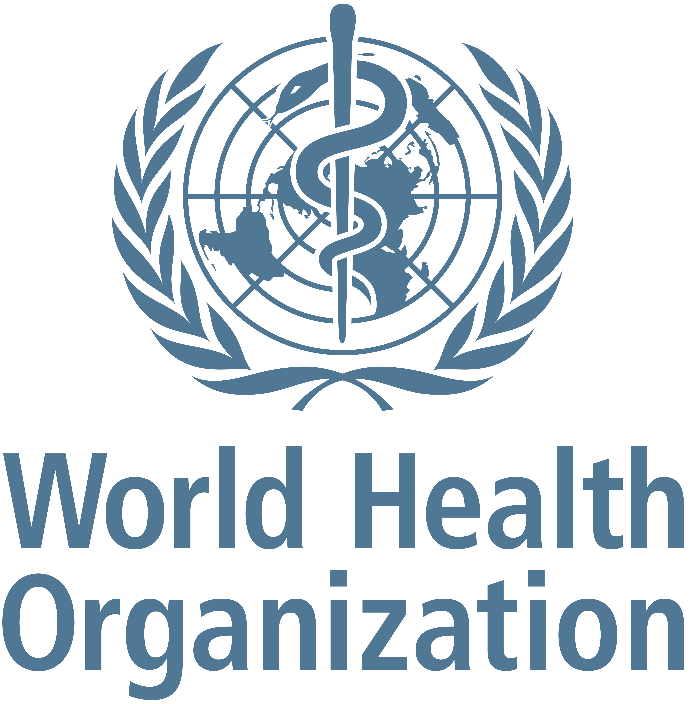
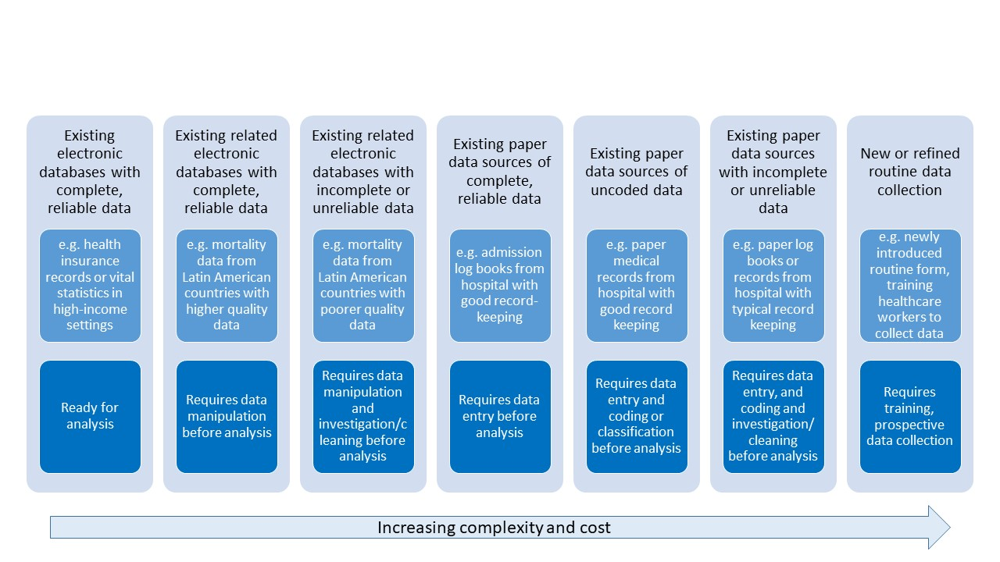
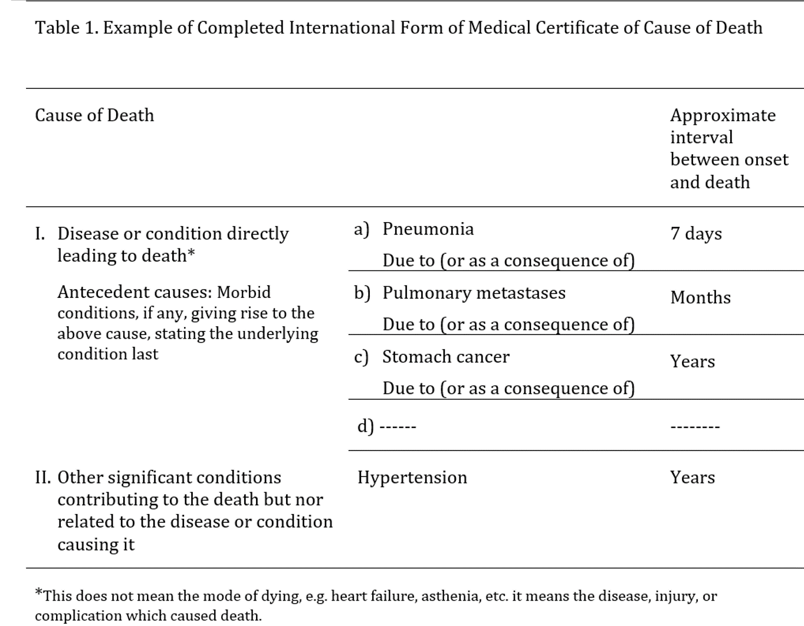

---
title: Measuring the impact of new vaccines using mortality and administrative
  hospitalization data
subtitle: Pneumococcal conjugate vaccine as a case study
output:
  rmdformats::readthedown:
    code_folding: hide
    css: ../stylesreadthedown.css
    lightbox: no
    self_contained: yes
    thumbnails: no
    toc_depth: '3'
  html_document:
    toc: yes
    toc_depth: '3'
    df_print: paged
  word_document:
    toc: yes
    toc_depth: '2'
--- 

```{r setup, include=FALSE}
#library(RCurl)
#devtools::install_github("gforge/c")
library(InterventionEvaluatR)
library(lubridate)
library(rmdformats)
library(htmlTable)
library(Gmisc)
knitr::opts_chunk$set(echo = FALSE)

data(pnas_brazil, package = "InterventionEvaluatR") #load the data
br1<-pnas_brazil
br1$date<-as.Date(br1$date)

data(ecuador_mortality, package = "InterventionEvaluatR") #load the data
ecuador_mortality$monthdate<-as.Date(ecuador_mortality$monthdate)
ecuador_mortality$date<-ecuador_mortality$monthdate


#
#https://medium.com/@arinbasu/a-tutorial-on-how-to-interface-an-r-notebook-with-overleaf-11f23c306cfd
```

```{r knitr-logo, out.width='50%', fig.show='hold',fig.align="center"}
#
```
<br>

WHO working group on the use of administrative data to evaluate the impact of pneumococcal conjugate vaccines:
 
* Adam Cohen (World Health Organization)
* Lucia Helena De Oliveira (Pan American Health Organization)
* Fernanda Lessa (Centers for Disease Control and Prevention)
* Jennifer Loo Farrar (Centers for Disease Control and Prevention)
* Tomoka Nakamura (World Health Organization)
* Cristiana Toscano (Universidade Federal de Goiás)
* Daniel Weinberger (Yale School of Public Health)

## Overview and how to use this guide
This document provides an introduction to the use of administrative data for evaluating vaccines. Administrative data include routinely collected hospitalization and healthcare data as well as mortality data. We discuss the motivation and need for studies of vaccine impact, present common data sources, discuss key considerations for analysis and different study designs, and provide an overview of common analysis types and their strengths and limitations. There is also a detailed case study, with a focus on data management and formatting, analysis, and interpretation. There is an accompanying practical data analysis example that guides the reader through the process of data cleaning and processing, analysis, and interpretation. This example is implemented in the R statistical software, which is a free and open source software.  

Many of the examples in this document focus on pneumococcal conjugate vaccines (PCVs). The evaluation of PCVs on pneumococcal disease is a good exemple. Pneumococcal disease represents a large public health burden globally and there has been a large effort to introduce these vaccines around the world. Yet PCVs are costly, so it is important to rigorously evaluate their public health impact. Administrative data have been used widely for the evaluation of PCVs in different settings. While the examples in this document focus on PCVs, the principles discussed and the methods readily extend to the evaluation of other vaccines and other public health interventions.


## What is vaccine 'impact'?
Efficacy studies are needed for licensure of new health technologies, including vaccines. Such studies, conducted as clinical trials, provide a measure of proportional reduction of disease in a vaccinated group compared to an unvaccinated group. However, in addition to being conducted in a scenario of ideal conditions, efficacy studies are limited to etiologically confirmed disease, and focus on individual level effects only. Once a vaccine is licensed and introduced in the population, post-licensure studies are required to measure vaccine effectiveness and impact of vaccination programs on the population [Hanquet G, 2013].

In contrast with vaccine efficacy studies, vaccine effectiveness studies are post-licensure studies in which the actual performance of a vaccine at population level is measured. Both vaccine efficacy and effectiveness can be based on individual or cluster randomized designs and can report direct and indirect effects of vaccines. Direct effect is the protective effect that a vaccinated individual gains from receiving the vaccine. Indirect effect corresponds to the reduction of infection in immunized and unimmunized individuals that results from reducing transmission from immunized individuals. The total effect or “vaccine impact”  is the combined reduction in disease resulting from both direct and indirect effects and represents the difference in disease rates between a population that has received the vaccine with a hypothetical population that had not used the vaccine [Saadatian-Elahi M, 2016]. Vaccine impact will depend on vaccine uptake, population characteristics, and the strength of indirect effects. The impact of a vaccination program is measured by comparing populations with and without a vaccination program, most commonly the same population before and after vaccination. [Hanquet, 2013]

Conducting robust and credible evaluations of the public health impact of interventions is challenging. Real-world data are complex, and decisions about how to clean, format, analyze, and interpret the data can influence the conclusions about the impact of the intervention. 

The assessment of vaccination through ecologic study design using aggregate data, such as interrupted time series and before-after studies, provide measures of impact that combine direct effects, related to individual protection from immune response, and indirect effects including non-vaccinated subjects who benefitted from reduced circulation of the pathogen. On the other hand, effectiveness measurements based on observational study designs, such as cohort and case-control studies, estimate the proportion of cases prevented in vaccinated subjects that were attributable to vaccination excluding indirect effects [Hanquet, Vaccine 2013]

Both primary and secondary data can be used for health impact assessment purposes. Primary data are prospectively-gathered data from a variety of sources, including population-based surveillance, sentinel site surveillance, periodic surveys, or nationally notifiable disease surveillance.

Secondary data sources are existing data collected for another purpose, such as routine hospital clinical and administrative data, hospitalization data from a network of hospitals of a given healthcare system, and national mortality data. Such secondary data sources are a potential source of information which have been successfully used to assess the impact of various vaccines, including rotavirus vaccines on diarrheal disease, Hib vaccines on invasive bacterial disease, and PCV on pneumonia hospitalization and mortality. One type of secondary data is administrative data, which are data routinely collected for administrative purposes (including claims, billing, and health records), which may or may not be electronic.

Considering available electronic administrative data in health care, Figure 1 below depicts the spectrum of data considering availability, type of data, data processing and cleaning requirements prior to analysis, complexity, and costs.


```{r, out.width='100%', fig.align="center"}

```

*Source: Jennifer Verani, Centers for Disease Control and Prevention – Kenya, slideset on “Using administrative data to measure PCV impact in Africa”*


A significant increase in the number of studies on vaccine impact has been observed in recent years. Most published studies on vaccine impact assessment used secondary data from health information systems, surveillance systems, and other sources, while few studies used primary data.

Several outcomes can be considered when assessing vaccine impact. For instance, pneumococcus causes a variety of syndromes, these can include acute otitis media events, invasive bacterial disease (suspected, probable or confirmed), pneumonia (clinical or X-ray confirmed), severe pneumonia (usually measured as hospitalized pneumonia), and mortality (due to invasive bacterial disease, pneumonia, or all-cause mortality). 

One must consider the estimated effect of the vaccine in the various outcomes of interest in the pre-licensure clinical trials, in order to plan the outcome of interest to be considered in impact assessment studies. For instance, randomized controlled trials of pneumococcal conjugate vaccines in the Gambia estimated a 35% decline on radiological pneumonia, 18% decline on hospitalized/severe pneumonia, and 13% decline in mortality [MacKenzie, *Vaccine*, 2014]. With a larger relative effect, it will often be easier to detect this decline in analyses of population-level trends. With smaller effects, the analyses become more challenging. For more specific outcomes (e.g., invasive pneumococcal disease), the expected effect will be large, while for less specific outcomes (e.g., clinical pneumonia), the pathogen of interest comprises a smaller fraction of cases, and the expected effect will be smaller.

As severe disease (hospitalization) and mortality outcomes are the most relevant outcomes of interest from a public health perspective, it is expected that secondary data will be the most used data sources for the purpose of PCV impact assessment.

In most countries where routinely collected secondary data on hospitalization and mortality are available, it is possible to evaluate vaccine impact after its introduction into the program. We thus focus this guidance document on these two data types and their potential sources.


```{r, eval=F}

ds<- cbind.data.frame(
  c("California-PCV7","Gambia-PCV9 (PCV7+1,5)", "South Africa-PCV9", "Philippines-PCV11 (never licensed)", "Latin America- PCV10"),
  c('21%', '35%*', '21%', '23%','23%'),
  c(NA, '18%',NA , NA, NA),
  c(NA, "13%", NA, NA, NA)
)
rownames(ds)<-NULL
names(ds)<-c('Trial', 'Effect on radiological pneumonia', 'Effect on severe/hospitalized pneumonia', 'Effect on mortality' )
tab1 <- htmlTable(ds, 
          tfoot="*Mackenzie GA, Vaccine 2014"
)
tab1

```

As severe disease (hospitalization) and mortality outcomes are the most relevant outcomes of interest from a public health perspective, it is expected that secondary data will be the most used data sources for the purpose of PCV impact assessment.

In most countries in world where routinely collected secondary data on hospitalization and mortality is available, it is possible to evaluate vaccine impact after its introduction into the program. We thus focus this guidance document in these two data types and its potential sources.


##	Defining the study question and objectives 
In order to assess the impact of an intervention in a given population, the investigator should structure the study question considering the PICO strategy. As such, the following should be identified:

- P - the target population in which the impact of the intervention is to be measured

- I - the intervention and date of intervention

- C - the comparator (disease or group of diseases to which the outcome will be compared with), which is not expected to be impacted by the intervention

- O - the outcome of interest, i.e., what is the condition being evaluated which is expected to be impacted by the intervention

The comparator considered will depend on the methodology of the study and will be discussed in further detail in the methods section of this document.

The outcome will be defined depending on the intervention being evaluated. For example, for pneumococcal vaccines, outcomes can be invasive disease, meningitis, pneumonia, otitis, or other syndromes prevented by the vaccine. For rotavirus vaccine, the outcome can be diarrhea, and so forth.


## Mortality data from Vital Statistics 

Many decision-makers are very interested in the potential of PCVs to prevent deaths. However, mortality is a less frequent outcome. Evaluating changes in all-cause mortality is difficult because the pathogen of interest will cause a relatively small fraction of all deaths. An alternative is to evaluate the impact of PCVs on mortality due to pneumonia, which is more specific to pneumococcus than all-cause death. Still, pneumococcus is just one of many pathogens that can cause pneumonia; therefore, the relative decline in disease rates due to the vaccine might be modest.

Information on mortality, natality, and migration is fundamental to the study of a population’s demographic dynamic. Together with information from population censuses, it also provides the basic data for estimating life expectancy and constructing other important sociodemographic and health indicators. Mortality statistics are widely used in health situation analysis, whether for different populations at a single point in time or for a single population at different times. This analysis is usually accompanied by specific information disaggregated by age, sex, causes of death. (PAHO, 2018)
The availability of nationally representative mortality data from mortality registries render death as an important outcome measure to evaluate health programs and interventions.

Vital statistics systems based on civil registration are the basic source of information for mortality analysis. The majority of countries in the world have vital statistics systems based on civil registration, an act whose legal purpose is the official registration of vital events (births, deaths, marriages, divorces, adoptions, etc.). (PAHO, 2018) In the mid-20th century, in order to provide countries with uniform statistical standards, concepts, and definitions to improve international comparability, the United Nations (UN) published a Handbook of Vital Statistics Methods. This was followed by the Principles and Recommendations for a Vital Statistics System, approved in 1970 and published by the UN in 1973. (PAHO, 2018)

According to the UN definition, “Civil registration is defined as the continuous, permanent, compulsory and universal recording of the occurrence and characteristics of vital events, in particular, events concerning the marital status of persons, as provided by decree or regulation, in accordance with the legal requirements in each country.” (United Nations, 2003:7).

A vital statistic system is defined as “the total process consisting of a) collecting information by civil registration or enumeration on the frequency of occurrence of specified and defined vital events, as well as relevant characteristics of the events themselves and of the person or persons concerned, and b) compiling, processing, to analyzing, evaluating, presenting and disseminating these data in statistical form.” (United Nations, 2003:5) This process is mandated by law, and is standardized across countries, requiring deaths to be registered through a medical death certificate that must be completed by a physician or legally authorized individual. The death certificate must contain information on characteristics of the deceased, the circumstances of the death, and the cause or causes of death. The death certificate and the reporting of deaths are standardized, with most countries in the world following the United Nations’ Principles and Recommendations for a Vital Statistics System (United Nations, 2003).

The international medical certificate of death is internationally used and recognized, consisting of two parts. Part I, devoted to the causes intervening in the causal chain, and Part II, devoted to the causes that, outside the chain, contributed to the fatal outcome.

The Table below shows an example of a completed form of Medical Certificate of cause of death [PAHO, 2018 Basic Guidelines for the analysis of Mortality]

```{r, out.width='100%', fig.show='hold',fig.align="center"}

```
 
Part I indicates the following causes of deaths: a) direct cause of death: the one that finalizes the process and, without leading to another cause, directly ends the person’s life. b) Intermediate or intervening cause(s): as the name indicates, the cause or causes in the middle of the process. c) Originating antecedent cause (OAC): this is what is entered on the last line, because it engendered all the causes entered on the lines above it.
Part II of the certificate will record other pathological states or diseases that, not having been part of the causal chain, contributed to the death simply because they were present. These states are known as contributing causes. The underlying cause of death (UCDDC) is defined as: “(a) The disease or injury which initiated the train of morbid events leading directly to death, or (b) the circumstances of the accident or violence which produced the fatal injury.” If the causes were entered correctly into the cause of death form/death certificate, the cause on the last line (OAC) will be the one selected as the UCD.

Most countries use the International Statistical Classification of Diseases (ICD), a nomenclature system for diseases standardized by WHO for reporting diseases and health conditions. Most common diseases, injuries, disorders and other medical conditions are classified under ICD. The ICD has approximately 15,000 unique codes. The ICD has different revisions; the one currently used by most countries is the 10th edition (ICD-10). A specific ICD-10 code will be assigned for each cause entered on the death certificate, considering the diverse ways in which the different causes can be stated by the physician. The cause of death for primary tabulation by a single cause will be the UCD. (WHO, 2004)

The 11th edition of the ICD (ICD-11) has been launched recently, but very few countries in the world are using the updated edition (WHO, 2018). ICD is the foundation for the identification of health trends and statistics globally, and the international standard for reporting diseases and health conditions. It is the diagnostic classification standard for all clinical and research purposes. ICD defines the universe of diseases, disorders, injuries and other related health conditions, listed in a comprehensive, hierarchical fashion that allows for easy storage, retrieval and analysis of health information for evidenced-based decision-making; sharing and comparing health information between hospitals, regions, settings and countries; and data comparisons in the same location across different time periods. (WHO, 2018)

The countries’ death information is usually compiled in electronic files containing all registered deaths. Mortality data repositories are available at National and International level, as all countries report and share their mortality data with WHO Regional Offices. WHO provides raw data files on its website. These files contain a regional mortality database and are presented in a standard format that can be processed with most of the available computer software. The data contain annual information on deaths for each country in the region, disaggregated by country of origin, sex, age of the deceased, cause of death (through various groupings), and details about the information sources and their availability (some countries submit information from estimates and others, from permanent universal registries). (WHO, 2015).


## Hospitalization data from administrative sources 
In most countries, patients with more severe disease are hospitalized. Therefore, pneumonia hospitalizations are proxies for severe pneumonia cases. In most settings, administrative data from hospitalizations are recorded and can contain individual level basic information of each patient, including age, date of hospitalization and discharge and admission/discharge diagnosis, coded by ICD codes. Thus, data from single hospitals, from a network of hospitals from a healthcare provider, and from national public healthcare systems, are useful sources of information to evaluate trends of hospitalizations and assess impact of vaccines in severe disease over time.
Hospitals are reimbursed for healthcare services provided, and thus detailed administrative data on every hospitalization is collected, for medical claims. This is different, and in addition, to hospital-based surveillance of selected syndromes and health conditions that may be in place in a given hospital or network of healthcare service providers. The hospital reimbursement process is complex and various approaches exist, varying by country and even within countries by healthcare structure and type. Furthermore, coverage, access, quality of healthcare service are variables that may change over time significantly influencing hospitalization rates. And the use of certain diagnostic codes can change over time as well.

As such, in addition to the challenges of obtaining good quality hospitalization data, estimates of vaccine impact based on hospitalization data may be particularly prone to confounding, as hospitalization rates are tightly linked to changes in the quality, access and use of the healthcare system, which often occur simultaneously with the introduction of new vaccines [Schuck-Paim, Vaccine 2017].

Unlike mortality data from vital statistics, hospitalization data are usually not standardized, are governed by privacy restrictions, and are very rarely shared with international organizations or other institutions outside of the country. Although the type and quality of data vary, most hospitals collect information on the age, date of admission and discharge, outcome (e.g., discharged, transferred, died), and admission and discharge diagnosis for each individual hospitalization claim. Newly admitted patients are assigned a diagnosis code upon admission to the hospital. Usually, diagnoses are recorded using standardized ICD codes. This code indicates the initial diagnosis at the time of admission. The principal discharge diagnosis is the condition that occasioned the need for hospitalization, which is determined after the patient has been thoroughly examined and completed the diagnostic examinations. As such, the discharge diagnosis can be different from the admission diagnosis, and if correctly recorded should more accurately represent the true condition that originated the need for hospitalization. For this reason, discharge diagnoses are usually considered for epidemiologic evaluations and in particular impact assessment evaluations. Evidence indicates that the discordance between admission and discharge diagnoses are more significant in selected conditions and syndromes, and this is particularly true for hospitalizations due to respiratory conditions, including pneumonia [Zikos 2019]. Nonetheless, as hospitalization discharge diagnoses are mainly used for reimbursement purposes, biases in coding are often present depending on the reimbursement and payment system in place, leading to an over indication of codes related to diseases which are reimbursed at higher values.  


## Study design 

### Overview
Observational studies present the opportunity to evaluate vaccine effectiveness and impact in a real world setting; however, these observational studies present a number of analytical challenges. The introduction of vaccines often occur concurrently with other public health and social interventions that can influence disease rates. Other relevant factors include changes in social welfare systems, changes in the capacity of the healthcare system, changes in the efficiency of registering hospitalizations and deaths, and changes in the use of pharmacological interventions that could influence susceptibility (e.g., increasing use of antiretroviral therapy in sub-Saharan Africa). Because vaccines are sometimes introduced at the same time as these other changes, it can be challenging to attribute specific changes to the introduction of a vaccine. The methods that we will discuss here attempt to address this issue using different approaches and different assumptions. It is important to be aware of the assumptions and limitations of the different approaches.

### Posible study designs for impact assessment
The analytic goal is to disentangle changes in disease rates that are caused by the introduction of a vaccine program with changes that are due to these other factors. There are several approaches that could be taken. First, in a pre-licensure study, vaccine impact could be evaluated using a cluster-randomized study design, where disease rates are compared between spatial clusters that have been randomized to receive that vaccine or not. Assuming that there is no transmission between clusters, that the assignment of clusters was random and successful (i.e., that the vaccinated and unvaccinated clusters are comparable), this provides an unbiased estimate of the total effect of the vaccine.

In a *post-licensure setting*, the cluster-randomized design can be approximated by using a ‘step-wedge’ study design. This design can be implemented in settings where the vaccine has not yet been introduced orwhere it might not be feasible to fully introduce the vaccine to the entire population. With this design, geographic units are randomized to receive the vaccine earlier or later. All geographic units eventually receive the vaccine. With this phased rollout, the geographic units that introduce the vaccine later serve as controls for the geographic units that introduce the vaccine earlier. Because the geographic units that comprise the control group are changing over time and the comparisons between the vaccinated and unvaccinated groups is taking place over some time period, estimates of vaccine impact could be confounded by underlying temporal trends. Therefore, it is important to appropriately adjust for time-varying rates of disease when analyzing these studies.

In most settings, such controlled roll-outs of vaccines are not possible. Therefore, the most common study designs are purely observational, in which changes in disease rates are evaluated over time or between regions. Caution needs to be used when performing and interpreting these studies to ensure that factors unrelated to vaccination are appropriately adjusted in the analysis. This guide will focus on the analysis situation where there is a single time series of interest from a country or region and the goal is to detect changes in incidence following vaccine introduction from this time series. When time series from multiple subnational regions are available, additional types of analyses are possible, including spatiotemporal analyses in which the declines in regions with higher or lower coverage are compared.

Interrupted time series analysis is among the most common approaches to assess population-level impact of new vaccines [Lopez Bernal, Int Journ Epid, 2017, Penfold, Acad Pediatr 2013, Ramsay CR, Int J Technology Assessment in Health, 2003]. Interrupted time series analysis allows for adjustments in annual variations, secular disease trends and changes in health care use, among other factors [Hanquet, Vaccine 2013]. Nonetheless, as other authors have reported in developed countries, methodological challenges exist when assessing vaccine impact, particularly considering PCVs [Hanquet, Vaccine 2013]. Evaluations of time trends can be made more robust by including control time series. These can include time series for other causes of disease that are not influenced by the vaccine or time series from other geographic units that did not receive vaccine. By comparing trends in the time series of interest with these control/comparator time series, more robust estimates can be obtained. This can be accomplished in the framework of interrupted time series analysis when a small number of controls is used. When multiple controls are available, they can be synthesized using  an approach called ‘synthetic controls’  [Bruhn, PNAS 2017] (see later sections for details). 

Further, additional methodological recommendations have been proposed for improving the assessment of population level vaccine impact analyses, which could increase the accuracy, reproducibility, and comparability of such studies [Bruhn, Epidemiology 2017].


### Counterfactuals: What would have happened without a vaccine?
With any analysis of vaccine impact, the goal is to compare the observed disease rates in the post-vaccine period with an estimate of what would have happened if the vaccine had not been introduced. This value is called the **counterfactual**. There are many ways to estimate counterfactuals from very simple approaches (as is done in pre/post comparison of incidence) to more complex approaches that adjust for trends and dynamics of the disease. In each of the following sections, we will discuss different methods to obtain this quantity.

## Key considerations for analysis

### Denominators
It is common when analyzing trend data to analyze changes in incidence (i.e., cases/population size) rather than the raw number of cases. The assumption here is that the number of cases should scale with population size. However, when using administrative data, a population denominator might not effectively adjust for underlying change. Often, the administrative database does not cover the entire population, or other factors (e.g., access to healthcare) are larger drivers of trends than population size. Using alternative denominators, such as total number of hospitalizations for the age group of interest, can sometimes be a more effective approach (see Schuck-Paim et al., *Vaccine* 2017). Whatever the chosen denominator, it can either be included as an offset term (regression coefficient is held to 1), or as a covariate in a regression model.

### Transition period
After a vaccine is formally introduced into a national immunization program, it takes time to implement the vaccine and vaccinate a large proportion of eligible infants (e.g., achieve high vaccination coverage). Additionally, it takes time for children who are vaccinated as infants to become toddlers (an age group that might be more important for transmitting pneumococcus). Due to these considerations, a transition period is typically defined to allow the program to reach maturity before trying to estimate changes in disease rates. The data are therefore subset into a pre-vaccine period, a transition period, and a post-vaccine period, and vaccine impact is defined by comparing the post-vaccine period and the pre-vaccine period, while ignoring the transition period. The length of transition period depends on how quickly the vaccine program is implemented and how quickly adequate vaccine uptake is reached. In most settings, 1-2 years are defined as the transition period. In many of the Latin American countries, 3-dose coverage of PCV rapidly reached a plateau of high uptake  within a year, so a 12-month transition period was used.

### How many years of data are required?
In many instances, vaccines are introduced in the context of unrelated changes that influence disease rates. Changes in the underlying health of the population (e.g., due to changes in social welfare programs, declines in indoor air pollution), changes in healthcare utilization, and changes in coding can all affect the reported rates of disease. Therefore, it is important to have sufficient data from the pre-vaccine period to detect and adjust for such trends. *At least 4-5 years* of pre-vaccine data are typically needed to adequately adjust for existing trends in the data. This is often context specific and depends on the particular factors driving underlying trends. Analyses using fewer years of pre-vaccine data should be interpreted with **extreme caution**.

Likewise, it is ideal to accumulate several years of post-vaccine data prior to evaluating vaccine uptake. This allows the vaccine program to mature. Additionally, pneumonia rates during short periods of observation can be strongly influenced by short epidemics such as those caused by influenza or RSV. This can potentially obscure or exaggerate the true vaccine effects. The number of years needed depends on the characteristics of the data. Simulation studies can be used to determine how many years are needed (Weinberger ad Warren, *Gates Open Research*, 2020), but typically at least 3-4 years are needed before there is reasonable power to detect a decline.

### What to do if you have an epidemic disease
All of these methods assume that the disease patterns follow a predictable pattern and can be captured either using a straight line relationship (ITS), or that the relationship with control variables is stable. Therefore, these methods are generally only appropriate for **endemic** diseases. For diseases that are epidemic or emergeing (e.g., COVID-19, meningococcal meningitis), other approaches might be required that account for the dynamics of the pathogen and the build-up of immunity in the population. If the epidemic is widespread but the intervention is limited to a smaller region, it might be possible to use the time series from an unvaccinated control population (e.g., another region within the country) as the control variable to generate a counterfactual in a synthetic control-type analysis. Or it might be necessary to use a dynamic transmission model that can capture non-linear dynamics (e.g., a compartmental model with Susceptible, Infected, and Resistant classes).

##	Types of analyses
In this context, a time series is defined as a variable in which the number of cases is tallied over time by a chosen unit (e.g., week, month, quarter, year). The goal for the analysis is to detect changes in the average number of cases or incidence over time.

In the following sections, we will look at 2 examples: Hospitalizations due to pneumonia among children 3-11 months of age in Brazil, and deaths due to pneumonia among children 2-59 months of age in Ecuador. These provide a useful contrast. The dataset from Brazil is more stable during the pre-vaccine period, and there is less unexplained noise. In contrast, in Ecuador, there is a strong downward trend in deaths prior to vaccine introduction. In Brazil, the results are less sensitive to the model choice, while in Ecuador, it varies notably. In both datasets, pneumonia is defined based on ICD10 codes (J12-J18).


```{r}
#Setup the data

intro.date<-as.Date('2010-03-01')
intro.date.minus.one<-intro.date %m-% months(1)
eval.date<-as.Date('2011-03-01')
outcome.name<-'J12_18'
offset.name<- "ach_noj"
first.date<-as.Date("2004-01-01")
last.date<-as.Date("2013-12-01")
kids<-br1[br1$age_group==1,]
kids<-kids[kids$date<=last.date & kids$date>=first.date,]
kids$month<-as.factor(month(kids$date))

intro.date2<-as.Date('2010-08-01')
intro.date.minus.one2<-intro.date2 %m-% months(1)
eval.date2<-as.Date('2011-08-01')
outcome.name2<-'J12_J18_prim'
offset.name2<-'acm_noj_prim'
first.date2<-as.Date("2005-01-01")
last.date2<-as.Date("2015-12-01")
kids2<-ecuador_mortality[ecuador_mortality$age_group=='ec 2-59m A',]
kids2<-kids2[kids2$monthdate<=last.date2,]
kids2$month<-as.factor(month(kids2$monthdate))


```

```{r, fig.width=10, fig.height=3}
par(mfrow=c(1,2))
plot(kids$date, kids[,outcome.name], type='l', bty='l', ylab="N Hosp.", xlab='date', ylim=c(0, max(kids[,outcome.name])), main='Time series of pneumonia hosp (Brazil)')
abline(v=intro.date, lty=2, col='gray')

plot(kids2$date, kids2[,outcome.name2], type='l', bty='l', ylab="N Deaths", xlab='date', ylim=c(0, max(kids2[,outcome.name2])), main='Time series of pneumonia deaths (Ecuador)')
abline(v=intro.date2, lty=2, col='gray')
```

### Pre-Post comparison
The simplest possible analysis approach is to compare the average number of cases or incidence in the post-vaccine period with that in the pre-vaccine period (a ‘pre-post comparison’ study). This method is easy to implement and easy to understand. The analyst needs to define the pre-vaccine period and the post-vaccine period. Typically, the first year or two after vaccine introduction are excluded from the analysis because vaccine coverage has not yet reached full coverage levels. The decision about where to set the pre- and post-vaccine periods should be made a priori and should not be influenced by observed aberrations in the data (unless these are due to a known data quality issue); otherwise the estimation of the variability in disease rates will not be accurate.

```{r, fig.width=10, fig.height=3}
mean.pre<-mean(kids[,outcome.name][kids$date< intro.date])
mean.post<-mean(kids[,outcome.name][kids$date>=eval.date])

par(mfrow=c(1,2))
plot(kids$date, kids[,outcome.name], type='l', bty='l', ylab="N Hosp.", xlab='date', ylim=c(0, max(kids[,outcome.name])), main='Pre-post comparison (Brazil)')
abline(v=intro.date, lty=2, col='gray')
arrows(x0=first.date, x1=intro.date.minus.one , y0=mean.pre, length=0, col='#1b9e77')
arrows(x0=eval.date, x1=last.date , y0=mean.post, length=0, col='#7570b3')

mean.pre<-mean(kids2[,outcome.name2][kids2$date< intro.date2])
mean.post<-mean(kids2[,outcome.name2][kids$date>=eval.date2])
plot(kids2$date, kids2[,outcome.name2], type='l', bty='l', ylab="N Deaths", xlab='date', ylim=c(0, max(kids2[,outcome.name2])), main='Pre-post comparison (Ecuador)')
abline(v=intro.date2, lty=2, col='gray')
arrows(x0=first.date2, x1=intro.date.minus.one2 , y0=mean.pre, length=0, col='#1b9e77')
arrows(x0=eval.date2, x1=last.date2 , y0=mean.post, length=0, col='#7570b3')

```

**Counterfactual** 
In this study design, it is assumed that if the vaccine had not been introduced, the incidence rate after vaccine introduction would be the same as the incidence of disease before vaccine introduction. Therefore, the counterfactual is simply the average incidence in the pre-vaccine period, and the comparison is with incidence in the post-vaccine period. In the plot below, the counterfactual is shown with a dotted line. Comparing the counterfactual with the observed mean for the post-period gives an estimate of the vaccine effect.


**Simple pre-post comparison**

```{r, fig.width=10, fig.height=3}
mean.pre<-mean(kids[,outcome.name][kids$date<intro.date])
mean.post<-mean(kids[,outcome.name][kids$date>=eval.date])

par(mfrow=c(1,2))
plot(kids$date, kids[,outcome.name], type='p',pch=16,cex=0.75, bty='l',col='lightgray', ylab="N hosp.", xlab='date', ylim=c(0, max(kids[,outcome.name])), main='Counterfactual (Brazil)')
arrows(x0=first.date, x1=intro.date.minus.one , y0=mean.pre, length=0, col='#1b9e77')
arrows(x0=eval.date, x1=last.date , y0=mean.post, length=0, col='#7570b3')
arrows(x0=eval.date, x1=last.date , y0=mean.pre, length=0, col='#d95f02', lty=3)
abline(v=intro.date, lty=3, col='gray')
abline(v=eval.date, lty=3, col='gray')
text(last.date, mean.pre*1.2, 'Counterfactual', col='#d95f02', cex=0.8,pos=2, offset=0)
text(last.date, mean.post*0.8, 'Fitted', col='#7570b3', cex=0.8,pos=2, offset=0)

mean.pre<-mean(kids2[,outcome.name2][kids2$date< intro.date2])
mean.post<-mean(kids2[,outcome.name2][kids$date>=eval.date2])
plot(kids2$date, kids2[,outcome.name2], type='l', bty='l', ylab="N Deaths", xlab='date', ylim=c(0, max(kids2[,outcome.name2])), main='Counterfactual (Ecuador)')
abline(v=intro.date2, lty=2, col='gray')
arrows(x0=first.date2, x1=intro.date.minus.one2 , y0=mean.pre, length=0, col='#1b9e77')
arrows(x0=eval.date2, x1=last.date2 , y0=mean.post, length=0, col='#7570b3')
arrows(x0=eval.date2, x1=last.date2 , y0=mean.pre, length=0, col='#d95f02', lty=3)
text(last.date2, mean.pre*1.2, 'Counterfactual', col='#d95f02', cex=0.8,pos=2, offset=0)
text(last.date2, mean.post*0.8, 'Fitted', col='#7570b3', cex=0.8,pos=2, offset=0)


```

**Calculation of vaccine impact** 

The most common statistic reported from a pre/post comparison study is a rate ratio, which is simply calculated as follows:

(Average Incidence Post-Vaccination)/(Average Incidence Pre-Vaccination). 

Values <1 are considered evidence that the disease rates have declined. It is also possible to calculate a rate difference to obtain the number of cases prevented.

**Assumptions** This analysis assumes that the only change in disease rates that is occurring over time is due to the vaccine. This is rarely a realistic assumption. **Therefore, this is a weak study design, and the results should be interpreted with caution.** For instance, there is a declining trend in Ecuador, which is ignored in this analysis.

**Pre-post comparison, adjusted for seasonality** 
Adjusting for seasonality can be useful if the vaccine is introduced mid-year (during the seasonal epidemic), so there is an imbalance in which months are in the pre- and post-vaccine periods. Seasonality can be adjusted in a number of ways, including using categorical/dummy variables representing the different months as covariate in the regression, using harmonic terms (Fourier series) to capture annual or biannual cycles, or fitting flexible splines that vary by week of the year.  Each of these approaches have the same goal, which is to adjust the average level based on the time of year.

```{r, fig.width=10, fig.height=7}
par(mfcol=c(2,2))
month<-as.factor(month(kids$date))
kids$period<-0
kids$period[kids$date>=intro.date  ] <-1
kids$period[kids$date>=eval.date  ]<-2
form1<-as.formula(paste0(outcome.name,'~month+as.factor(period)'))
mod1<-glm(form1,family='quasipoisson', data=kids )
pred1<-predict(mod1, type='response')
kid.counter<-kids
kid.counter$period<-as.factor(0)
pred1.counter<-predict(mod1, type='response', newdata=kid.counter)
pred1.counter.post<-pred1.counter
pred1.counter.post[kids$date<=eval.date] <-NA
pred1.pre<-pred1
pred1.pre[kids$date>=intro.date]<-NA
pred1.post<-pred1
pred1.post[kids$date<eval.date]<-NA
plot(kids$date, kids[,outcome.name], type='p', pch=16, bty='l', ylab="N hosp.", col='gray', cex=0.7,  xlab='date', ylim=c(0, max(kids[,outcome.name])),main='Brazil' )
points(kids$date,pred1.pre, type='l' ,col='#1b9e77' )
points(kids$date,pred1.post, type='l' , col='#7570b3' )
points(kids$date,pred1.counter, type='l', col='#d95f02', lty=3  )
abline(v=intro.date, lty=3, col='gray')
abline(v=eval.date, lty=3, col='gray')
rr.pre.post<- pred1/pred1.counter
plot(kids$date, pred1/pred1.counter, type='l', bty='l', ylab="Rate Ratio", xlab='date',main='Rate ratio', ylim=c(0.5,1.2))
abline(h=1, lty=2, col='gray')

month<-as.factor(month(kids2$date))
kids2$period<-0
kids2$period[kids2$date>=intro.date2  ] <-1
kids2$period[kids2$date>=eval.date2  ]<-2
form1<-as.formula(paste0(outcome.name2,'~month+as.factor(period)'))
mod1<-glm(form1,family='quasipoisson', data=kids2 )
pred1<-predict(mod1, type='response')
kid.counter<-kids2
kid.counter$period<-as.factor(0)
pred1.counter<-predict(mod1, type='response', newdata=kid.counter)
pred1.counter.post<-pred1.counter
pred1.counter.post[kids2$date<=eval.date2] <-NA
pred1.pre<-pred1
pred1.pre[kids2$date>=intro.date2]<-NA
pred1.post<-pred1
pred1.post[kids2$date<eval.date2]<-NA
plot(kids2$date, kids2[,outcome.name2], type='p', pch=16, bty='l', ylab="N Deaths", col='gray', cex=0.7,  xlab='date', ylim=c(0, max(kids2[,outcome.name2])),main='Ecuador' )
points(kids2$date,pred1.pre, type='l' ,col='#1b9e77' )
points(kids2$date,pred1.post, type='l' , col='#7570b3' )
points(kids2$date,pred1.counter, type='l', col='#d95f02', lty=3  )
abline(v=intro.date2, lty=3, col='gray')
abline(v=eval.date2, lty=3, col='gray')
rr.pre.post2<- pred1/pred1.counter
plot(kids2$date, rr.pre.post2, type='l', bty='l', ylab="Rate Ratio", xlab='date',main='Rate ratio', ylim=c(0.5,1.2))
abline(h=1, lty=2, col='gray')


``` 


### Interrupted time series analysis (ITS) 
In many instances, there is an underlying trend in the time series that is unrelated to vaccination. Such a trend can be caused by a number of factors, including changes in healthcare access, changes in susceptibility of the population, and changes in the sensitivity of surveillance. Such trends can bias the estimates of vaccine impact if they are not properly controlled. The simplest approach to adjust for trends is to fit a straight line through the data and then test whether the slope of the line or the level of the line changes after vaccine introduction. This type of analysis is called segmented regression and can be accomplished by fitting a Poisson or negative binomial regression model, which are common regression approaches used when the outcome is a count variable (e.g., number of hospitalizations per week). A number of quantities can be estimated using these models, including the change in the slope of the trend line or in the average number of cases. However, it is often most useful to use the model to calculate the decline in incidence (rate ratio or rate difference) compared to what would be expected if the trend/level had remained constant. Seasonal variations and known trends can be adjusted in this model using regression covariates.

**Assumptions of ITS analysis**
A key assumption is that the linear trend in the pre-vaccine period captures the important underlying trends and that these trends would have continued at the same rate if the vaccine had not been introduced. Assumptions also need to be made about which time periods to include in the vaccine introduction period and whether the slope should level out after a certain amount of time (and how much time should be allowed) (see plots in next section). Some of these assumptions about the timing and shape of the trajectory can be relaxed by using a flexible spline to capture post-vaccine changes.

**Calculation of vaccine impact from ITS analysis** 
Vaccine impact is measured in a variety of ways with ITS models. Some authors report the change in the slope parameter or change in the level. However, these values are somewhat abstract and difficult to interpret from a public health standpoint. It is more useful to calculate a relative change in incidence (rate ratio) or an absolute change (rate difference) by comparing the fitted value from the regression with the counterfactual value.

**Variations of ITS models**
There are a number of ways to structure these models, but they typically include an index for time to capture the slope during the pre-vaccine period as well as terms that allow the slope or intercept to change in the post-vaccine period. The structure of the ITS model depends on how quickly you expect the vaccine effect to take hold. For instance, the change can be immediate (disjointed ITS) or more gradual. Some of these variations are detailed below. An excellent review of this topic is provided by Bernal, Cummins and Gasparrini (*Intl Journ of Epidem.*, 2017 (46)1: 348-355).

#### Disjointed ITS
In a disjointed ITS analysis, dummy variables (encoded 0 before vaccine introduction and 1 after vaccine introduction) are included to allow the level to change, and an interaction term between the dummy variable and the index for time allows the slope to change after vaccine introduction. In this model, the line segments fitted through the data do not connect (this can be clearly seen on the plot of rate ratios below). In practice, this can lead to strange and implausible shifts in the fitted values as shown in the plots of the rate ratio below. Here we have 3 time periods (pre-vaccine, 12-month ramp-up period, and post-vaccine period).

**ITS with disjointed segments**

```{r, fig.width=10 ,fig.height=7  }
kids$index<-1:nrow(kids) #creates an index for time
#kids$log.offset<-log(kids$acm_noj_prim)
kids$log.offset<-rep(0, nrow(kids))
form1<-as.formula(paste0(outcome.name,'~month+as.factor(period)*index'))
mod1<-glm(form1,family='quasipoisson', data=kids ,offset=log.offset)
pred1<-predict(mod1, type='response')
kid.counter<-kids
kid.counter$period<-as.factor(0)
pred1.counter<-predict(mod1, type='response', newdata=kid.counter)
pred1.counter.post<-pred1.counter
pred1.counter.post[kids$date<=eval.date] <-NA
pred1.pre<-pred1
pred1.pre[kids$date>=intro.date]<-NA
pred1.post<-pred1
pred1.post[kids$date<eval.date]<-NA
par(mfcol=c(2,2))
plot(kids$date, kids[,outcome.name], type='p', pch=16, bty='l', ylab="N hosp.", col='gray', cex=0.7,  xlab='date', ylim=c(0, max(kids[,outcome.name])), main='Brazil')
points(kids$date,pred1.pre, type='l' ,col='#1b9e77' )
points(kids$date,pred1.post, type='l' , col='#7570b3' )
points(kids$date,pred1.counter, type='l', col='#d95f02', lty=3  )
abline(v=intro.date, lty=3, col='gray')
abline(v=eval.date, lty=3, col='gray')
its.rr.disjoint<-pred1/pred1.counter
plot(kids$date, its.rr.disjoint, type='l', bty='l', ylab="Rate Ratio", xlab='date',main='Rate ratio', ylim=c(0.75,1.2))
abline(h=1, lty=2, col='gray')


kids2$index<-1:nrow(kids2) #creates an index for time
#kids2$log.offset<-log(kids2$acm_noj_prim)
kids2$log.offset<-rep(0, nrow(kids2))
form1<-as.formula(paste0(outcome.name2,'~month+as.factor(period)*index'))
mod1<-glm(form1,family='quasipoisson', data=kids2 ,offset=log.offset)
pred1<-predict(mod1, type='response')
kid.counter<-kids2
kid.counter$period<-as.factor(0)
pred1.counter<-predict(mod1, type='response', newdata=kid.counter)
pred1.counter.post<-pred1.counter
pred1.counter.post[kids2$date<=eval.date2] <-NA
pred1.pre<-pred1
pred1.pre[kids2$date>=intro.date2]<-NA
pred1.post<-pred1
pred1.post[kids2$date<eval.date2]<-NA
plot(kids2$date, kids2[,outcome.name2], type='p', pch=16, bty='l', ylab="N Deaths", col='gray', cex=0.7,  xlab='date', ylim=c(0, max(kids2[,outcome.name2])), main='Ecuador')
points(kids2$date,pred1.pre, type='l' ,col='#1b9e77' )
points(kids2$date,pred1.post, type='l' , col='#7570b3' )
points(kids2$date,pred1.counter, type='l', col='#d95f02', lty=3  )
abline(v=intro.date2, lty=3, col='gray')
abline(v=eval.date2, lty=3, col='gray')
its.rr.disjoint2<-pred1/pred1.counter
plot(kids2$date, its.rr.disjoint2, type='l', bty='l', ylab="Rate Ratio", xlab='date',main='Rate ratio', ylim=c(0.75,1.2))
abline(h=1, lty=2, col='gray')


```

#### ITS with connected segments

A better alternative is to use a linear spline, which forces the fitted line segments to connect. Since most vaccines roll out gradually, and there is unlikely to be an immediate drop, this is a more realistic way to model the data. We still have 3 line segments, but now they are connected.

**ITS with connected segments**

```{r, fig.width=10, fig.height=7}
par(mfcol=c(2,2))
kids$index<-1:nrow(kids) #creates an index for time
intro.date.index<-min(which(kids$date>=intro.date))
eval.date.index<-min(which(kids$date>=eval.date))
kids$spl1<- kids$index -  intro.date.index + 1
kids$spl2<- kids$index -  eval.date.index + 1
kids$spl1[kids$spl1<0]<-0
kids$spl2[kids$spl2<0]<-0
form1<-as.formula(paste0(outcome.name,'~month+ index +spl1 + spl2'))
mod1<-glm(form1 ,family='quasipoisson', data=kids,offset=log.offset )
pred1<-predict(mod1, type='response')
kid.counter<-kids
kid.counter$spl1<-0
kid.counter$spl2<-0
pred1.counter<-predict(mod1, type='response', newdata=kid.counter)
pred1.counter.post<-pred1.counter
pred1.counter.post[kids$date<=eval.date] <-NA
pred1.pre<-pred1
pred1.pre[kids$date>=intro.date]<-NA
pred1.post<-pred1
pred1.post[kids$date<eval.date]<-NA
#par(mfrow=c(2,1))
plot(kids$date, kids[,outcome.name], type='p', pch=16, bty='l', ylab="N hosp", col='gray', cex=0.7,  xlab='date', ylim=c(0, max(kids[,outcome.name])), main='Brazil')
points(kids$date,pred1.pre, type='l' ,col='#1b9e77' )
points(kids$date,pred1.post, type='l' , col='#7570b3' )
points(kids$date,pred1.counter, type='l', col='#d95f02', lty=3  )
abline(v=intro.date, lty=3, col='gray')
abline(v=eval.date, lty=3, col='gray')
its.rr.connected1<-pred1/pred1.counter
plot(kids$date,its.rr.connected1, type='l', bty='l', ylab="Rate Ratio", xlab='date',main='Rate ratio', ylim=c(0.75,1.2))
abline(h=1, lty=2, col='gray')

kids2$index<-1:nrow(kids2) #creates an index for time
intro.date.index<-min(which(kids2$date>=intro.date2))
eval.date.index<-min(which(kids2$date>=eval.date2))
kids2$spl1<- kids2$index -  intro.date.index + 1
kids2$spl2<- kids2$index -  eval.date.index + 1
kids2$spl1[kids2$spl1<0]<-0
kids2$spl2[kids2$spl2<0]<-0
form1<-as.formula(paste0(outcome.name2,'~month+ index +spl1 + spl2'))
mod1<-glm(form1 ,family='quasipoisson', data=kids2,offset=log.offset )
pred1<-predict(mod1, type='response')
kid.counter<-kids2
kid.counter$spl1<-0
kid.counter$spl2<-0
pred1.counter<-predict(mod1, type='response', newdata=kid.counter)
pred1.counter.post<-pred1.counter
pred1.counter.post[kids2$date<=eval.date2] <-NA
pred1.pre<-pred1
pred1.pre[kids2$date>=intro.date2]<-NA
pred1.post<-pred1
pred1.post[kids2$date<eval.date2]<-NA
#par(mfrow=c(2,1))
plot(kids2$date, kids2[,outcome.name2], type='p', pch=16, bty='l', ylab="N Deaths", col='gray', cex=0.7,  xlab='date', ylim=c(0, max(kids2[,outcome.name2])), main='Ecuador')
points(kids2$date,pred1.pre, type='l' ,col='#1b9e77' )
points(kids2$date,pred1.post, type='l' , col='#7570b3' )
points(kids2$date,pred1.counter, type='l', col='#d95f02', lty=3  )
abline(v=intro.date2, lty=3, col='gray')
abline(v=eval.date2, lty=3, col='gray')
its.rr.connected2<-pred1/pred1.counter
plot(kids2$date,its.rr.connected2, type='l', bty='l', ylab="Rate Ratio", xlab='date',main='Rate ratio', ylim=c(0.75,1.2))
abline(h=1, lty=2, col='gray')


```

#### ITS with leveling of the slope

This could be further modified to allow the slope to level out after a certain time period (in this example, the post-vaccine trend levels out 24 months after vaccine introduction). In the dataset from Brazil, the rate ratio levels off nicely, as we would expect. In Ecuador, the rate ratio initially declines then creeps back up before leveling out. This could reflect noise in the data from Ecuador.

**ITS with leveling of the trend and a single control variable**

```{r, fig.width=10, fig.height=7}
par(mfcol=c(2,2))
kids$index<-1:nrow(kids) #creates an index for time
intro.date.index<-min(which(kids$date>=intro.date))
eval.date.index<-min(which(kids$date>=eval.date))
kids$spl1<- kids$index -  intro.date.index + 1
kids$spl2<- kids$index -  eval.date.index + 1
kids$spl1[kids$spl1<0]<-0
kids$spl2[kids$spl2<0]<-0
kids$spl1[kids$spl1>36]<-36 #level off 24 months after spl2 starts
kids$spl2[kids$spl2>24]<-24 #Level off after 24 months
form1<-as.formula(paste0(outcome.name,'~month+ index +spl1 + spl2'))
mod1<-glm(form1 ,family='quasipoisson', data=kids,offset=log.offset )
pred1<-predict(mod1, type='response')
kid.counter<-kids
kid.counter$spl1<-0
kid.counter$spl2<-0
pred1.counter<-predict(mod1, type='response', newdata=kid.counter)
pred1.counter.post<-pred1.counter
pred1.counter.post[kids$date<=eval.date] <-NA
pred1.pre<-pred1
pred1.pre[kids$date>=intro.date]<-NA
pred1.post<-pred1
pred1.post[kids$date<intro.date]<-NA
#par(mfrow=c(2,1))
plot(kids$date, kids[,outcome.name], type='p', pch=16, bty='l', ylab="N hosp", col='gray', cex=0.7,  xlab='date', ylim=c(0, max(kids[,outcome.name])), main='Brazil')
points(kids$date,pred1.pre, type='l' ,col='#1b9e77' )
points(kids$date,pred1.post, type='l' , col='#7570b3' )
points(kids$date,pred1.counter, type='l', col='#d95f02', lty=3  )
abline(v=intro.date, lty=3, col='gray')
abline(v=eval.date, lty=3, col='gray')
its.rr.level<-pred1/pred1.counter
plot(kids$date, its.rr.level, type='l', bty='l', ylab="Rate Ratio", xlab='date',main='Rate ratio', ylim=c(0.75,1.2))
abline(h=1, lty=2, col='gray')


kids2$index<-1:nrow(kids2) #creates an index for time
intro.date.index<-min(which(kids2$date>=intro.date2))
eval.date.index<-min(which(kids2$date>=eval.date2))
kids2$spl1<- kids2$index -  intro.date.index + 1
kids2$spl2<- kids2$index -  eval.date.index + 1
kids2$spl1[kids2$spl1<0]<-0
kids2$spl2[kids2$spl2<0]<-0
kids2$spl1[kids2$spl1>36]<-36 #level off 24 months after spl2 starts
kids2$spl2[kids2$spl2>24]<-24 #Level off after 24 months
form1<-as.formula(paste0(outcome.name2,'~month+ index +spl1 + spl2'))
mod1<-glm(form1 ,family='quasipoisson', data=kids2,offset=log.offset )
pred1<-predict(mod1, type='response')
kid.counter<-kids2
kid.counter$spl1<-0
kid.counter$spl2<-0
pred1.counter<-predict(mod1, type='response', newdata=kid.counter)
pred1.counter.post<-pred1.counter
pred1.counter.post[kids2$date<=eval.date2] <-NA
pred1.pre<-pred1
pred1.pre[kids2$date>=intro.date2]<-NA
pred1.post<-pred1
pred1.post[kids2$date<intro.date2]<-NA
#par(mfrow=c(2,1))
plot(kids2$date, kids2[,outcome.name2], type='p', pch=16, bty='l', ylab="N Deaths", col='gray', cex=0.7,  xlab='date', ylim=c(0, max(kids2[,outcome.name2])), main='Ecuador')
points(kids2$date,pred1.pre, type='l' ,col='#1b9e77' )
points(kids2$date,pred1.post, type='l' , col='#7570b3' )
points(kids2$date,pred1.counter, type='l', col='#d95f02', lty=3  )
abline(v=intro.date2, lty=3, col='gray')
abline(v=eval.date2, lty=3, col='gray')
its.rr.level2<-pred1/pred1.counter
plot(kids2$date, its.rr.level2, type='l', bty='l', ylab="Rate Ratio", xlab='date',main='Rate ratio', ylim=c(0.75,1.2))
abline(h=1, lty=2, col='gray')


```

#### The use of controls in ITS analysis
With ITS analysis, there is a good chance that there are changes in the time series that are not well-captured by the linear trend assumption. There are 2 approaches that can be used to detect and control for such patterns: control outcomes and control covariates.

**Control Outcomes**
With a control outcome, a different disease that is not affected by the vaccine is chosen, and the same model that was fit to the main outcome of interest is fit to this control time series. The ‘vaccine effect’ is estimated for both the outcome of interest and the control. The inference is typically made by comparing these vaccine effects. If the control series shows no vaccine effect, and the outcome of interest does, this would be taken as evidence that the estimate is not biased by unrelated trends. This requires that a control is chosen that would be influenced by relevant confounding factors. See the section below on choosing control variables for a discussion about selecting control variables.

**Control covariates**
It is also possible to include other time series as control variables in the ITS regression model. The goal with this approach is to adjust for time-varying confounders. As an example, if the outcome is pneumonia, and smoking rates are changing over time, the rate of smoking in the population at each time point could be included as a covariate.

As an example, we could include all non-respiratory deaths as a control variable in the model to adjust for changes in reporting/underlying health of the population/population size. In this example, the rate ratio is 0.92, corresponding to an 8% reduction in deaths due to pneumonia.


```{r, fig.width=10, fig.height=7}
par(mfcol=c(2,2))
kids$index<-1:nrow(kids) #creates an index for time
intro.date.index<-min(which(kids$date>=intro.date))
eval.date.index<-min(which(kids$date>=eval.date))
kids$log.offset<- log(kids[,offset.name]+0.5)
kids$spl1<- kids$index -  intro.date.index +1
kids$spl2<- kids$index -  eval.date.index +1
kids$spl1[kids$spl1>36]<-36 #level off 24 m after spl2 start
kids$spl2[kids$spl2>24]<-24 #Level off after 24 months
kids$spl1[kids$spl1<0]<-0
kids$spl2[kids$spl2<0]<-0
kids$month<-as.factor(month(kids$date))
form1<-as.formula(paste0(outcome.name,'~month+ index +spl1 + spl2 +log.offset'))
mod1<-glm(form1,family='quasipoisson', data=kids )
pred1<-predict(mod1, type='response')
kid.counter<-kids
kid.counter$spl1<-0
kid.counter$spl2<-0
pred1.counter<-predict(mod1, type='response', newdata=kid.counter)
pred1.counter.post<-pred1.counter
pred1.counter.post[kids$date<=eval.date] <-NA
pred1.pre<-pred1
pred1.pre[kids$date>=intro.date]<-NA
pred1.post<-pred1
pred1.post[kids$date<intro.date]<-NA
#par(mfrow=c(2,1))
plot(kids$date, kids[,outcome.name], type='p', pch=16, bty='l', ylab="N Deaths", col='gray', cex=0.7,  xlab='date', ylim=c(0, max(kids[,outcome.name])), main='ITS, adjusted for ACM, Brazil')
points(kids$date,pred1.pre, type='l' ,col='#1b9e77' )
points(kids$date,pred1.post, type='l' , col='#7570b3' )
points(kids$date,pred1.counter, type='l', col='#d95f02', lty=3  )
abline(v=intro.date, lty=3, col='gray')
abline(v=eval.date, lty=3, col='gray')
its.rr.control<-pred1/pred1.counter
plot(kids$date, its.rr.control, type='l', bty='l', ylab="Rate Ratio", xlab='date',main='Rate ratio', ylim=c(0.75,1.2))
abline(h=1, lty=2, col='gray')

kids2$index<-1:nrow(kids2) #creates an index for time
intro.date.index<-min(which(kids2$date>=intro.date2))
eval.date.index<-min(which(kids2$date>=eval.date2))
kids2$log.offset<- log(kids2[,offset.name2]+0.5)
kids2$spl1<- kids2$index -  intro.date.index +1
kids2$spl2<- kids2$index -  eval.date.index +1
kids2$spl1[kids2$spl1>36]<-36 #level off 24 m after spl2 start
kids2$spl2[kids2$spl2>24]<-24 #Level off after 24 months
kids2$spl1[kids2$spl1<0]<-0
kids2$spl2[kids2$spl2<0]<-0
kids2$month<-as.factor(month(kids2$date))
form1<-as.formula(paste0(outcome.name2,'~month+ index +spl1 + spl2 +log.offset'))
mod1<-glm(form1,family='quasipoisson', data=kids2 )
pred1<-predict(mod1, type='response')
kid.counter<-kids2
kid.counter$spl1<-0
kid.counter$spl2<-0
pred1.counter<-predict(mod1, type='response', newdata=kid.counter)
pred1.counter.post<-pred1.counter
pred1.counter.post[kids2$date<=eval.date] <-NA
pred1.pre<-pred1
pred1.pre[kids2$date>=intro.date2]<-NA
pred1.post<-pred1
pred1.post[kids2$date<intro.date2]<-NA
#par(mfrow=c(2,1))
plot(kids2$date, kids2[,outcome.name2], type='p', pch=16, bty='l', ylab="N Deaths", col='gray', cex=0.7,  xlab='date', ylim=c(0, max(kids2[,outcome.name2])), main='ITS, adjusted for ACM, Ecuador')
points(kids2$date,pred1.pre, type='l' ,col='#1b9e77' )
points(kids2$date,pred1.post, type='l' , col='#7570b3' )
points(kids2$date,pred1.counter, type='l', col='#d95f02', lty=3  )
abline(v=intro.date2, lty=3, col='gray')
abline(v=eval.date2, lty=3, col='gray')
its.rr.control2<-pred1/pred1.counter
plot(kids2$date, its.rr.control2, type='l', bty='l', ylab="Rate Ratio", xlab='date',main='Rate ratio', ylim=c(0.75,1.2))
abline(h=1, lty=2, col='gray')
```

Let’s compare the rate ratio estimates from the different ITS models we have tested so far. In both instances, using a simple pre/post comparison would lead to a drastic over-estimation of the vaccine effect. In the dataset from Brazil, the estimates from the different trend models are highly consistent. This perhaps reflects the low level of unexplained variation in the data and lack of a strong trend. In Ecuador, the estimates vary depending on the trend model used. It is important to note that these plots only show the point estimates. If we included uncertainty intervals, it might show that the four trend models are not so different. In both countries, the inclusion of a single control variable did not have a strong influence on the results. 


**Comparison of rate ratios estimated from from different models**

```{r, fig.width=10, fig.height=3.5}
comp.cols<-c('#e41a1c','#377eb8','#4daf4a','#984ea3','#ff7f00')
par(mfrow=c(1,2))
its.comp1<-cbind.data.frame(its.rr.control, its.rr.connected1, its.rr.disjoint, its.rr.level,rr.pre.post)
matplot(kids$date,its.comp1, type='l', bty='l', ylim=c(0.6,1.1), col=comp.cols, xaxt='n', ylab='Rate Ratio', xlab='', main='Brazil')
axis(side=1,at=as.Date(c('2004-01-01','2006-01-01','2008-01-01','2010-01-01','2012-01-01')), labels=c('2004','2006','2008','2010','2012')) 
abline(v=intro.date, lty=2, col='gray')
abline(v=eval.date, lty=3, col='gray')
legend(x=as.numeric(min(kids$date)), y=0.85, legend=c("ITS:smooth+control", "ITS:smooth","ITS:Disjointed",'ITS:plateau', 'Pre/Post'),
        cex=0.8,lty=c(1,1,1,1,1),
       box.lty=0, col=comp.cols)

its.comp2<-cbind.data.frame(its.rr.control2, its.rr.connected2, its.rr.disjoint2, its.rr.level2,rr.pre.post2)
matplot(kids2$date, its.comp2, type='l', bty='l', ylim=c(0.6,1.1), col=comp.cols, xaxt='n', ylab='Rate Ratio', xlab='', main='Ecuador')
axis(side=1,at=as.Date(c('2005-01-01','2007-01-01','2009-01-01','2011-01-01','2013-01-01','2015-01-01')), labels=c('2005','2007','2009','2011','2013','2015')) 
abline(v=intro.date2, lty=2, col='gray')
abline(v=eval.date2, lty=3, col='gray')
legend(x=as.numeric(min(kids2$date)), y=0.85, legend=c("ITS:smooth+control", "ITS:smooth","ITS:Disjointed",'ITS:plateau', 'Pre/Post'),
        cex=0.8,lty=c(1,1,1,1,1),
       box.lty=0, col=comp.cols)
```


**Counterfactual** 
With an ITS model, the assumption is that the trend from the pre-vaccine period would have continued with the same slope into the post-vaccine period. To estimate the value of the counterfactual at each time point, we use the regression model but hold the terms representing post-vaccine changes in trend or level to 0 (no change from the pre-vaccine trends and levels). For models that include a control variable, the assumption is that the association between the control variable and the outcome variable is the same in the pre- and post- vaccine periods, and the change in mean and change in slope terms effectively capture changes in the outcome variable *after adjusting* for the control variable.

#### Extensions

There are a number of variants on these approaches that can, in some circumstances, strengthen the analyses.

**Change point models**
With the ITS model described, the user needs to specify the time at which the vaccine-associated change begins. In some circumstances, even if the change occurs before the introduction of a vaccine, the decline is incorrectly attributed to the vaccine. Change point analyses are effectively ITS models, where the timing of the change in slope or change in mean is estimated from the data. This provides an additional piece of information: how much disease rates change and **when** disease rates begin to change. The model are also more felxible and could rpovide a more accurate estimate of the decline, if the guess about when rates will decline is incorrect in the ITS model. This approach can provide a helpful check to ensure that the change is actually occurring after the data of intervention at a plausible time point. Kurum et al, *Epidemiology* 2017 provides an example of how these models can be used to estimate effects of pneumococcal vaccines against pneumonia.

**Holt-Winters models and ARIMA models**
There are countless variants of ITS-type models that incorporate information about the time series. With the Holt-Winters approach, time points closer to the date of vaccine introduction are given more weight when estimating the slope and mean cases in the pre-vaccine period and can thus more effectively adjust for changes in the population that occur close to the time of vaccine introduction. See Andrade et al, *PLOS One* 2017 for an example of this model. ARIMA models also explicitly account for the time series characteristics of the data and decompose the series into different components. This approach allows the confidence intervals to expand appropriately as we move further away from the date of vaccine introduction. In practice, trying to include autoregressive terms and control time series in the same model can lead to issues where the estimate for the association with the control time series is biased towards 0. As a result, trends in the data are "explained" by the autoregressive term rather than the control time series, and this can lead to biased estimates of the counterfactual. 

## Choosing control variables 
As discussed in the previous sections, control variables can be used to strengthen analyses of vaccine impact in several ways. They can help identify data quality issues and also to adjust for time-varying factors that could lead to misleading conclusions. For instance, social welfare programs might influence the general health of the population and drive down rates of pneumonia, independent of a vaccine. Ignoring the effects of this social welfare program would lead one to incorrectly attribute declines in disease rates to the vaccine. A control disease that is also influenced by the general health improvements could allow an analyst to detect and adjust for these improvements when calculating vaccine impact.

The key challenge comes in deciding which control diseases would be appropriate controls for the disease of interest. As a general principle, the control disease and the disease of interest should share relevant risk factors and etiologies. For instance, if the goal is to adjust for the effect of the social welfare program on the risk of infectious diseases, using bone fractures as a control when estimating the effect of a vaccine against pneumonia might be a poor choice. This is because trends in fractures have a completely different set of causes than trends in acute respiratory infections. Perhaps a different acute infectious event would be more appropriate. Conversely, if the goal is to adjust for changes in healthcare capacity, trends in fractures could capture important trends. Pathogen-specific time series, such as for influenza or RSV activity, could also be used to adjust pneumonia rates for short-term epidemics and tease out the long term trends. It can sometimes be difficult to determine a priori which controls would be appropriate. For instance, in mortality databases, some deaths are attributed to unspecified causes.

A key assumption when selecting control diseases is that the relationship between the outcome of interest (e.g., pneumonia hospitalizations) and the control time series is stable over time, and that the only thing that causes a change between them is the intervention of interest. Therefore, diarrhea might be a poor control variable for pneumonia when evaluating pneumococcal conjugate vaccines if rotavirus vaccine has been introduced recently as well. This is because the rotavirus vaccine changes the relationship between diarrhea and pneumonia. In this example, using diarrhea as a control would lead to a bias towards detecting no effect because diarrhea and pneumonia will both be going down due to their respective vaccines.

Another key assumption is that the control variables are themselves not influenced by the intervention of interest. Therefore, invasive pneumococcal disease (IPD) would be a poor control for evaluating the impact of pneumococcal conjugate vaccines on pneumonia, because IPD is itself influenced by the same vaccine. Likewise, sepsis might be a poor control because IPD could be caused by pneumococcus and not coded as such. The inclusion of a control that is influenced by the same intervention will bias the estimates towards no effect because both will be going down in parallel due to the same cause.

Sometimes it is not clear whether a set of causes of death should be considered as controls. Low-quality databases often have a large proportion of deaths coded using “garbage codes”, which are ICD-10 codes for certain ill-defined causes that should not be considered as the underlying cause of death (including symptoms, signs and ill-defined conditions) [GBD study, 1999]. The frequency of these garbage codes are used as a measure of database quality and completeness. In many settings, the quality of coding has changed over time. A decrease in garbage codes over time would be expected to be associated with an increase in cause-specific codes. Therefore, the time series of garbage codes itself could be useful for adjusting the reported rates of pneumonia deaths for changes in coding practices. Conversely, if actual pneumonia cases are incorrectly coded with a garbage code, then the vaccine will cause a decline in the garbage codes, and including these garbage codes as control variables will bias the estimates towards seeing no effect.

In summary, control diseases should share some relevant etiological drivers with the disease of interest butand should themselves not be influenced by the vaccine intervention. They should also not be impacted  or by other interventions that would change the relationship between the control and the outcome of interest during the evaluation period. The sections that follow discuss some specific uses of control diseases in analyses.


### Synthetic controls
The ITS models described above are fit to the full time series of data, including pre- and post-vaccine periods. And we discussed how control covariates can be included as an adjustment in the regression model. The model is set up to detect changes in slope or level of disease after introduction of the vaccine. Synthetic controls analysis is an extension of this idea. The main differences are (1) that the models are only fit to data from the pre-vaccine period, and the model is used to extrapolate to the post-vaccine period and (2) typically many control time series are included, and variable selection is used to weight these controls. This approach has certain advantages, including that no assumptions are made that the pre-vaccine trend is linear or about the timing or shape of the trajectory of the post-vaccine change.

**Simple example with a single time series**
Using the same datasets from Brazil and Ecuador that were used in the ITS example, we will evaluate changes in J12-J18 following introduction of the vaccine. We will fit the model just to data form the pre-vaccine period, adjusting for seaosnality and the control variable. As an example, we will use log(all-cause).
```{r, fig.width=10, fig.height=3.5}
par(mfrow=c(1,2))
kids$outcome_pre<-kids[,outcome.name]
kids$outcome_pre[kids$date>=intro.date]<-NA #set to missing for post period
kids$log.ach<-log(kids[,offset.name]+0.5)
form1<-as.formula(paste0('outcome_pre','~month+ log.offset'))
mod1<-glm(form1,family='quasipoisson', data=kids)
fit.outcome.pre<-predict(mod1, type='response')
plot(kids$date, kids[,outcome.name], type='p', pch=16, bty='l', ylab="N hosp.", col='gray', cex=0.7,  xlab='date', ylim=c(0, max(kids[,outcome.name])), main='Fit of synthetic control model')
points(kids$date[kids$date<intro.date],fit.outcome.pre, type='l' ,col='#1b9e77' )


kids2$outcome_pre<-kids2[,outcome.name2]
kids2$outcome_pre[kids2$monthdate>=intro.date2]<-NA #set to missing for post period
kids2$log.offset<-log(kids2[,offset.name2]+0.5)
form2<-as.formula(paste0('outcome_pre','~month+  log.offset'))
mod2<-glm(form2,family='quasipoisson', data=kids2)
fit.outcome.pre2<-predict(mod2, type='response')
plot(kids2$date, kids2[,outcome.name2], type='p', pch=16, bty='l', ylab="N Deaths", col='gray', cex=0.7,  xlab='date', ylim=c(0, max(kids2[,outcome.name2])), main='Fit of synthetic control model')
points(kids2$monthdate[kids2$monthdate<intro.date2],fit.outcome.pre2, type='l' ,col='#1b9e77' )
```

Now that we have fit the model, we will plug in the observed values of the control variable into the model to get an estimate of pneumonia  during the post-vaccine months

```{r, fig.width=10, fig.height=3.5}
par(mfrow=c(1,2))
fit.outcome.post<-predict(mod1, type='response', newdata=kids)
plot(kids$date, kids[,outcome.name], type='p', pch=16, bty='l', ylab="N hosp.", col='gray', cex=0.7,  xlab='date', ylim=c(0, max(kids[,outcome.name])), main='Extrapolation to post-vaccine period')
points(kids$date,fit.outcome.post, type='l' ,col='#d95f02' )
points(kids$date[kids$date<intro.date],fit.outcome.pre, type='l' ,col='#1b9e77' )
abline(v=intro.date.minus.one, lty=2, col='gray')

fit.outcome.post2<-predict(mod2, type='response', newdata=kids2)
plot(kids2$monthdate, kids2[,outcome.name2], type='p', pch=16, bty='l', ylab="N Deaths", col='gray', cex=0.7,  xlab='date', ylim=c(0, max(kids2[,outcome.name2])), main='Extrapolation to post-vaccine period')
points(kids2$monthdate,fit.outcome.post2, type='l' ,col='#d95f02' )
points(kids2$monthdate[kids2$monthdate<intro.date2],fit.outcome.pre2, type='l' ,col='#1b9e77' )
abline(v=intro.date.minus.one2, lty=2, col='gray')
```

The vaccine effect is calculated by taking the difference or ratio between the observed and extrapolated value during the post-vaccine period. The plots shown below give the ratio or difference at each time point. We will typically instead aggregate the observed cases and the extrapolated cases over a certain time period--by year, or during the evaluation period (e.g., excluding the first 12 months of post-vaccine data)
```{r, fig.width=10, fig.height=3.5}
par(mfcol=c(1,2))
eval.start<-eval.date
evalstart.index<-which(kids$date==eval.start)
evalstart.index<-evalstart.index:nrow(kids)
ratio<-kids[,outcome.name]/fit.outcome.post
ave.ratio<- sum(kids[,outcome.name][evalstart.index])/sum(fit.outcome.post[evalstart.index])
difference<-kids[,outcome.name]-fit.outcome.post
plot(kids$date,ratio, type='l', bty='l', main='Rate ratio (Brazil)',ylim=c(0.5,1.5),xlab='', ylab='Ratio')
abline(h=1, lty=3, col='gray')
abline(v=intro.date.minus.one, lty=2, col='gray')
points(kids$date[evalstart.index], rep(ave.ratio, length(evalstart.index)), type='l',col='#7570b3')
# plot(kids$date,difference, type='l', bty='l', main='Difference')
# abline(h=0, lty=3, col='gray')
# abline(v=intro.date.minus.one, lty=2, col='gray')


eval.start2<-eval.date2
evalstart.index2<-which(kids2$monthdate==eval.start2)
evalstart.index2<-evalstart.index2:nrow(kids2)
ratio2<-kids2[,outcome.name2]/fit.outcome.post2
ave.ratio2<- sum(kids2[,outcome.name2][evalstart.index2])/sum(fit.outcome.post2[evalstart.index2])
difference2<-kids2[,outcome.name2]-fit.outcome.post2
plot(kids2$monthdate,ratio2, type='l', bty='l', main='Rate ratio (Ecuador)',ylim=c(0.5,1.5), xlab='', ylab='Ratio')
abline(h=1, lty=3, col='gray')
abline(v=intro.date.minus.one2, lty=2, col='gray')
points(kids2$monthdate[evalstart.index2], rep(ave.ratio2, length(evalstart.index2)), type='l',col='#7570b3')
# plot(kids2$monthdate,difference2, type='l', bty='l', main='Difference')
# abline(h=0, lty=3, col='gray')
# abline(v=intro.date.minus.one2, lty=2, col='gray')
```

**Use of multiple controls**
In the example above, we have a single control time series. However, it is often difficult to choose a single control *a priori*, and there are often a number of possible candidates. With a typical synthetic control analysis, a large number of possible control variables are included in the regression, and Bayesian variable selection is used to give more or less weight to different controls. Controls that do not capture key variation in the outcome will receive a weight of 0. Controls that are more important will receive weights closer to 1. Controls are not 'excluded' from the model as they would be using classic forward or backward variable selection. Rather they just receive more or less weight. Thus the final model is a composite that includes all of candidate controls.

**Counterfactual** 
The counterfactual is generated by plugging the observed values for the control time series during the post-vaccine period into the model. If the relationship between the outcome disease and the controls is stable over time, this represents an estimate of number of pneumonia cases that would be expected if the vaccine had not been introduced.

**Calculation of vaccine impact** 
The vaccine effect is calculated by taking the ratio or difference between the observed cases and the extrapolated number of cases estimated from the regression model (the counterfactual). This can be done for each time point (as in the plots above). We will typically instead aggregate the observed cases and the extrapolated cases over a certain time period--by year, or during the evaluation period (e.g., excluding the first 12 months of post-vaccine data). 

**Assumptions**
The synthetic controls model relaxes the assumption used in the ITS model that the trends following a linear pattern. However, synthetic controls has its own asusmptions that need to be met for the results to be valid. 

1. The control variables are not influenced by the vaccine. If the control variable is influenced by the target vaccine, then rates of disease for both the outcome and control will decline, and the estimate of the difference between the observed data and the counterfactual will be biased towards seeing no effect. Controls should be screened in advance to identify those that might be influenced by the vaccine 

2. The association between the outcome and the controls is stable over time. Or to put it another way, the only factor that changes the relationship between the control disease and the outcome over time is the target vaccine.  This is a key assumption. If, we are evaluating the effect of PCVs against pneumonia, and diarrhea is a control variable, this could be a problem if rotavirus vaccine was introduced around the same time. That is because we would have 2 factors that change the relationship between pneumonia and diarrhea: PCV introduction and rotavirus vaccine introduction. In this instance, both diseases would be driven down by their respective vaccines, so the counterfactual would be biased down, and the vaccine effect would be under-estimated. Control variable should be screened in advance to identify those that might be influenced by targeted interventions. 
  Broad interventions (e.g., social welfare programs) will affect both the outcome and control disease. In this instance, we *want* to include the control variables that are influenced by the intervention because it will help to adjust for trends in the outcome variable that are unrelated to vaccination.

3. The controls share key causal drivers with the controls and capture relevant variation that is unaffected by the vaccine. If there are trends in the outcome that are not captured by the controls, the estimates will be biased. This bias could go in either direction. For instance, in many populations, reported pneumonia rates in the elderly have been increasing for unexplained reasons. If the controls cannot capture this increase, one might (incorrectly) conclude that the vaccine causes an increase in pneumonia rates.  Likewise, if the outcome disease exhibits wild fluctuations due to unexplained factors, and the controls don't adjust for this, there will remain a lot of unexplained variability, and it will be difficult to obtain an estimate of vaccine impact


##	Feasibility of conducting a time series analysis of secondary data to assess vaccine impact (Concepts) 

Before embarking on a time series analysis to assess the impact of vaccine introduction in hospitalization or mortality, other aspects should be considered, in order to determine the feasibility of conducting such analysis. The main aspects to consider relate to data availability and quality assessment of such data. The team must, with preliminary data in hand, ask whether the data is good enough to pursue an impact assessment,  i.e., are there any major quality issues with the available data, are there enough data points, what is the number of events over time, etc.

The first step is mapping out the vaccination program in the country, and characterizing the secondary data source and available data. Below is a list of aspects to consider.

The first step is mapping out the vaccination program in the country, and characterizing the secondary data source and available data. Below a series of aspects to consider and discuss within the team.

**Vaccination Program**

Vaccination Program

* When was the specific vaccine considered in the impact evaluation introduced in your country?

* Was the vaccine introduced in a phased manner or launched universally at national-scale?

* Which vaccine product has been used and is currently being used in your country? If there was a change in vaccine product, when did it occur?

* What vaccination schedule has been used and is currently being used? If there was a change in vaccine schedule, when did it occur?

* How quickly did the vaccine reach high coverage, i.e. equal to or above DPT3 coverage? What is considered high coverage levels in your country? How was uptake calculated? What was the numerator and denominator?

* Were there any major obstacles or challenges in the vaccine introduction and/or in the process of scaling up coverage of the vaccine in the target population?


**Mortality Information System**

* What is the main mortality/hospitalization data source in your country ? Do you use this data for describing disease burden or assessing impact of health interventions?

* Is the dataset available online?

* Is the dataset available aggregated or case by case data? What is the difference between both types of datasets? Which one should be used for impact assessment through time series analysis and why? 

* For mortality registries, what criteria are used to determine the cause of death in your country? Have there been any substantial changes or revisions to the coding criteria in the recent past?

* For hospitalization databases, what are the criteria considered for indication of discharge diagnosis? Have there been any substantial changes or revisions to the coding criteria in recent past? How likely are biases in coding due to hospitalization reimbursement systems using discharge diagnosis?

* How long has the current mortality registry/hospitalization information system been in place?

* Is there official documentation or a manual that describes the process for data collection and mortality/hospitalization estimate synthesis? 

* Is there a data dictionary available for the publicly-accessible or non-publicly accessible mortality/hospitalization databases in your country? 

* On average, what is the time delay (i.e. number of months) for reporting deaths/hospitalizations in the national death registry/hospitalization database in your country? 

* Have there been any modifications to the mortality/hospitalization information system (in terms of reporting, data collection and processing, data cleaning etc.) in the past 10-15 years?

* Consider the following aspects regarding quality of information in the national death registry databases:

+ How complete is the mortality registry, and has this changed during the study period?

+ What issues regarding mortality data quality are the most important in your country?

+ Is there variation in mortality data quality by geographic location and over time in your country? If so, describe.

* Consider the following aspects regarding quality of 
information in the hospitalization information/databases:

+ Does the system cover all hospitalizations in the country/location? If not, what is the proportion of the population not covered?

+ Has this proportion changed over time? If yes, how? Do you expect that more or less hospitalizations (as a proportion of all hospitalizations in the country) are reported to the information system over time? How this may impact your assessment and hospitalization trends over time?

+ What issues regarding hospitalization data quality are the most important in your country?

+ Is there variation in hospitalization data quality by geographic location and over time in your country? If so, describe.


## Case study on measuring the impact of pneumococcal conjugate vaccines

Pneumococcal infections cause significant morbidity and mortality in children under 5 years of age in countries throughout the world, and are being the leading cause of vaccine-preventable deaths worldwide [Liu L, Lancet 2016]. Streptococcus pneumoniae (S. pneumoniae or pneumococcus) causes a variety of clinical syndromes, including pneumonia, meningitis, and bacteremia, as well as milder but more common illnesses such as otitis media and sinusitis [O’Brien KL, Lancet 2009]. All age groups are affected, but most of the burden affects infants, young children and the elderly.

The World Health Organization (WHO) estimated that pneumococcal disease was, in the pre-vaccine period, the leading cause of vaccine-preventable deaths worldwide. In 2005, there were an estimated 14.5 million cases of serious pneumococcal disease each year worldwide, resulting in approximately 826,000 deaths [O’Brien KL, Lancet 2009]. Shortly after PCV introduction, in 2015, pneumococcal deaths globally were estimated at 320,000 to 515,000, with 50% of these deaths occurring in five large countries in Africa and Asia reinforcing the need for larger vaccine uptake. [Wahl, B, Lancet 2018].

Bacteremia is the most common invasive clinical presentation of pneumococcal infection in children aged 2 years or less, whereas pneumonia is the most common clinical presentation in adults. Invasive pneumococcal disease (IPD) implies the morbidity associated with isolation of pneumococci from normally sterile body sites, such as the blood stream, or those secondary to bloodstream spread, e.g. meningitis or septic arthritis.

Pneumococcal conjugate vaccines (PCVs) were first licensed in 2000. There are currently at least three commercially available vaccines, Synflorix (10-valent, PCV10, GSK), Prevnar (13-valent, PCV13, Pfizer), and Pneumosil (10-valent, Serum Institute of India). All available vaccines have demonstrated excellent safety and immunogenicity profiles in clinical trials [WER, 2019]. The World Health Organization (WHO) in 2012 recommended the introduction of pneumococcal conjugate vaccines (PCVs) in childhood immunization programs with high priority to countries with mortality rate >50 deaths/1000 births in children under 5 years of age [WER, 2012]. In 2019, Strategic Advisory Group of Experts (SAGE) updated its recommendation, urging all countries in the world to introduce PCVs, in either 3+0 or 2+1 schedules, regardless of disease burden and mortality rates [WER, 2019].

To date, more than 140 countries in the world have introduced PCVs into their national immunization programs, including many low- and middle-income countries [IVAC - View-hub report, 2019].Impact assessment studies are crucial after the introduction of new technologies to demonstrate that they work in real world settings as they have in clinical trials. This is particularly true for new vaccines, which have been made available in the past decade and are associated with higher costs when compared to traditional vaccines [Penfold RB, Acad Pediatr 2013; Bruhn CA, Epidemiology 2017].

Demonstrating vaccine impact on disease occurrence is also crucial to inform decision making and provide evidence to sustain the use of immunization programs. Additionally, In addition to providing evidence for decision makers, vaccine impact studies are crucial to allow all stakeholders to recognize the benefits of vaccination; to assess the programmatic use of vaccine; and monitor progress towards national and international child health goals.

After PCV introduction in several countries among the first to use the vaccine, many studies were conducted to assess their effectiveness and impact on various relevant clinical outcomes. To this end, many studies benefited from guidance provided by the WHO manual “Measuring impact of Streptococcus pneumoniae and Haemophilus influenzae type b conjugate vaccination”, published in 2012 [WHO, 2012]. In this manual, selected approaches to measuring PCV and Hib impact on disease occurrence and a framework for determining the best methodology for measuring that impact for different countries or epidemiologic settings are presented, including using secondary data sources such as vital statistics and administrative records of hospitalizations. However, ecologic study designs are not fully explored and may be a useful method for measuring vaccine impact, as recently demonstrated by several studies, using available secondary data sources such as mortality registries and administrative hospitalization databases. In addition, new methods to measure PCV impact using administrative data have been developed since the publication of that manual.

A significant body of evidence is currently available demonstrating PCV effectiveness and impact on acute otitis media, pneumonia, invasive bacterial diseases, including both cases managed in the outpatient setting and more severe disease requiring hospitalization [de Oliveira, 2016; Loo, JD, 2014 ]. However, to date, there is scarce evidence on the impact of PCVs on mortality and morbidity in children under 5 years of age, using available secondary mortality and hospitalization data-sources, particularly in  low- and middle- income countries. This is mainly due to challenges in availability, access to, and analysis of secondary sources of morbidity and mortality data. Despite the large body of evidence of PCV impact, countries that newly introduce PCV may choose to conduct an impact evaluation to be used for local program evaluation.

A multi-national study led by the Pan American Health Organization (PAHO) conducted in 10 low- and middle- income countries in the Latin American Region was recently completed, with the aim of determining the impact of PCVs on pneumonia mortality in children under 5 years of age, following their introduction into the national routine immunization program targeting infants. This study has been able to demonstrate, as a proof of concept, the ability that it is possible to use available mortality data to evaluate the impact of PCVs on all-cause pneumonia mortality in children under the age of 5 years in selected countries, by means of time series analysis methodology [de Oliveira, CID, 2020]. In addition, similar studies are being undertaken in the African, European, and Southeast Asian Regions by the respective WHO regional offices with countries in their regions [Gatera, Vaccine 2016; Izu, Bull World Health Organization 2017].

The use of nationwide data from secondary sources, including the National Mortality Information Systems and Hospitalization Information systems, from pre- and post-vaccine introduction periods is possible, granted various aspects of data availability, extraction, quality, and other methodological challenges are adequately addressed and overcome.

As such, this document provides guidance on approaches to measuring PCV impact using mortality and hospitalization secondary data sources, including minimum data requirements, and a framework for ensuring adequate application of relevant methodological aspects required for the use of time series methodology. This may serve as a useful resource to policy makers who will utilize results of impact assessment studies to make decisions regarding vaccine introduction and sustainability; Ministry of Health technical officers directly involved with requesting and/or conducting data management, epidemiologic studies and data analysis; as well as professionals working in academic institutions supporting the Ministry of Health in conducting research impact assessment evaluation.

### Study question and objectives: A focus on pneumococcal vaccines

For pneumonia in children, as the case study for the assessment of PCV, the study question focuses on the impact of PCV in pneumonia hospitalizations or deaths in children of a given age group of interest, in country X, in a given time period (consider the time being assessed after PCV introduction).

Study objectives will be structured considering the research question above, and include:

The **main objective** of secondary data analysis of PCV impact is to evaluate the impact of PCV vaccination ( **INTERVENTION **) in pneumonia mortality ( **OUTCOME**) in children younger than 5 years of age (**POPULATION**) in **COUNTRY** X through the assessment of available secondary mortality data. 

Secondary objectives of these types of studies include the following:

1. To assess the pneumonia mortality or disease burden in Country X in children <5 years of age and by sub-groups of age

2. To describe the pneumonia mortality burden in Country X considering any cause of death reported versus considering only the main cause of death reported.

3. Characterize the temporal trends of PCV vaccine coverage (3rd dose) in children 1 year of age over time in Country X.


### Feasibility of conducting ITS analysis of secondary data: A focus on pneumococcal vaccines

After considering the specific questions related to pneumococcal vaccine introduction in your country, the next step is to search and evaluate any available data from international data sources, including population/demographics, vaccination coverage, and secondary mortality/hospitalization data. As already mentioned, hospitalization data is not likely to be available from international data sources as these are not usually shared. But mortality data is routinely shared and available from international organization data sites. Of note, this available data is aggregated at a level which enables simple descriptive analysis, but is usually not useful for conducting an ITS analysis, for which one will need to obtain case by case data from national data registries/databases.  It is however very useful to allow assessment of the data quality and feasibility of conducting an ITS analysis for vaccine impact assessment.

Various aspects of the available data from international data sources, including data quality and preliminary descriptive analysis, should be evaluated and considered before deciding to embark on an ITS. 

A step by step outline to access and analyse available data is presented below:

**Part 1: Available international Mortality data**

*PLISA - PAHO*

1)	Access PLISA, mortality data 
http://www.paho.org/data/index.php/en/
a.	Number of annual deaths in general and due to pneumonia in children
i.	Under “mortality” click on "Main causes of death" in the upper right quadrant of the page
ii.	Select the country, age group and both sexes and discuss.

b.	Click “Core health indicators”
http://www.paho.org/data/index.php/en/indicadores.html
Click “see databases”, “country profile”
i.	For all years, your country, select the various subdomain topics of interest to view information on population, PCV3 coverage, numbers and rates of mortality (in general) and by cause (respiratory illness in children) 
1.	Suggested sub-domains of interest: services, demographics, mother and child mortality, mortality by cause (respiratory) 
ii.	Discuss

c.	Click “see databases”, “indicator profile”
For all years,  your country, select the various health indicators select the various indicators of interest to view information on number/rates of general and cause specific deaths in children 
i.	Select the following indicators
1.	Under-five deaths due to ARI (%)
2.	Under five deaths estimated 
3.	Under five mortality rate estimated
4.	Lower respiratory infection mortality rate 

2)	Access PLISA, “core health indicators” 
Qualitative analysis of mortality data based on standardized mortality quality indicators 
a.	Click “see databases”, “indicator profile”, select the subdomain “health information”
http://www.paho.org/data/index.php/en/indicadores.html
i.	% under-registration 
ii.	% ill-defined and unknown causes of death (%)
iii.	%  garbage codes (http://www.paho.org/data/index.php/en/indicadores/sistemas-de-salud/493-garbage-en.html)

3)	Under PLISA, “Core health indicatos”, “see databases”, “trends”
a.	Generate and discuss trends of overall deaths, mortality rates, and mortality data quality indicators, revised and discussed above, over time.


**World Health Organization (WHO) mortality data**

1) Explore the WHO website for mortality data (https://www.who.int/healthinfo/statistics/en/)
a.Click on "WHO Mortality Database" and then "Access the online database"
b. Click on “select parameters”, and then specify the indicator, country and period of interest. The number of deaths or the standardized mortality rate can be accessed.
i. For number of deaths: under indicator check “disease of the respiratory system”, then check “Number of deaths - pneumonia, both sexes”, and check “below 1 year” and also “1 to 4 years” age groups.

```{r}
#HOLD for WHO_screenshot1
```

Evaluate the number of pneumonia deaths by age and gender, over time, in your 		country.

ii. For standardized mortality rate: under indicator check “Age-standardized death rates per 100 000 world standard population”, then check ASDR (age standardized death rate) per 100,000, and check “ICD Chapter 10 - Diseases of the Respiratory System - both sexes” and check in both male and female below. Under country selected the country of interest, and under period, the time period or years of interest.

```{r}
#HOLD for WHO_screenshot2
```

c. Click on Load, and then Ok, you will return to the WHO Mortality database page and click on graph or table B (all countries are shown in table A).

```{r}
#HOLD for WHO_screenshot3
```

d. You can see tables (as below) with the indicator selected.

```{r}
#HOLD for WHO_screenshot4
```

e. You can also see graphs/figures presenting the indicators selected, considering the available graph options in the menu. 

```{r}
#HOLD for WHO_screenshot4
```

Evaluate the mortality rates due to respiratory diseases over time, in your country.


```{r, out.width='50%', fig.show='hold',fig.align="center"}

```

**Part 2: Coverage and vacine introduction information**

1)	Access the PAHO and WHO website to review data on vaccination coverage in your country

WHO: https://www.who.int/immunization/monitoring_surveillance/data/en/
a.	Download and review official country estimates of national coverages (4.1 Official country reported coverage estimates time series are available in html and in excel)
b.	Download and review official reports of administrative coverages by country (4.2 Download country reported administrative data time series in excel)
c.	Prepare a table summarizing PCV3 coverage in your country using data from these sources.
d.	Now, download and review the reports prepared according to the method of estimating national immunization coverage by WHO / UNICEF (WUENIC) (4.5 WHO / UNICEF Estimates of National Immunization Coverage (WUENIC) are available in html and in excel. the country summaries (in pdf), content of PDF in excel and the method.)
i.	How do the reported WHO / UNICEF estimates and administrative coverage estimates differ?
ii.	Are you familiar with the methods for estimating WHO / UNICEF coverage? The country summaries and methods are available on this page.

PAHO: http://www.paho.org/data/index.php/en/  
a.	Click in “Health Topics”, “imunizations”
b.	Among the available links, evaluate the information on selected vaccines in your country:
i.	Vaccine coverage by country  
ii.	Vaccine coverage by vaccine  
iii.	Year of vaccine introduction 

Evaluate the PCV3 coverage over time in your country.

**Part 3: Population data – United Nations, Division of Population (UNPOP)**

1) Access in UNPOP and the World Bank website population data in your countries
https://www.un.org/en/development/desa/population/publications/dataset/index.asp
Main page of the UN Population website with several links for publications, data, manuals, papers, maps, among others.

Among them, the link to access the databases and demographic / population information:
https://population.un.org/wpp/
a.	“Graphs”, “demographic profiles”, select your country
Review and discuss the figures generated under “lines charts” and “population pyramids”
b.	“Interactive data”, click in “Population by age and sex”
i.	select “Latin America and the Caribbean”, select your country
ii.	select the time period in years (ex. 2005-2019)
iii.	select “both sexes combined”
iv.	select the age group of your interest for the analysis (or all for curiosity)
v.	Validate/confirm the suggested format provided by the webpage for the pivot table to be generated for presenting the  data
vi.	Evaluate the results and use this information to generate the information which will be used for the final product of the workshop, as described in further detail below  

c.	Click in “Data Sources”, select your country. Evaluate the description of the available data, its sources, and methods used for population estimation.  

d.	OBSERVATION: If you want to download datasets, click in “Download files”, “Standard Projections” and “Population Indicators”
i.	under “Age Composition”, the databases  in .xls “Population by age groups” can be dowloaded

*Evaluate the estimated population of children <5 years of age over time (year by year during the study period you would select) in your country.*


Finally, after going through local and international data, consider the following questions and discuss them with your team in order to agree on the feasibility regarding conducting a vaccine impact analysis using the available data in your country.

Finally, after going through the available data, consider the following questions and discuss them with your team in order to agree on the feasibility regarding conducting a vaccine impact analysis using the available data in your country.

* What is the total population, population of children <5 years, and general trends of general and specific mortality in children over time in your country?

* What is the quality of mortality data in your country, considering the quality indicators available and evaluated?

*Do you consider it feasible to perform vaccine impact analyses on mortality over time (and / or other health interventions) considering the number of events and quality of mortality data in your country?


## Data management

Once you have decided to perform an ITS to evaluate the impact of vaccination, you will obtain official data from your country, for the study period of the intended analysis. Databases should be extracted from original and cleaned datasets, which are usually managed by National Centers of Statistics and Demography or their equivalent. Mortality registries are managed by a specific team in every country, as they follow standardized guidelines for data collection, processing, cleaning, and reporting. Hospitalization data may or may not be available at national level and when available are usually managed by teams responsible for hospital healthcare services. 

These available secondary databases are protected by ethical regulations and personal identifiers cannot be obtained. It is important to note that although personal identifiers are not needed, as these data will not be linked to other individual level databases, ITS analysis requires case by case databases, and not aggregated data (although this data will later be aggregated during the analysis process). For ITS, date of birth of each individual in the database is required. This may pose a problem in some countries where date of birth is considered a personal identifier. In these circumstances, special authorizations are required to access this variable and its coding into age may be required before rendering the data available for this purpose.

The study protocol should be evaluated by local ethics committees as individual data will be obtained and evaluated (in some countries these data without personal identifiers are publicly available and their use is exempt from IRB approval).  

Regarding the variables required for the analysis, the data to be extracted for analysis is  individual level data of all deaths (regardless of cause), or hospitalizations (regardless of cause), occurring in the country during a given time period. Variables of interest which should be extracted include: date of birth, date of death/hospitalization, age of death/hospitalization, location of birth (municipality and state/region), location of death/hospitalization (municipality and state/region), gender, causes of death (primary/ main/underlying, secondary, intermediate and any other, in 3 and/or 4 digit ICD codes as available in the dataset), and any variable of socio-economic indicators available at the individual level (mother’s literacy, poverty index, etc). 

Even if this data usually follows a routine process of cleaning at the National level, for other uses and international data sharing, when extracted, the dataset requires additional cleaning and verification. In particular, generating the variable “age at death” (date of death - date of birth) and verifying the age distribution of the events is very relevant. Generating the age variable may be challenging as in many countries the date of birth and date of death are not single variables (in date format) but rather a combination of date, month and year variables (in number formats) which have to be merged to generate a single date variable. 
Also, datasets usually also contain a separate variable for age (age at hospitalization or age at death), which in most cases are poorly filled out with many missings, and which are in many cases different than the age estimated by using dates of birth and events (as described above). The age variable usually comprises two variables - one indicating the unit (hours, days, months or years) and a second one indicating the actual number. So these have to be merged and converted into an age variable in days, which will then be further converted in age-groups considering the age groups of interest for the analysis. For example, if the age sub-groups of the younger than 5 years of age (so <60 months) are <2 months, 2-23 months, 24-59 months, these have to be coded and categorized considering days to avoid mistakes in classification.

Finally, dichotomous variables for pneumonia and non-pneumonia deaths should be created, for descriptive analysis of number of events due to ICD codes related to pneumonia considered as the main outcomes of interest in the analysis. In the hospitalization dataset, we will use the variable discharge diagnosis and include ICD codes related to pneumonia. In the mortality dataset different variables of causes of death are usually available. The primary/main/underlying cause of death (these are used interchangeably) should be considered as the main outcome of interest. For a more sensitive definition, one may want to also consider as pneumonia any death in which ICD codes related to pneumonia are present in any of the variables of causes of death (including secondary, intermediate and any other). 
A detailed example of creating and recoding variables, data cleaning and descriptive preliminary analysis is R is available in the following link: http://guidance.interventionevaluatr.com/practical-exercises.html

## Data analysis

A brief overview of the steps needed to perform an evaluation analysis are outlined below.

### Worked example: Ecuador
For a detailed, guided example that shows how to format your data, run analyses, and interpret results in R, see the [Practical Exercise](https://guidance.interventionevaluatr.com/practical-exercises.html). In that Exercise, we use individual-level mortality records from Ecuador, learn how to explore the raw data, format time series, and run and interpret the time series analyses, including interrupted time series and synthetic controls.

### Worked example: South Africa. 
We evaluate the impact of PCVs on rates of death due to pneumonia in South Africa. This analysis is based on the study in *PLOS Medicine* by Jackie Kleynhans et al. This is a challening dataset due to changing rates of HIV infection and use of antiretroviral therapy, both of which influence rates of death independent of the vaccine. [This vignette can be found here](https://danweinberger.github.io/who-guidance-materials/South-Africa-Example.html)

For those who do not use R, we have created a simple point-and-click interface that allows the user to upload a spreadsheet and simply specify the name of the outcome and control variables and the date of vaccine introduction. The interface runs synthetic controls as well as interrupted time series and the STL-PCA method for sparse data. The interface can be accessed on the web here: (http://dev.interventionevaluatr.com/). Alternatively, the program can be run locally through R by following the instructions here: https://github.com/weinbergerlab/InterventionEvaluatR

###	Data formatting

When evaluating changes in disease rates associated with an intervention, the first step is to format the data into a **time series**. Time series enumerate the number of cases in a time period (e.g., week, month, quarter, or year). We typically do this by starting with a spreadsheet that has individual-level data (i.e., one row per hospitalization or death), creating a variable that has the date rounded down to the date of the beginning of the nearest week/month/quarter/year, and then adding up the number of cases that occurred during that time period. 

Ultimately we want to get a dataset that looks something like this, with a column for the date, and a column for each of the diseases or cause sof death that we want to enumerate. If you have multiple strata, such as different age groups or regions, the dataset will need to reflect this. In the table below, we have 2 age groups. Each date/age group combination should have only 1 row in this dataset, *and all date/age combinations should be represented, even if there were 0 cases observed during a particular time period*. Here we can see the first 3 months of data for age groups 2-23m and 2-59m in Ecuador.

```{r, echo=F}

 data(ecuador_mortality, package = "InterventionEvaluatR") #load the data
ecuador_mortality$monthdate<-as.Date(ecuador_mortality$monthdate)
dataset<-ecuador_mortality
print(head(ecuador_mortality[ecuador_mortality$monthdate<=as.Date('2005-03-01'),1:5] ))
```

###	Descriptive analysis
The most useful thing to do to ensure the data are appropriately formatted is to plot the data as a time series line plot, where we have time on the x-axis and number of cases on the y-axis. These plots show the time series for deaths due to pneumonia (J12-J18) or due to non-respiratory causes.      

```{r, echo=F, fig.width=6, fig.height=2 }
par(mfcol=c(1,2) ,mar=c(2,4,1,1))
dataset=ecuador_mortality
ds.sub<-dataset[dataset$age_group=='ec 2-59m A',]
plot(ds.sub$monthdate,ds.sub[,outcome.name2], type='l', bty='l', col='blue', xlab='Date', ylab='J12-18', ylim=c(0, max(ds.sub[,outcome.name2])))
plot(ds.sub$monthdate,ds.sub[,offset.name2], type='l', bty='l', col='blue', xlab='Date', ylab='All non-resp.', ylim=c(0, max(ds.sub$acm_noj_prim)))
```

### Analyzing the data

As discussed in the previous sections, there are a number of ways to evaluate the impact of PCVs. These include pre-post comparisons, interrupted time series analyses, and synthetic controls; and there are many variants of these approaches. 

For all of the analysis types that we have reviewed, the analysis involves a comparison between the number of cases (or incidence) in a post-vaccine evaluation period, compared to an **expected** number of cases. The expected number of cases can be derived by extrapolating the trend line (interrupted time series or pre-post analyses) or by tracking trends in comparison diseases.

Regardless of the analytical framework used, it is critical to adjust for underlying trends in the data that are unrelated to vaccine introduction. If the underlying trend is linear or log-linear, a standard interrupted time series analysis might be appropriate. However, the trends unrelated to vaccine introduction often follow patterns that are not readily captured with a straight line. Ignoring these trends can lead to incorrect results. Therefore, it is critical to identify control variables that can be used to adjust for unrelated factors. This can be accomplished in a number of ways, as discussed above.

Several summary measures can be reported from the main analysis. These include
1. The relative change in incidence during a specified evaluation period, also known as the "Rate Ratio". The rate ratio is calculated by summing the number of cases that occurred after the intervention and dividing by the expected number of cases.
2. The absolute change in incidence during a specified evaluation period, also known as the "Rate difference". The rate difference is calculated by summing the number of cases that occurred after the intervention and subtracting the expected number of cases.
3. Reports from interrupted time series analysis often also report on the change in the slope of the line from the pre-vaccine period to the post-vaccine period. While this does provide evidence of a change, it is a somewhat abstract quantity that can be difficult to interpret from a public health standpoint and can be difficult to compare between studies

It is also important to conduct sensitivity analyses to determine the robustness of the findings. These can include

1. Shifting the specified date of vaccine introduction or the evaluation period forward or backward in time

2. Using different controls or sets of control diseases

3. Using different analytical approaches. For instance, if the main analysis uses synthetic controls, an interrupted time series could be performed as a comparison

### Interpreting results in light of uncertainty

With any statistical analysis, there will be a measure of uncertainty in the estimates. These give an indication of the precision of the estimates and are specific to the model used and the underlying data.
When performing a randomized controlled trial for the purposes of licensing a vaccine the goal is to determine whether the vaccine works as intended, and this is determined through a formal statistical test. The question in that situation is whether the efficacy of the vaccine is greater than 0, and a 95% confidence interval for vaccine efficacy that does not cross 0 is taken as evidence for a ‘significant’ effect.

In post-licensure studies of vaccine impact, the goals of the analyses and use of the results are different than in a clinical  trial. The results are used to obtain an estimate of the magnitude of impact (e.g., percent reduction or number of cases averted); the results are not typically used to make a dichotomous decision. Moreover, impact evaluations are observational studies using available data and are therefore not designed to have a specified statistical power. Therefore, the estimates of vaccine impact and the uncertainty intervals should be used to give an indication of the magnitude of the effect and the strength of the evidence. **Results should not be interpreted in terms of binary statistical significance.**

When describing the results, it is most useful with this type of study to present the estimate of interest (e.g., rate ratio, cases averted), along with the uncertainty intervals, and then discuss the size of the effect and the robustness of the results. The uncertainty intervals around the rate ratio capture just some of the sources of error and uncertainty in the analyses.

As a concrete example, the Figure  shows the rate ratio estimates from 5 different sets of analyses. Rate ratio A has a value of 0.65 (0.58, 0.72). This represents a strong decline of 35% (impact: 1-RR*100) , with little uncertainty in the estimates. Rate ratio B also has a value of 0.65 (95%CI 0.3, 1.01), but with much wider confidence intervals, which cross 1 (i.e., no effect). It would be incorrect to say that there is no decline, just because the confidence interval for the rate ratio crosses 1 (indicating no effect). Rather, we can say that there was an estimated 35% decline, with a high degree of uncertainty in the estimate, with plausible estimates ranging from no effect (-1%) to a very strong effect (70% decline).

As a comparison, rate ratios C and D represent smaller effects (10% decline). C has narrow confidence intervals (ranging from 0.85-0.95), while rate ratio D has wider confidence intervals (ranging from 0.8-1.1). In this instance, we would say that C shows evidence of a small decline, with a moderate degree of certainty. For D, it is difficult to draw a firm conclusion–we could say that there is some evidence for a small decline, but there is a high degree of uncertainty in the estimates. However, we cannot say with confidence that there was a notable decline.

For E, there is no evidence of a decline (RR=1; 95% CI 0.9, 1.1), with a small degree of uncertainty.


```{r}
rr1<- c(0.65, 0.58, 0.72)
rr2<-c(0.65, 0.3, 1.01)
rr3<- c(0.9, 0.85, 0.95)
rr4<-c(0.9, 0.8, 1.1)
rr5<-c(1.0, 0.9, 1.1)

all.rrs<-rbind(rr1, rr2, rr3, rr4,rr5)
plot(all.rrs[,1], ylim=range(all.rrs), bty='l', pch=16, ylab='Rate Ratio', xaxt='n', xlab='')
axis(1, at=c(1:nrow(all.rrs)), labels=c("A", "B","C","D", "E"))
arrows(x0<-1:nrow(all.rrs) ,y0=all.rrs[,2], y1=all.rrs[,3], length=0   )
abline(h=1, lty=2, col='gray')
```
Finally, as illustrated in the previous sections, different analysis approaches can yield different estimates. It can be helpful to discuss where the results agree between methods, and if they disagree, discuss possible reasons why.

It is important to remember that the uncertainty intervals presented in an evaluation study typically capture just one or a few sources of error, which are related to the fit of the model and the characteristics of the data. Issues with data quality are not as easily captured by a summary measure of uncertainty, and uncertainty related to the choice of which analytical framework to use are also not typically captured.

##	Communicating and Presenting results effectively (including suggested templates) 

Communicating and presenting results of the analysis is an important aspect of the study, particularly conveying the message to program managers, decision makers, and other stakeholders involved.

When presenting the results from an evaluation study, it is important to convey the magnitude of the effect, and the uncertainty in the estimates. It is also important to convey caution that these are observational results and to describe them with sufficient caution.

* Present the relative decline as a percent reduction in disease rates. Indicate what time period the evaluation is done and indicate over what period. For instance for an interrupted time series or synthetic control analysis, say "pneumonia rates declined by 23% following the introduction of pneumococcal conjugate vaccines during the period January 2011-December 2013 compared to the expected number of cases”.

* Describe “declines in disease rates associated with the introduction of the vaccine”, rather than "declines in disease rates caused by the vaccine. The wording can explicitly say the decline is associated with vaccine introduction, or could state that the decline occurred following the introduction of the vaccine.

A template for presentation, including relevant background information of the country, vaccine introduction, available data sources, in addition to study objectives, methods and results, is provided in the [Annex: template for presentation of results](https://github.com/DanWeinberger/who-guidance-materials/raw/master/docs/Outline%20Protocol_ENG.docx) and with a [powerpoint template for presentations](https://github.com/DanWeinberger/who-guidance-materials/raw/master/docs/Template_Presenting%20Study%20results.pptx).

## Conclusions

We present approaches to assess the impact of vaccines using secondary data on mortality and hospitalizations, using the specific case of PCV as an example. In addition to an overview of the concepts and methods, we discuss minimum data requirements, present step by step guidance to access data from international and local/country level sources, and a framework for ensuring adequate application of relevant methodological aspects required for the use of time series methodology.
This document can be used by policy makers who will use results of impact assessment studies to make decisions regarding vaccine introduction and sustainability; Ministry of Health technical officers directly involved with requesting and/or conducting data management, epidemiologic studies and data analysis; as well as professionals working in academic institutions supporting the Ministry of Health in conducting research impact assessment evaluation.

For those interested in pursuing such analysis, we provide here a template of study protocol which can be a helpful start for your work (Annex: Template for Study protocol). This is included as a [Word document template](https://github.com/DanWeinberger/who-guidance-materials/raw/master/docs/Outline%20Protocol_ENG.docx) and with a [powerpoint template for presentations](https://github.com/DanWeinberger/who-guidance-materials/raw/master/docs/Template_Presenting%20Study%20results.pptx)

The adequate use of these methodologies are very important for further assessment of the impact of vaccines in population level morbidity and mortality, and these results will ultimately be relevant for guidance on vaccination policies around the world. 

## References 

(IVAC), Johns Hopkins Bloomberg School of Public Health International Vaccine Access Center. "View-Hub Report: Global Vaccine Introduction and Implementation." Baltimore, MD: Johns Hopkins Bloomberg School of Public Health, 2019. Print.

(PAHO), Pan American Health Organization. "Basic Guidelines for the Analysis of Mortality." Washington, D.C: PAHO, 2018. Print.

---. "Health Situation in the Americas: Core Indicators 2018." Washington, D.C: PAHO, 2018. Print.

(UN), United Nations. "United Nations Population Division 

(Unpop). ."  https://esa.un.org/unpd/wpp/ %! United Nations Population Division (UNPOP).  %U https://esa.un.org/unpd/wpp/. Print.

(WHO), World Health Organization. "Analysis and Use of Health Facility Data ". Print.

---. "Health Statistics and Information Systems. Statistics. Mortality Raw Data." 2005. Print.

---. "Icd-10 : International Statistical Classification of Diseases and Related Health Problems: Tenth Revision." World Health Organization, 2004. Print.

---. "International Classification of Diseases for Mortality and Morbidity Statistics  (11th Revision)." 2018. Print.

---. "Measuring Impact of Streptococcus Pneumoniae and Haemophilus Influenzae Type B Conjugate Vaccination." Geneva2012 of WHO/IVB/12.08. Print.

Alonso, Wladimir J., Daniel López, and Cynthia Schuck-Paim. "Popweaver: A Program for Interpolation and Visualization of Census and Other Sparsely Collected Data." Journal of Population Research In press %! Popweaver: a program for interpolation and visualization of census and other sparsely collected data %@ 3 (2017). Print.

Bruhn, C. A., et al. "Estimating the Population-Level Impact of Vaccines Using Synthetic Controls." Proc Natl Acad Sci U S A 114.7 (2017): 1524-29 %7 2017/02/01 %8 02 %! Estimating the population-level impact of vaccines using synthetic controls %@ 1091-6490. Print.

Bruhn, C. A., et al. "Improving Assessments of Population-Level Vaccine Impact." Epidemiology 28.2 (2017): 233-36 %7 2016/12/07 %8 Mar %! Improving Assessments of Population-level Vaccine Impact %@ 1044-3983. Print.

de Oliveira, L. H., et al. "Impact and Effectiveness of 10 and 13-Valent Pneumococcal Conjugate Vaccines on Hospitalization and Mortality in Children Aged Less Than 5 Years in Latin American Countries: A Systematic Review." PLoS One 11.12 (2016): e0166736 %7 2016/12/12 %! Impact and Effectiveness of 10 and 13-Valent Pneumococcal Conjugate Vaccines on Hospitalization and Mortality in Children Aged Less than 5 Years in Latin American Countries: A Systematic Review %@ 1932-6203. Print.

de Oliveira, L. H., et al. "Declines in Pneumonia Mortality Following the Introduction of Pneumococcal Conjugate Vaccines in Latin American and Caribbean Countries." Clin Infect Dis  (2020). Print.

Gatera, M., et al. "Use of Administrative Records to Assess Pneumococcal Conjugate Vaccine Impact on Pediatric Meningitis and Pneumonia Hospitalizations in Rwanda." Vaccine 34.44 (2016): 5321-28. Print.

Gatera, M., et al. "Use of Administrative Records to Assess Pneumococcal Conjugate Vaccine Impact on Pediatric Meningitis and Pneumonia Hospitalizations in Rwanda." Vaccine 34.44 (2016): 5321-28 %7 2016/09/14 %8 10 %! Use of administrative records to assess pneumococcal conjugate vaccine impact on pediatric meningitis and pneumonia hospitalizations in Rwanda %@ 1873-2518. Print.
Hanquet, G., et al. "Vaccine Effects and Impact of Vaccination Programmes in Post-Licensure Studies." Vaccine 31.48 (2013): 5634-42 %7 2013/07/17 %8 Nov 19 %! Vaccine effects and impact of vaccination programmes in post-licensure studies %@ 0264-410x. Print.

Izu, A., et al. "Pneumococcal Conjugate Vaccines and Hospitalization of Children for Pneumonia: A Time-Series Analysis, South Africa, 2006-2014." Bull World Health Organ 95.9 (2017): 618-28. Print.

Lee, E., et al. "Database of Normalised Computed Tomography Dose Index for Retrospective Ct Dosimetry." J Radiol Prot 34.2 (2014): 363-88. Print.

Liu, L., et al. "Global, Regional, and National Causes of under-5 Mortality in 2000-15: An Updated Systematic Analysis with Implications for the Sustainable Development Goals." Lancet 388.10063 (2016): 3027-35. Print.

Loo, J. D., et al. "Systematic Review of the Effect of Pneumococcal Conjugate Vaccine Dosing Schedules on Prevention of Pneumonia." Pediatr Infect Dis J 33 Suppl 2 (2014): S140-51. Print.

Lopez Bernal, J., S. Cummins, and A. Gasparrini. "The Use of Controls in Interrupted Time Series Studies of Public Health Interventions." Int J Epidemiol 47.6 (2018): 2082-93. Print.

Lopez Bernal, J., S. Soumerai, and A. Gasparrini. "A Methodological Framework for Model Selection in Interrupted Time Series Studies." J Clin Epidemiol 103 (2018): 82-91. Print.

McCollum, E. D., et al. "Impact of the 13-Valent Pneumococcal Conjugate Vaccine on Clinical and Hypoxemic Childhood Pneumonia over Three Years in Central Malawi: An Observational Study." PLoS One 12.1 (2017): e0168209 %7 2017/01/04 %! Impact of the 13-Valent Pneumococcal Conjugate Vaccine on Clinical and Hypoxemic Childhood Pneumonia over Three Years in Central Malawi: An Observational Study %@ 1932-6203. Print.

O'Brien, K. L., et al. "Burden of Disease Caused by Streptococcus Pneumoniae in Children Younger Than 5 Years: Global Estimates." Lancet 374.9693 (2009): 893-902. Print.
Organization, World Health. "Pneumococcal Vaccines Who Position Paper--2012." Wkly Epidemiol Rec 87.14 (2012): 129-44. Print.

---. "Pneumococcal Vaccines Who Position Paper--2019." Wkly Epidemiol Rec 94.8 (2019): 85-104. Print.

Penfold, R. B., and F. Zhang. "Use of Interrupted Time Series Analysis in Evaluating Health Care Quality Improvements." Acad Pediatr 13.6 Suppl (2013): S38-44 %7 2013/12/07 %8 Nov-Dec %! Use of interrupted time series analysis in evaluating health care quality improvements %@ 1876-2859. Print.

Phillips, D. E., et al. "A Composite Metric for Assessing Data on Mortality and Causes of Death: The Vital Statistics Performance Index." Popul Health Metr 12 (2014): 14. Print.

Saadatian-Elahi, M., et al. "Beyond Efficacy: The Full Public Health Impact of Vaccines." Vaccine 34.9 (2016): 1139-47 %7 2016/01/26 %8 Feb 24 %! Beyond efficacy: The full public health impact of vaccines %@ 0264-410x. Print.

Sartori, A. M., et al. "Methods and Challenges for the Health Impact Assessment of Vaccination Programs in Latin America." Rev Saude Publica 49 %7 2016/01/15 %! Methods and challenges for the health impact assessment of vaccination programs in Latin America %@ 1518-8787 (2015). Print.

Schuck-Paim, C., et al. "Challenges to Estimating Vaccine Impact Using Hospitalization Data." Vaccine 35.1 (2017): 118-24 %7 2016/11/26 %8 01 %! Challenges to estimating vaccine impact using hospitalization data %@ 1873-2518. Print.

Shioda, K., et al. "Challenges in Estimating the Impact of Vaccination with Sparse Data." Epidemiology 30.1 (2019): 61-68. Print.

Sreenivasa Kumar, M. L., et al. "Impact of Metabolic Syndrome on Global Left Ventricular Function: As Evaluated by the Myocardial Performance Index." J Saudi Heart Assoc 26.3 (2014): 145-51. Print.

Wahl, B., et al. "Burden of Streptococcus Pneumoniae and Haemophilus Influenzae Type B Disease in Children in the Era of Conjugate Vaccines: Global, Regional, and National Estimates for 2000-15." Lancet Glob Health 6.7 (2018): e744-e57. Print.

Zikos, D., A. Shrestha, and L. Fegaras. "Estimation of the Mismatch between Admission and Discharge Diagnosis for Respiratory Patients, and Implications on the Length of Stay and Hospital Charges." AMIA Jt Summits Transl Sci Proc 2019 (2019): 192-201 %7 2019/05/06 %! 

Estimation of the Mismatch between Admission and Discharge Diagnosis for Respiratory Patients, and Implications on the Length of Stay and Hospital Charges %@ 153-4063 %2 PMC6568083 %M 31258971. Print.

